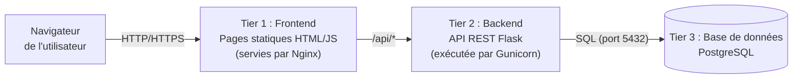

# L'application fil rouge : « Listify »

Tout le parcours s'appuie sur une même application 3-tiers, volontairement simple sur le plan fonctionnel : **Listify**, un gestionnaire de tâches partagées. Sa simplicité est une décision pédagogique : la difficulté du parcours doit porter sur le **déploiement**, jamais sur le code applicatif.

## Architecture



| Tier | Rôle | Technologie | Pourquoi ce choix |
|---|---|---|---|
| Frontend | Interface utilisateur | HTML + JavaScript natif (pas de framework) | Aucun build à gérer au S1 ; un build (Vite) sera introduit au S2 quand on parlera d'images multi-stage |
| Backend | API REST | Python 3 + Flask + Gunicorn | Python est connu de tous ; Flask est minimal et lisible ; Gunicorn illustre la notion de serveur d'application et de workers |
| Base de données | Persistance | PostgreSQL | Standard industriel, riche en outils d'administration (sauvegarde, réplication) exploités au fil du parcours |

L'API expose trois routes :

| Méthode | Route | Description |
|---|---|---|
| `GET` | `/api/health` | Sonde de vie : renvoie l'état de l'API et de sa connexion à la base |
| `GET` | `/api/tasks` | Liste toutes les tâches |
| `POST` | `/api/tasks` | Crée une tâche (`{"title": "..."}`) |
| `DELETE` | `/api/tasks/<id>` | Supprime une tâche |

## Le code source complet

Le code est fourni ci-dessous dans son intégralité. En semaine 1, vous créerez un dépôt Git `listify` contenant exactement cette arborescence :

```text
listify/
├── backend/
│   ├── app.py
│   ├── requirements.txt
│   └── wsgi.py
├── frontend/
│   ├── index.html
│   ├── app.js
│   └── style.css
├── db/
│   └── schema.sql
└── README.md
```

### Backend : `backend/app.py`

```python title="backend/app.py"
"""Listify : API REST minimale de gestion de tâches.

Toute la configuration passe par des variables d'environnement
(principe 12-factor, facteur III) :

    DB_HOST      hôte PostgreSQL   (défaut : localhost)
    DB_PORT      port PostgreSQL   (défaut : 5432)
    DB_NAME      nom de la base    (défaut : listify)
    DB_USER      utilisateur       (défaut : listify)
    DB_PASSWORD  mot de passe      (obligatoire)
"""
import os

import psycopg2
import psycopg2.extras
from flask import Flask, jsonify, request

app = Flask(__name__)


def get_conn():
    """Ouvre une connexion à PostgreSQL à partir de l'environnement."""
    return psycopg2.connect(
        host=os.environ.get("DB_HOST", "localhost"),
        port=int(os.environ.get("DB_PORT", "5432")),
        dbname=os.environ.get("DB_NAME", "listify"),
        user=os.environ.get("DB_USER", "listify"),
        password=os.environ["DB_PASSWORD"],
        connect_timeout=3,
    )


@app.get("/api/health")
def health():
    """Sonde de vie : l'API répond-elle, et voit-elle sa base ?"""
    status = {"api": "ok", "database": "ok"}
    code = 200
    try:
        with get_conn() as conn, conn.cursor() as cur:
            cur.execute("SELECT 1")
    except Exception as exc:  # noqa: BLE001 - on veut le message, quel qu'il soit
        status["database"] = f"error: {exc.__class__.__name__}"
        code = 503
    return jsonify(status), code


@app.get("/api/tasks")
def list_tasks():
    with get_conn() as conn:
        with conn.cursor(cursor_factory=psycopg2.extras.RealDictCursor) as cur:
            cur.execute(
                "SELECT id, title, created_at FROM tasks ORDER BY id"
            )
            return jsonify(cur.fetchall())


@app.post("/api/tasks")
def create_task():
    payload = request.get_json(silent=True) or {}
    title = (payload.get("title") or "").strip()
    if not title:
        return jsonify({"error": "title is required"}), 400
    with get_conn() as conn:
        with conn.cursor(cursor_factory=psycopg2.extras.RealDictCursor) as cur:
            cur.execute(
                "INSERT INTO tasks (title) VALUES (%s) "
                "RETURNING id, title, created_at",
                (title,),
            )
            return jsonify(cur.fetchone()), 201


@app.delete("/api/tasks/<int:task_id>")
def delete_task(task_id: int):
    with get_conn() as conn:
        with conn.cursor() as cur:
            cur.execute("DELETE FROM tasks WHERE id = %s", (task_id,))
            if cur.rowcount == 0:
                return jsonify({"error": "not found"}), 404
    return "", 204
```

!!! note "Pourquoi `RETURNING` et `jsonify` ?"
    `RETURNING` demande à PostgreSQL de renvoyer la ligne insérée dans la même requête : un aller-retour réseau au lieu de deux. `jsonify` sérialise proprement les types PostgreSQL (dates notamment) et positionne l'en-tête `Content-Type: application/json`. Ces détails comptent : en production, chaque aller-retour et chaque en-tête mal positionné se paie.

### Backend : `backend/wsgi.py` et `backend/requirements.txt`

```python title="backend/wsgi.py"
"""Point d'entrée WSGI : c'est ce module que Gunicorn importera."""
from app import app  # noqa: F401
```

```text title="backend/requirements.txt"
flask==3.0.3
gunicorn==22.0.0
psycopg2-binary==2.9.11
```

!!! warning "Versions figées"
    Les versions sont **épinglées** (`==`) volontairement : c'est la première brique de la reproductibilité, un concept central du parcours. Un `requirements.txt` sans versions produit une application différente selon le jour où on l'installe.

### Base de données : `db/schema.sql`

```sql title="db/schema.sql"
-- Schéma de Listify. Idempotent : ré-exécutable sans erreur.
CREATE TABLE IF NOT EXISTS tasks (
    id         SERIAL PRIMARY KEY,
    title      TEXT        NOT NULL,
    created_at TIMESTAMPTZ NOT NULL DEFAULT now()
);
```

!!! tip "Premier contact avec l'idempotence"
    Le `IF NOT EXISTS` rend ce script **idempotent** : on peut l'exécuter une fois ou dix fois, l'état final est le même. Retenez ce mot, c'est le concept le plus important du semestre 1. Un script `CREATE TABLE` sans `IF NOT EXISTS` échoue à la deuxième exécution : il décrit une *action* ; celui-ci décrit un *état voulu*.

### Frontend : `frontend/index.html`

```html title="frontend/index.html"
<!DOCTYPE html>
<html lang="fr">
<head>
  <meta charset="utf-8">
  <meta name="viewport" content="width=device-width, initial-scale=1">
  <title>Listify</title>
  <link rel="stylesheet" href="style.css">
</head>
<body>
  <main>
    <h1>Listify</h1>
    <p id="status">Connexion à l'API...</p>
    <form id="new-task-form">
      <input id="new-task-title" type="text"
             placeholder="Nouvelle tâche..." required>
      <button type="submit">Ajouter</button>
    </form>
    <ul id="task-list"></ul>
  </main>
  <script src="app.js"></script>
</body>
</html>
```

### Frontend : `frontend/app.js`

```javascript title="frontend/app.js"
// Le frontend parle à l'API en chemin relatif (/api/...).
// C'est le reverse proxy (Nginx) qui routera ces requêtes vers le backend :
// le navigateur n'a jamais besoin de connaître l'adresse du backend.
const API = "/api";

const statusEl = document.getElementById("status");
const listEl = document.getElementById("task-list");
const formEl = document.getElementById("new-task-form");
const inputEl = document.getElementById("new-task-title");

async function refresh() {
  try {
    const res = await fetch(`${API}/tasks`);
    if (!res.ok) throw new Error(`HTTP ${res.status}`);
    const tasks = await res.json();
    statusEl.textContent = `${tasks.length} tâche(s)`;
    listEl.innerHTML = "";
    for (const task of tasks) {
      const li = document.createElement("li");
      li.textContent = task.title + " ";
      const del = document.createElement("button");
      del.textContent = "✕";
      del.onclick = async () => {
        await fetch(`${API}/tasks/${task.id}`, { method: "DELETE" });
        refresh();
      };
      li.appendChild(del);
      listEl.appendChild(li);
    }
  } catch (err) {
    statusEl.textContent = `API injoignable : ${err.message}`;
  }
}

formEl.addEventListener("submit", async (event) => {
  event.preventDefault();
  await fetch(`${API}/tasks`, {
    method: "POST",
    headers: { "Content-Type": "application/json" },
    body: JSON.stringify({ title: inputEl.value }),
  });
  inputEl.value = "";
  refresh();
});

refresh();
```

### Frontend : `frontend/style.css`

```css title="frontend/style.css"
body {
  font-family: system-ui, sans-serif;
  background: #f5f5f5;
  display: flex;
  justify-content: center;
  padding-top: 4rem;
}
main {
  background: white;
  padding: 2rem;
  border-radius: 8px;
  box-shadow: 0 2px 8px rgba(0, 0, 0, .1);
  width: min(90vw, 480px);
}
#new-task-form { display: flex; gap: .5rem; margin: 1rem 0; }
#new-task-title { flex: 1; padding: .5rem; }
ul { list-style: none; padding: 0; }
li {
  display: flex;
  justify-content: space-between;
  padding: .5rem 0;
  border-bottom: 1px solid #eee;
}
```

## Points d'architecture à retenir dès maintenant

1. **Le frontend ne connaît pas le backend.** Il appelle `/api/...` en chemin relatif ; c'est le reverse proxy qui route. Vous comprendrez pourquoi au [chapitre 4 du bloc 1](semestre1/bloc1/cours/04-architecture-application-web.md).
2. **Le backend ne connaît pas ses secrets.** Adresse de la base et mot de passe arrivent par variables d'environnement : le même code tournera sans modification sur votre VM (S1), dans un conteneur (S2) et dans Kubernetes (S2), seule la configuration changera.
3. **La base est le seul tier avec état.** Frontend et backend peuvent être détruits et recréés à volonté ; la base, elle, exige sauvegardes et précautions. Cette asymétrie (*stateless* vs *stateful*) structurera de nombreuses décisions du parcours, jusqu'au débat « faut-il mettre sa base dans Kubernetes ? » au S2.

## Vérification locale rapide (sans VM)

Avant même le TP 1, vous pouvez vérifier que le code fonctionne sur votre poste si PostgreSQL y est disponible (ou via un conteneur, ce que vous apprendrez au S2) :

```bash
# 1. Base de données (exemple avec un PostgreSQL local)
createdb listify
psql -d listify -f db/schema.sql

# 2. Backend
cd backend
python3 -m venv .venv && source .venv/bin/activate
pip install -r requirements.txt
export DB_PASSWORD=changeme DB_USER=$USER DB_NAME=listify
gunicorn --bind 127.0.0.1:8000 wsgi:app

# 3. Test de l'API
curl http://127.0.0.1:8000/api/health
curl -X POST http://127.0.0.1:8000/api/tasks \
     -H 'Content-Type: application/json' -d '{"title": "premier essai"}'
curl http://127.0.0.1:8000/api/tasks
```

En TP, vous ne ferez **jamais** tourner l'application ainsi sur le poste hôte : tout se passera dans des machines virtuelles, précisément pour apprendre à déployer sur une machine distante qui n'est pas votre environnement de développement.
