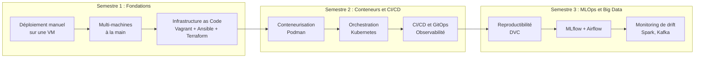

# Ingénierie du Déploiement et de la Mise en Production

**Public :** élèves ingénieurs en informatique (cycle ingénieur, niveau M1-M2)
**Durée :** 3 semestres, environ 60 h encadrées par semestre (CM 40 % / TD 10 % / TP 50 %)

## Le fil conducteur : reconstruire l'histoire du déploiement

Ce parcours ne présente pas une liste d'outils à la mode. Il fait revivre, dans l'ordre où l'industrie les a rencontrés, les problèmes qui ont fait naître ces outils. Vous allez d'abord déployer une application **à la main**, sur un serveur nu, comme on le faisait en 2005. Vous allez souffrir : oublier une étape, casser une configuration, être incapable de reproduire votre propre travail. C'est voulu.

Chaque outil du parcours (Ansible, Podman, Kubernetes, Airflow, MLflow...) sera introduit comme la **réponse à un problème que vous aurez vécu en TP**, jamais comme une recette à recopier. Quand vous découvrirez Ansible, vous saurez exactement quelle douleur il soulage, parce que vous l'aurez ressentie la semaine précédente.

## Philosophie générale

### 1. La théorie d'abord, l'outil ensuite

Chaque outil est une implémentation de **concepts durables** : idempotence, isolation, réconciliation d'état, orchestration de graphes de tâches. Les outils meurent (souvenez-vous de Chef, de Mesos, de Docker Swarm), les concepts restent. C'est sur les concepts que porte l'évaluation théorique. Un ingénieur qui a compris la boucle de réconciliation apprendra le successeur de Kubernetes en une semaine ; un ingénieur qui a appris Kubernetes par cœur devra tout recommencer.

### 2. Apprendre par la friction

On déploie volontairement « à la main » avant d'automatiser. Cette friction n'est pas une perte de temps : elle construit le modèle mental de ce que l'outil abstrait réellement. Quand `kubectl apply` créera vos ressources en trois secondes, vous saurez précisément quelles dizaines d'opérations manuelles ces trois secondes remplacent, et donc où chercher quand cela casse.

### 3. Tout en local

Tous les TP tournent sur le poste de l'étudiant :

- **VirtualBox + Vagrant** pour les machines virtuelles ;
- **Podman** comme moteur de conteneurs ;
- **minikube** (pilote Podman) ou **kind** pour Kubernetes ;
- exécuteurs locaux pour Airflow et MLflow.

Aucun compte cloud payant n'est requis. Le cloud est traité en théorie et via des émulateurs (LocalStack en démonstration).

!!! info "Pourquoi Podman plutôt que Docker ?"
    Podman est 100 % open source, fonctionne **sans démon** et en mode **rootless** par défaut. C'est un choix à la fois pédagogique (l'architecture est plus transparente : chaque conteneur est un simple processus fils, visible avec `ps`) et pratique (pas de licence Docker Desktop, pas de droits administrateur nécessaires en salle de TP). Les commandes étant identiques (`alias docker=podman`), la compétence est directement transférable en entreprise, où Docker reste le standard de fait.

### 4. Projet fil rouge

Une même application 3-tiers (frontend + API + base de données) est redéployée à chaque étape du parcours avec la technologie du moment. Vous mesurez concrètement, chronomètre en main, le gain de chaque abstraction. L'application est décrite en détail dans la page [Application fil rouge](fil-rouge.md).

## Compétences visées (référentiel)

| Code | Compétence |
|---|---|
| **C1** | Concevoir et justifier une architecture de déploiement adaptée à un besoin (coût, disponibilité, sécurité, charge) |
| **C2** | Provisionner et configurer une infrastructure de manière reproductible (IaC) |
| **C3** | Conteneuriser, orchestrer et exposer des services applicatifs |
| **C4** | Concevoir des chaînes d'intégration et de livraison continues fiables |
| **C5** | Industrialiser le cycle de vie d'un produit d'IA (données, entraînement, serving, monitoring) |
| **C6** | Diagnostiquer, observer et opérer un système en production |

## Progression des concepts transversaux

Le même petit nombre de concepts revient à chaque semestre, incarné dans des outils différents. Ce tableau est votre carte : à chaque nouveau chapitre, demandez-vous quelle ligne il illustre.

| Concept | Semestre 1 | Semestre 2 | Semestre 3 |
|---|---|---|---|
| **Idempotence** | Modules Ansible | Manifests Kubernetes, pipelines | Tâches Airflow |
| **État désiré / réconciliation** | Terraform (plan/state) | Boucles de contrôle K8s, GitOps | Promotion automatique des modèles |
| **Reproductibilité** | Vagrant + Ansible | Images immuables | DVC + MLflow + seeds |
| **Isolation** | VM, segmentation réseau | Namespaces, cgroups, rootless | Environnements d'entraînement |
| **Observabilité** | Logs systemd | Prometheus / Grafana | Drift, métriques différées |

## Organisation des semestres

- **[Semestre 1](semestre1/index.md) : Fondations, du serveur unique à l'Infrastructure as Code.** Comprendre ce qu'est réellement un déploiement (couches système, réseau, applicatives), puis découvrir pourquoi et comment l'automatiser.
- **[Semestre 2](semestre2/index.md) : Conteneurs, orchestration et livraison continue.** Passer de « je déploie des machines » à « je déploie des applications » ; automatiser le chemin du commit à la production.
- **[Semestre 3](semestre3/index.md) : Mise en production des produits d'IA et de la donnée.** Appliquer toute la stack au cas particulier, et plus difficile, des produits pilotés par les données et les modèles.

## Règles du jeu (valables les 3 semestres)

1. **Tout livrable est un dépôt Git** dont le README permet une reconstruction complète par l'enseignant, en une commande si l'outillage du semestre le permet. C'est le critère d'évaluation le plus discriminant et le plus professionnalisant.
2. **Tenez un journal de bord** (runbook) pendant chaque TP : chaque commande exécutée, chaque erreur rencontrée, chaque solution trouvée. Ce journal est noté en contrôle continu et vous sauvera la vie au moment des défis chronométrés.
3. **Les pannes font partie du cours.** L'enseignant injectera des pannes volontaires en TP et en soutenance. Savoir diagnostiquer méthodiquement (symptôme, hypothèse, vérification, correction) est une compétence évaluée à part entière.

## Bibliographie de référence du parcours

La bibliographie détaillée, chapitre par chapitre, se trouve en fin de chaque leçon. Les ouvrages socles du parcours sont recensés dans la [bibliographie générale](bibliographie.md).
