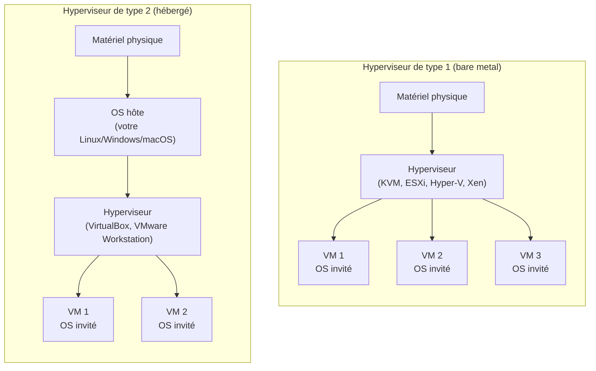
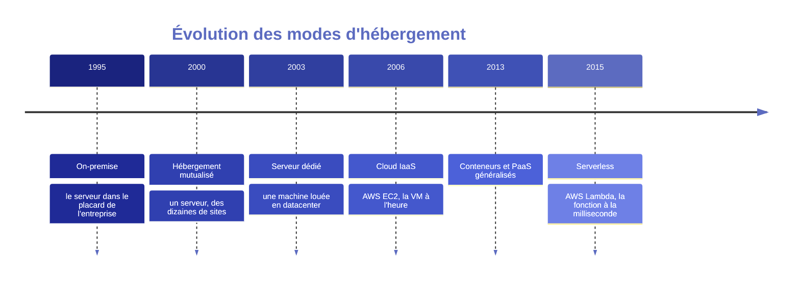

# Chapitre 1 : Anatomie d'un serveur

!!! abstract "Objectifs du chapitre"
    À l'issue de ce chapitre, vous saurez :

    - définir ce qu'est un serveur, physiquement et logiquement ;
    - expliquer la virtualisation et distinguer hyperviseurs de type 1 et de type 2 ;
    - situer les grands modes d'hébergement (on-premise, mutualisé, dédié, cloud) dans leur contexte historique et économique ;
    - justifier le choix de VirtualBox pour les TP du semestre.

## 1. Qu'est-ce qu'un serveur ?

Le mot « serveur » désigne deux choses distinctes, et la confusion entre les deux est une source d'erreurs constante chez les débutants :

Un serveur (logiciel)
:   Un **programme** qui attend des requêtes et y répond : Nginx est un serveur HTTP, PostgreSQL est un serveur de bases de données, sshd est un serveur SSH. Le terme s'oppose à *client*, le programme qui émet la requête.

Un serveur (matériel)
:   Une **machine** conçue pour exécuter ces programmes en continu : alimentation redondante, disques échangeables à chaud, mémoire ECC (à code correcteur d'erreurs), format rack 19 pouces, et surtout aucun écran ni clavier : on l'administre à distance.

Dans ce cours, quand le contexte ne précise pas, « serveur » désigne la machine (physique ou virtuelle) sur laquelle on déploie. Un même serveur-machine héberge généralement plusieurs serveurs-logiciels : dans le bloc 1, votre unique VM fera tourner à la fois Nginx, Gunicorn et PostgreSQL.

### 1.1 Ce qui distingue un serveur de votre machine de travail

Techniquement, rien n'empêche de servir un site web depuis un ordinateur portable. Ce qui distingue un serveur digne de ce nom, ce sont des exigences d'**exploitation** :

| Exigence | Sur votre portable | Sur un serveur |
|---|---|---|
| Disponibilité | On l'éteint le soir | Allumé 24 h/24, objectif d'*uptime* contractuel (99,9 % = 8 h 46 d'arrêt par an) |
| Administration | Écran + clavier | À distance uniquement (SSH, console série, IPMI) |
| Pannes matérielles | On perd sa journée | Alimentations et disques redondants, RAID, mémoire ECC |
| Réseau | IP dynamique, NAT de box | IP fixe, débit garanti, souvent plusieurs interfaces |
| Environnement | Bureau, poussière, café | Salle climatisée, onduleurs, contrôle d'accès |

Cette liste explique l'existence des **centres de données** (datacenters) : mutualiser la climatisation, l'énergie redondée, la connectivité et la sécurité physique pour des milliers de machines.

### 1.2 Les ressources que le déploiement consomme

Tout déploiement consomme quatre ressources, et tout dimensionnement se raisonne sur ces quatre axes. Retenez-les : ils reviendront au semestre 2 (requests/limits de Kubernetes) et au semestre 3 (dimensionnement des entraînements) :

- **CPU** : la capacité de calcul. Se mesure en cœurs ; se partage bien entre processus (le noyau ordonnance).
- **Mémoire (RAM)** : l'espace de travail des processus. Ne se partage pas : quand elle est pleine, le noyau tue des processus (vous rencontrerez l'*OOM Killer* au TP 4 puis massivement au S2).
- **Stockage** : capacité (Go) mais surtout **latence et débit d'entrées/sorties** (IOPS). Une base de données lente est presque toujours un problème d'I/O avant d'être un problème de CPU.
- **Réseau** : bande passante et latence. Souvent négligé jusqu'au jour où il devient le goulot d'étranglement.

!!! example "Exemple travaillé : dimensionner Listify"
    L'application fil rouge pour 100 utilisateurs simultanés : Gunicorn avec 4 workers consomme environ 4 × 60 Mo = 240 Mo de RAM ; PostgreSQL avec ses caches, environ 512 Mo pour une petite base ; Nginx est négligeable (quelques Mo) ; le système Debian de base, environ 200 Mo. Total ≈ 1 Go : notre VM de TP à 2 Go de RAM est confortable. Le premier facteur limitant en cas de montée en charge ne sera pas la RAM mais le nombre de workers Gunicorn (voir chapitre 4).

## 2. La virtualisation

### 2.1 Le problème d'origine

Au début des années 2000, un serveur physique typique était utilisé à 5-15 % de sa capacité : on dédiait une machine par application, par prudence (isolation des pannes) et par contrainte (conflits de dépendances entre applications). Résultat : des salles machines pleines de serveurs qui chauffent en ne faisant presque rien.

La **virtualisation** répond à ce gaspillage : faire tourner plusieurs **machines virtuelles** (VM) isolées sur une même machine physique, chacune avec son propre système d'exploitation, ses propres disques (virtuels), sa propre carte réseau (virtuelle). VMware commercialise la première solution x86 grand marché en 1999 ; les extensions matérielles Intel VT-x et AMD-V (2005-2006) rendent ensuite la virtualisation quasi native en performances.[^1]

[^1]: Pour l'histoire longue, la virtualisation existait déjà sur les mainframes IBM dans les années 1960 (système CP/CMS, 1967). L'article de référence sur les conditions formelles de virtualisabilité est Popek et Goldberg, « Formal Requirements for Virtualizable Third Generation Architectures », *Communications of the ACM*, 1974.

### 2.2 L'hyperviseur

Le logiciel qui crée et exécute les VM s'appelle un **hyperviseur** (*hypervisor*). Son rôle : partager le matériel réel entre plusieurs systèmes invités en leur donnant chacun l'illusion d'un matériel dédié. On distingue deux architectures :

Hyperviseur de type 1 (« bare metal »)
:   S'exécute **directement sur le matériel**, sans système d'exploitation en dessous. C'est l'architecture des serveurs de production et de tout le cloud : VMware ESXi, Microsoft Hyper-V, Xen (historiquement chez AWS), et **KVM**, le module de virtualisation intégré au noyau Linux (utilisé par AWS depuis 2017, Google Cloud, OpenStack et la quasi-totalité des hébergeurs).

Hyperviseur de type 2 (« hébergé »)
:   S'exécute **comme une application** au-dessus d'un OS classique. C'est l'outil du poste de travail : VirtualBox, VMware Workstation/Fusion, Parallels. Moins performant (chaque accès matériel traverse l'OS hôte) mais parfait pour développer et apprendre.

!!! note "Le cas de KVM : la frontière est poreuse"
    KVM brouille la classification : c'est un module du noyau Linux, donc l'hyperviseur *est* l'OS hôte. On le classe en type 1 parce que le noyau accède directement au matériel, mais un Linux avec KVM reste un système complet capable d'exécuter d'autres applications. Retenez la distinction par l'usage : type 1 = production, type 2 = poste de travail.

### 2.3 Ce que la virtualisation isole, et à quel prix

Chaque VM embarque **son propre noyau et son propre OS complet**. C'est la force de la VM (isolation très forte : une VM compromise ne voit rien de l'hôte ni des autres VM ; on peut mélanger Linux et Windows sur le même hôte) et sa faiblesse (chaque VM paie le coût d'un OS entier : centaines de Mo de RAM, dizaines de secondes de démarrage, dizaines de Go de disque).

Gardez cette phrase en tête, elle structurera le débat VM vs conteneurs au semestre 2 : **une VM virtualise le matériel ; un conteneur virtualise l'OS**. Les conteneurs partageront le noyau de l'hôte, d'où leur légèreté... et leur isolation moindre.

### 2.4 Vocabulaire à maîtriser

| Terme | Définition |
|---|---|
| **Hôte** (host) | La machine physique (ou son OS) qui exécute l'hyperviseur |
| **Invité** (guest) | Le système qui tourne dans la VM |
| **Image disque** | Fichier représentant le disque de la VM (formats VDI, VMDK, qcow2...) |
| **Snapshot** | Photographie de l'état complet d'une VM à un instant, restaurable |
| **Additions invité** (guest additions) | Pilotes installés dans l'invité pour améliorer intégration et performances |
| **Paravirtualisation** | L'invité *sait* qu'il est virtualisé et coopère avec l'hyperviseur via des pilotes optimisés (virtio) au lieu d'émuler du vrai matériel |

!!! tip "Les snapshots, votre filet de sécurité en TP"
    Avant chaque manipulation risquée du TP, prenez un snapshot de votre VM. Une commande destructrice, et vous revenez en arrière en dix secondes au lieu de réinstaller. C'est aussi un avant-goût d'un concept clé du parcours : pouvoir revenir à un **état connu**.

## 3. Panorama historique de l'hébergement

Où met-on physiquement le serveur ? La réponse a changé quatre fois en trente ans, et chaque étape est une leçon d'architecture. Ce panorama est à connaître : l'examen comporte régulièrement une question de choix d'hébergement justifié (compétence C1).

### 3.1 On-premise : le serveur chez soi

L'entreprise achète ses machines et les installe dans ses locaux (« sur site », *on-premises*). Contrôle total : sur le matériel, les données, le réseau. Coût total élevé et souvent sous-estimé : il faut acheter (**CAPEX**, dépense d'investissement), mais aussi climatiser, onduler, sécuriser physiquement, et disposer de personnel compétent 24 h/24.

Toujours pertinent aujourd'hui pour : données soumises à des contraintes fortes de souveraineté ou de latence (industrie, santé, défense), charges parfaitement prévisibles où l'amortissement bat la location, et... les salles de TP d'université.

### 3.2 Hébergement mutualisé (shared hosting)

Fin des années 1990 : des hébergeurs louent quelques Mo sur un serveur partagé entre des dizaines de clients. On dépose ses fichiers PHP par FTP, la base MySQL est fournie, l'administration système est invisible (et inaccessible). C'est l'hébergement des sites vitrines, encore massivement vendu (OVH, o2switch...).

Leçon d'architecture : la mutualisation réduit les coûts mais couple les locataires entre eux : le site voisin qui sature le CPU dégrade le vôtre. Le terme moderne est **multi-tenancy**, et le problème du « voisin bruyant » (*noisy neighbor*) reviendra tel quel dans Kubernetes au S2.

### 3.3 Serveur dédié et colocation

Années 2000 : on loue une machine entière dans le datacenter d'un hébergeur (dédié), ou on y installe sa propre machine (colocation). On obtient la puissance et l'isolation, sans la salle machine. Mais l'unité de commande reste la **machine physique**, livrée en jours, louée au mois : impossible d'absorber un pic de charge de deux heures.

### 3.4 Le cloud : l'infrastructure à la demande

2006 : Amazon lance EC2 (*Elastic Compute Cloud*). Rupture fondamentale, qui n'est **pas** technologique (ce sont des VM sur des hyperviseurs, technologie connue) mais **économique et opérationnelle** :

1. **Self-service par API** : on obtient une VM en 60 secondes par un appel programmatique, sans humain dans la boucle. C'est cette API qui rendra possible l'Infrastructure as Code (bloc 3).
2. **Facturation à l'usage** : à l'heure, puis à la seconde. Le CAPEX devient **OPEX** (dépense de fonctionnement).
3. **Élasticité** : 10 machines pour la nuit du Black Friday, zéro le lendemain.

Le NIST en donne la définition canonique (cinq caractéristiques : self-service à la demande, accès réseau large, mutualisation des ressources, élasticité rapide, service mesuré).[^2] Sur cette base se déclinent les modèles de service, qu'on distingue par **ce que le fournisseur gère à votre place** :

[^2]: Peter Mell et Timothy Grance, *The NIST Definition of Cloud Computing*, NIST Special Publication 800-145, septembre 2011.

| Modèle | Le fournisseur gère | Vous gérez | Exemples |
|---|---|---|---|
| **IaaS** (Infrastructure as a Service) | Matériel, hyperviseur, réseau physique | OS, middleware, application, données | EC2, Google Compute Engine, OVH Public Cloud |
| **PaaS** (Platform as a Service) | + OS, runtime, mise à l'échelle | Application, données | Heroku, Google App Engine, Scalingo |
| **SaaS** (Software as a Service) | Tout | Vos données, la configuration | Gmail, Office 365 |
| **FaaS** / serverless | Tout sauf le code de vos fonctions | Le code, découpé en fonctions | AWS Lambda, Cloud Functions |

!!! example "Exemple travaillé : où héberger Listify ?"
    Étude de cas type examen. Listify pour une PME de 200 employés :

    - **Mutualisé** : impossible, il faut exécuter un processus Python persistant (Gunicorn) et PostgreSQL ; le mutualisé classique n'offre que PHP + MySQL.
    - **PaaS** : très bon choix réel (on pousse le code, tout est géré), mais pédagogiquement il cache tout ce qu'on veut apprendre.
    - **IaaS ou dédié** : une VM à ~10 €/mois suffit largement ; c'est le modèle que reproduit notre TP.
    - **On-premise** : injustifiable pour cette taille, sauf contrainte de données.

    Retenez la méthode : partir des **contraintes** (processus persistants ? données sensibles ? charge variable ? budget ? compétences ?) et éliminer, plutôt que partir des modes.

### 3.5 Et dans ce cours ?

Conformément à la philosophie « tout en local », le cloud est traité en théorie et le restera : **votre poste + VirtualBox joue le rôle du datacenter**, et vous êtes à la fois le client et l'hébergeur. Ce n'est pas un pis-aller : les concepts (VM, réseau privé, API de provisionnement avec Vagrant puis Terraform) sont exactement ceux du cloud, à l'échelle près. Une démonstration de LocalStack (émulateur local des API AWS) sera faite au bloc 3.

## 4. VirtualBox : notre datacenter de poche

VirtualBox est un hyperviseur de type 2, libre (GPL pour le cœur), multiplateforme, maintenu par Oracle. On le choisit pour les TP car :

- il fonctionne à l'identique sous Linux, Windows et macOS Intel (les Mac Apple Silicon utiliseront UTM/QEMU, un guide d'adaptation est fourni) ;
- il est pilotable en ligne de commande (`VBoxManage`) et surtout par **Vagrant**, ce qui prépare le bloc 3 ;
- ses modes réseau (NAT, host-only, internal) permettent de simuler un vrai réseau de datacenter au bloc 2.

Les notions VirtualBox nécessaires (création de VM, types de réseau, snapshots, port forwarding) sont introduites en situation dans le [TP 1](../tp/tp1-vm-ssh-durcissement.md).

## Ce qu'il faut retenir

1. Un serveur-machine héberge des serveurs-logiciels ; les exigences propres au serveur sont des exigences d'**exploitation** (disponibilité, administration à distance, redondance).
2. Tout dimensionnement se raisonne sur quatre ressources : CPU, RAM, stockage (IOPS !), réseau.
3. Un hyperviseur de **type 1** tourne sur le matériel nu (production, cloud) ; un **type 2** tourne sur un OS hôte (poste de travail). KVM est le type 1 du monde Linux.
4. Une VM virtualise le **matériel** et embarque un OS complet : isolation forte, coût élevé. (Les conteneurs, au S2, virtualiseront l'OS.)
5. La révolution du cloud est économique et opérationnelle (API self-service, paiement à l'usage, élasticité) plus que technologique. IaaS / PaaS / SaaS se distinguent par la ligne de partage des responsabilités.
6. Le choix d'un mode d'hébergement se justifie par les contraintes : données, charge, budget, compétences.

## Pour préparer le TP 1

- Installer VirtualBox ≥ 7.0 sur votre poste (lien et version exacte dans le guide d'installation distribué en semaine 1).
- Télécharger l'ISO Debian 12 netinst depuis le miroir local de l'école.
- Vérifier dans le BIOS/UEFI que la virtualisation matérielle (Intel VT-x / AMD-V) est activée.

## Bibliographie du chapitre

### Sources primaires

- Peter Mell, Timothy Grance, *The NIST Definition of Cloud Computing*, NIST SP 800-145, 2011. [nvlpubs.nist.gov](https://nvlpubs.nist.gov/nistpubs/Legacy/SP/nistspecialpublication800-145.pdf). La définition de référence du cloud, 3 pages, à lire intégralement.
- Gerald J. Popek, Robert P. Goldberg, « Formal Requirements for Virtualizable Third Generation Architectures », *Communications of the ACM*, vol. 17, n° 7, 1974. Le papier fondateur de la théorie de la virtualisation.
- Oracle, *VirtualBox User Manual*, chapitres 1 (« First Steps ») et 6 (« Virtual Networking »). [virtualbox.org/manual](https://www.virtualbox.org/manual/).

### Lectures recommandées

- Kief Morris, *Infrastructure as Code*, 2ᵉ éd., O'Reilly, 2020, chapitre 1 : l'histoire de l'« âge du fer » à l'« âge du cloud », qui recoupe la section 3 de ce chapitre.
- Barbara Krasovec et al., « Virtualization », section du *Linux System Administrators Guide* ; ou, plus moderne, la documentation KVM : [linux-kvm.org](https://www.linux-kvm.org/page/Documents).
- Betsy Beyer et al. (dir.), *Site Reliability Engineering*, O'Reilly, 2016, chapitre 2 (« The Production Environment at Google, from the Viewpoint of an SRE ») : à quoi ressemble un vrai datacenter moderne. [Gratuit en ligne](https://sre.google/sre-book/production-environment/).

### Pour aller plus loin

- Keith Adams, Ole Agesen, « A Comparison of Software and Hardware Techniques for x86 Virtualization », *ASPLOS*, 2006 : comment VMware virtualisait le x86 *avant* VT-x, un bijou d'ingénierie.
- L'histoire d'EC2 racontée par son équipe : Benjamin Black, « EC2 Origins », billet de blog, 2009.
