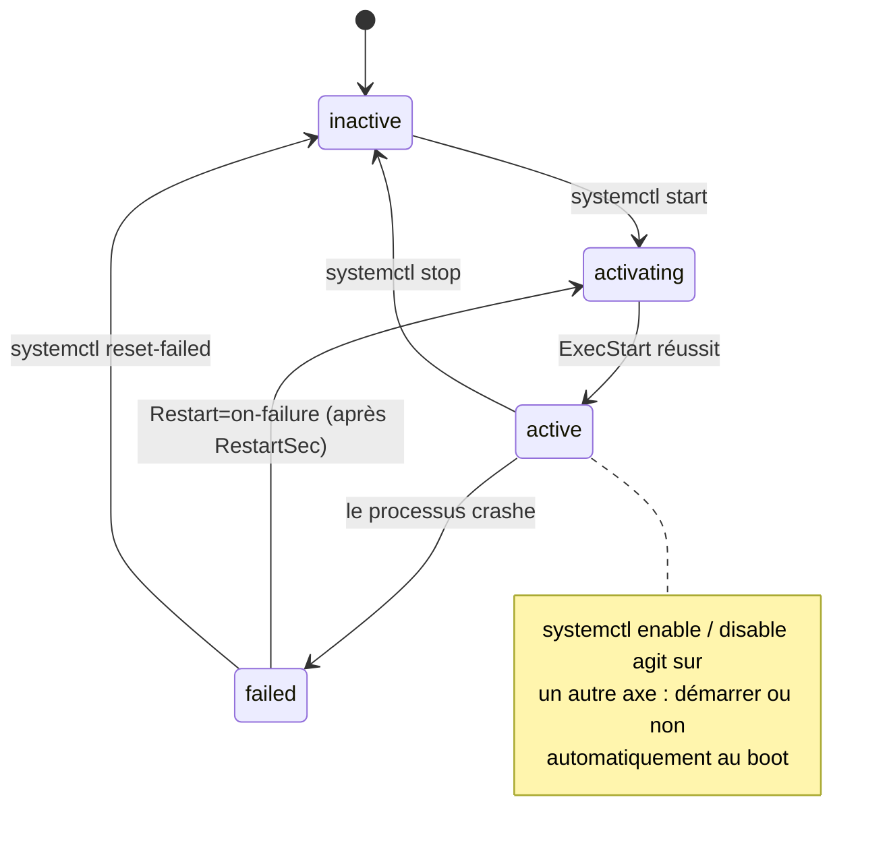

# Chapitre 2 : Le système d'exploitation serveur

!!! abstract "Objectifs du chapitre"
    À l'issue de ce chapitre, vous saurez :

    - choisir une distribution Linux serveur et justifier ce choix ;
    - installer, mettre à jour et interroger des paquets avec APT en comprenant ce qu'est réellement un paquet ;
    - manipuler utilisateurs, groupes et permissions, et créer un utilisateur système dédié à une application ;
    - écrire une unité systemd, gérer le cycle de vie d'un service et exploiter ses journaux avec journald.

    Ce chapitre est le socle direct du [TP 2](../tp/tp2-backend-bdd.md), où vous écrirez votre propre service systemd.

## 1. Pourquoi Linux, et quelle distribution ?

Linux fait tourner l'écrasante majorité des serveurs : plus de 96 % du premier million de serveurs web selon les relevés W3Techs, et la totalité du top 500 des superordinateurs. Les raisons sont autant historiques (gratuité, code ouvert, culture Unix de l'administration à distance et du tout-fichier) que techniques (stabilité, outillage, et aujourd'hui : les conteneurs sont une technologie du noyau Linux).

Une **distribution** assemble le noyau Linux, une bibliothèque C, un système d'init, un gestionnaire de paquets et des milliers de logiciels empaquetés et testés ensemble. Pour le serveur, trois familles dominent :

| Famille | Distributions | Gestionnaire de paquets | Trait distinctif |
|---|---|---|---|
| Debian | Debian, **Ubuntu** (et Ubuntu LTS) | APT (`.deb`) | Debian : stabilité et communauté ; Ubuntu : cycle prévisible, support commercial Canonical |
| Red Hat | RHEL, Rocky Linux, AlmaLinux, Fedora | DNF (`.rpm`) | Standard des grandes entreprises, support long (10 ans), certifications |
| Autres | Alpine (minimalisme, musl), openSUSE, Arch | apk, zypper, pacman | Alpine reviendra au S2 : images de conteneurs de quelques Mo |

Deux notions structurent le choix :

Cycle de vie et support
:   Une version **LTS** (*Long Term Support*) est maintenue plusieurs années (5 ans pour Ubuntu LTS, ~5 ans pour une Debian stable avec LTS). En production, on ne veut **pas** les dernières versions des logiciels : on veut des versions **figées qui reçoivent uniquement des correctifs de sécurité**. C'est le contrat d'une distribution stable : les versions ne changent jamais au sein d'une release, seuls les correctifs sont rétroportés (*backporting*).

Distribution serveur vs poste de travail
:   Même base, mais l'installation serveur est **minimale** : pas d'interface graphique (inutile et surface d'attaque en plus), pas d'applications de bureau. Tout se fait en SSH.

!!! info "Le choix du cours : Debian 12 « Bookworm »"
    Debian est 100 % communautaire, extrêmement stable, documentée, et c'est la base d'Ubuntu : tout ce que vous apprenez est transférable. Toutes les corrections de TP et les pannes injectées sont préparées sur Debian 12 : ne changez pas de distribution.

## 2. La gestion de paquets

### 2.1 Qu'est-ce qu'un paquet ?

Un paquet `.deb` est une archive contenant : les **fichiers** du logiciel (binaires, configurations par défaut, documentation), des **métadonnées** (nom, version, mainteneur) et surtout deux choses qui font toute la valeur du système :

1. Des **dépendances** déclarées : `nginx` dépend de `libssl3`, qui dépend de `libc6`... Le gestionnaire résout ce graphe automatiquement. Avant les gestionnaires de paquets, l'installation manuelle des dépendances en cascade avait un nom : le *dependency hell*.
2. Des **scripts de maintenance** (`preinst`, `postinst`, `prerm`, `postrm`) exécutés aux étapes de l'installation : c'est ainsi que l'installation de PostgreSQL crée l'utilisateur système `postgres`, initialise le répertoire de données et démarre le service.

### 2.2 APT en pratique

APT (*Advanced Package Tool*) travaille avec des **dépôts** (*repositories*) : des serveurs HTTP qui hébergent les paquets et leurs index, listés dans `/etc/apt/sources.list` et `/etc/apt/sources.list.d/`. Les commandes à maîtriser :

```bash
sudo apt update                # 1. Rafraîchir les INDEX locaux depuis les dépôts
apt list --upgradable          # 2. Voir ce qui peut être mis à jour
sudo apt upgrade               # 3. Mettre à jour les paquets installés
sudo apt install nginx         # Installer (résout et installe les dépendances)
sudo apt remove nginx          # Désinstaller (garde les fichiers de config)
sudo apt purge nginx           # Désinstaller ET supprimer les configurations
apt show nginx                 # Métadonnées : version, dépendances, description
dpkg -L nginx                  # Lister les fichiers installés par un paquet
dpkg -S /usr/sbin/nginx        # Trouver quel paquet possède un fichier
```

!!! warning "`apt update` ne met rien à jour"
    Piège classique : `apt update` télécharge uniquement les **index** (la liste de ce qui existe) ; c'est `apt upgrade` qui met à jour les paquets. Oublier `apt update` d'abord, c'est installer depuis un catalogue périmé : erreurs 404 garanties sur les miroirs.

`dpkg -L` et `dpkg -S` sont vos meilleurs alliés pour répondre à la question centrale du TP 2 : « ce logiciel que je viens d'installer, *où* a-t-il mis ses fichiers ? ». La réponse suit une convention, le **FHS** (*Filesystem Hierarchy Standard*) :

| Répertoire | Contenu | Exemple pour Nginx |
|---|---|---|
| `/usr/bin`, `/usr/sbin` | Binaires | `/usr/sbin/nginx` |
| `/etc` | **Configurations** (éditables par l'admin) | `/etc/nginx/nginx.conf` |
| `/var` | Données variables : logs, bases, caches | `/var/log/nginx/`, `/var/lib/postgresql/` |
| `/opt`, `/srv` | Logiciels hors paquets, données servies | `/opt/listify/` (notre application au TP 2) |
| `/home` | Répertoires des utilisateurs humains | `/home/deploy/` |

### 2.3 Et les dépendances Python ? Deux mondes de paquets

Le TP 2 vous confrontera à une subtilité importante : notre backend a des dépendances **Python** (`flask`, `gunicorn`, installées par pip) qui ne relèvent pas d'APT. Règle absolue sur un serveur Debian moderne : **jamais de `pip install` global** (Debian 12 le bloque d'ailleurs : environnement « externally managed », voir la PEP 668). On utilise un **environnement virtuel** (`python3 -m venv`) propre à l'application : les dépendances de Listify vivent dans `/opt/listify/venv`, isolées de celles du système et des autres applications. C'est déjà de l'**isolation**, le concept de la colonne 4 du [tableau de progression](../../../index.md#progression-des-concepts-transversaux).

## 3. Utilisateurs, groupes et permissions

### 3.1 Le modèle : tout processus a une identité

Sous Linux, chaque processus s'exécute avec l'identité d'un utilisateur (UID) et de groupes (GID), et chaque fichier appartient à un utilisateur et à un groupe. Toute la sécurité de votre serveur du bloc 1 repose sur ce mécanisme, qu'il faut donc comprendre précisément.

Trois catégories d'utilisateurs cohabitent :

- **root** (UID 0) : tous les droits, aucune vérification. On ne travaille jamais connecté en root ; on élève ses privilèges ponctuellement avec `sudo`.
- **Utilisateurs humains** (UID ≥ 1000) : vous, avec un mot de passe, un shell et un `/home`.
- **Utilisateurs système** (UID < 1000) : créés pour **exécuter des services**, sans mot de passe ni shell de connexion. `postgres`, `www-data` (Nginx)... et `listify`, que vous créerez au TP 2.

### 3.2 Pourquoi un utilisateur système par application ?

C'est le **principe du moindre privilège** (détaillé au [chapitre 5](05-securite-de-base.md)) appliqué aux processus : si le backend Listify est compromis par une faille, l'attaquant obtient les droits de l'utilisateur `listify`... qui ne peut ni lire `/etc/shadow`, ni toucher aux données PostgreSQL, ni modifier la configuration Nginx. Le rayon d'action de la compromission (*blast radius*) est contenu.

```bash
# Création d'un utilisateur système (TP 2) :
sudo adduser --system --group --home /opt/listify --shell /usr/sbin/nologin listify
```

Décortiquons : `--system` (UID < 1000, pas de question interactive), `--group` (crée aussi le groupe `listify`), `--shell /usr/sbin/nologin` (toute tentative de connexion échoue : cet utilisateur n'est pas fait pour les humains).

### 3.3 Les permissions

Chaque fichier porte trois triplets de permissions : utilisateur propriétaire (**u**), groupe (**g**), autres (**o**), chacun avec lecture (**r** = 4), écriture (**w** = 2), exécution (**x** = 1).

```text
$ ls -l /opt/listify/backend/app.py
-rw-r----- 1 listify listify 2143 12 sept. 10:04 /opt/listify/backend/app.py
 │└┬┘└┬┘└┬┘   └──┬──┘ └──┬──┘
 │ u   g   o   propriétaire  groupe
 │ rw- r-- ---  = 640 : le propriétaire lit/écrit, le groupe lit, les autres rien
 └ type : - fichier, d répertoire, l lien
```

Sur un répertoire, `x` signifie « traverser » (entrer dedans) et `r` « lister le contenu ». Les commandes :

```bash
sudo chown -R listify:listify /opt/listify   # changer propriétaire et groupe
sudo chmod 640 fichier                       # notation octale
sudo chmod g+w fichier                       # notation symbolique
```

!!! example "Exemple travaillé : qui peut lire le fichier de configuration secret ?"
    Au TP 2, le mot de passe de la base sera dans `/etc/listify/listify.env`. Permissions cibles : `chown root:listify` et `chmod 640`. Vérifions le raisonnement : root le modifie (u = rw) ; le groupe `listify`, donc le service, le lit sans pouvoir le modifier (g = r) ; tout autre utilisateur, y compris `www-data` si Nginx est compromis, n'y a **aucun** accès (o = aucun droit). Trois lignes de permissions = une politique de sécurité complète. Vous vérifierez en TP qu'un `sudo -u www-data cat /etc/listify/listify.env` échoue bien.

## 4. systemd : le chef d'orchestre des services

### 4.1 Le problème : qui démarre les services, et qui les surveille ?

Installer Gunicorn ne suffit pas : il faut que le processus soit **lancé au démarrage de la machine**, **relancé s'il meurt**, arrêté proprement, et que ses sorties soient journalisées. Historiquement, ce rôle revenait à des scripts shell (System V init) fragiles et non standardisés. Depuis 2015 environ, toutes les grandes distributions utilisent **systemd** : le premier processus démarré par le noyau (PID 1), ancêtre de tous les autres, qui gère l'ensemble des services du système.[^1]

[^1]: systemd a suscité d'intenses controverses dans la communauté Linux (périmètre jugé trop large, complexité). Le débat est clos dans les faits : Debian l'a adopté par vote en 2014, et c'est le standard que vous rencontrerez partout. L'exposé des motivations par son auteur reste éclairant : Lennart Poettering, « Rethinking PID 1 », 2010.

systemd raisonne en **unités** (*units*) : services (`.service`), points de montage (`.mount`), minuteurs (`.timer`, le remplaçant moderne de cron), sockets, cibles (`.target`, des groupes d'unités). Nous nous concentrons sur les services.

### 4.2 Anatomie d'une unité de service

Voici, commentée ligne à ligne, l'unité que vous écrirez au TP 2 pour le backend Listify. C'est le fichier le plus important du bloc 1 :

```ini title="/etc/systemd/system/listify.service"
[Unit]
# Description libre, affichée par systemctl status
Description=Listify backend (Gunicorn)
# Ordonnancement : démarrer après le réseau et PostgreSQL...
After=network-online.target postgresql.service
# ...et exprimer une dépendance faible : demander PostgreSQL s'il n'est pas lancé
Wants=postgresql.service

[Service]
# Identité d'exécution : le principe du moindre privilège, appliqué
User=listify
Group=listify
# Répertoire de travail du processus
WorkingDirectory=/opt/listify/backend
# Variables d'environnement chargées depuis un fichier (secrets hors du .service)
EnvironmentFile=/etc/listify/listify.env
# La commande : le venv de l'application, pas le python du système
ExecStart=/opt/listify/venv/bin/gunicorn --workers 3 --bind 127.0.0.1:8000 wsgi:app
# Politique de redémarrage : relancer en cas de crash, pas en cas d'arrêt manuel
Restart=on-failure
RestartSec=2

[Install]
# Rattachement : ce service fait partie du mode "système démarré multi-utilisateur"
WantedBy=multi-user.target
```

Points de compréhension essentiels :

- **`After` vs `Wants`** : `After` ne dit *que* l'ordre (« si les deux démarrent, PostgreSQL d'abord ») ; `Wants` demande le démarrage de l'autre unité. Il faut les deux. `Requires` serait la version forte (si PostgreSQL tombe, Listify est arrêté aussi) : trop rigide ici, notre API sait répondre 503 quand la base est absente.
- **`Restart=on-failure`** : première rencontre avec l'**auto-réparation**. systemd surveille le processus et le relance s'il sort en erreur. Kubernetes fera exactement cela au S2, à l'échelle d'un cluster : même concept, autre portée.
- **`EnvironmentFile`** : la configuration est **hors du code et hors de l'unité**, dans un fichier aux permissions restreintes. C'est le facteur III des 12-factor apps ([chapitre 4](04-architecture-application-web.md)).

### 4.3 Le cycle de vie d'un service



```bash
sudo systemctl daemon-reload        # OBLIGATOIRE après toute modification d'un .service
sudo systemctl start listify        # démarrer maintenant
sudo systemctl stop listify         # arrêter
sudo systemctl restart listify      # stop + start
sudo systemctl reload nginx         # recharger la config SANS couper le service (si supporté)
sudo systemctl enable listify       # démarrer automatiquement au boot
sudo systemctl enable --now listify # enable + start en une commande
systemctl status listify            # état, PID, dernières lignes de journal
systemctl list-units --type=service --state=running
```

!!! warning "Les deux pièges qui coûtent des points"
    1. **`start` n'implique pas `enable`** : un service démarré à la main mais jamais `enable` disparaît au prochain reboot. C'est l'une des pannes injectées favorites de l'équipe pédagogique.
    2. **Oublier `daemon-reload`** : systemd garde les unités en cache ; modifier le fichier `.service` sans `daemon-reload` applique... l'ancienne version.

### 4.4 Les journaux : journald

systemd capture automatiquement tout ce que les services écrivent sur leurs sorties standard et le stocke dans le **journal** (binaire, indexé, interrogeable), consulté avec `journalctl` :

```bash
journalctl -u listify                  # tout le journal du service
journalctl -u listify -f               # suivre en temps réel (comme tail -f)
journalctl -u listify --since "10 min ago"
journalctl -u listify -p err           # seulement les priorités >= "err"
journalctl -u listify --no-pager -n 50 # les 50 dernières lignes, sans pagination
journalctl --list-boots                # journaux par démarrage de la machine
```

Le journal capture aussi ce que les applications n'écrivent pas : le fait qu'un processus a été tué, par qui, avec quel code de sortie. Au TP 4, c'est `journalctl` qui vous permettra de diagnostiquer la panne injectée par l'enseignant.

Certains logiciels journalisent **aussi** (ou seulement) dans des fichiers sous `/var/log` : Nginx écrit `/var/log/nginx/access.log` et `error.log`, PostgreSQL `/var/log/postgresql/`. Réflexe d'exploitation : un problème = **deux** endroits à regarder, `journalctl -u <service>` et `/var/log/<logiciel>/`.

### 4.5 Méthode de diagnostic d'un service qui ne démarre pas

Cette checklist est à connaître par cœur : c'est la méthode attendue en soutenance devant une panne.

1. `systemctl status <service>` : quel état ? quel code de sortie ? quelles dernières lignes de log ?
2. `journalctl -u <service> -n 50` : le message d'erreur complet du processus.
3. L'erreur est-elle **avant** l'exécution (fichier `ExecStart` introuvable, `User` inexistant, permission refusée sur `WorkingDirectory` : c'est systemd qui parle) ou **dans** l'application (traceback Python : c'est votre code ou sa configuration) ?
4. Tester la commande à la main, sous la bonne identité : `sudo -u listify /opt/listify/venv/bin/gunicorn ...`. Si ça marche à la main mais pas via systemd, chercher une différence d'**environnement** (variables, répertoire courant).
5. Après correction : `daemon-reload` si l'unité a changé, `restart`, puis re-vérifier `status`.

## Ce qu'il faut retenir

1. En production on choisit une distribution **stable/LTS** : versions figées, correctifs de sécurité rétroportés. Le cours utilise Debian 12.
2. Un paquet = fichiers + métadonnées + **dépendances** + scripts de maintenance ; APT résout le graphe. `dpkg -L`/`-S` répondent à « où sont les fichiers ? », le FHS donne la logique (`/etc` config, `/var` données, `/opt` applications hors paquets).
3. Les dépendances Python vivent dans un **venv par application**, jamais dans le Python système.
4. Un utilisateur **système** par application, sans shell : le moindre privilège appliqué aux processus. Permissions rwx/octal : une politique de sécurité en une ligne de `ls -l`.
5. systemd gère le cycle de vie des services : une unité `.service` déclare *qui* exécute *quoi*, *après quoi*, et *que faire en cas de crash* (`Restart=` : l'auto-réparation, concept qui culminera avec Kubernetes).
6. `daemon-reload` après modification d'unité ; `enable` pour survivre au reboot ; `journalctl -u` + `/var/log/` pour diagnostiquer, avec la checklist en 5 étapes.

## Bibliographie du chapitre

### Sources primaires

- *Debian Administrator's Handbook* (Raphaël Hertzog, Roland Mas), gratuit en ligne : [debian-handbook.info](https://debian-handbook.info/). Chapitres 5 (système de paquets) et 6 (APT) : la référence sur .deb/APT, par deux développeurs Debian.
- Pages de manuel systemd : `man systemd.unit`, `man systemd.service`, `man systemd.exec`, `man journalctl`. Documentation en ligne : [freedesktop.org/software/systemd](https://www.freedesktop.org/software/systemd/man/). C'est la source qui fait foi, et elle est excellente.
- *Filesystem Hierarchy Standard* 3.0, Linux Foundation, 2015 : [refspecs.linuxfoundation.org/fhs.shtml](https://refspecs.linuxfoundation.org/fhs.shtml).
- PEP 668, « Marking Python base environments as externally managed », 2022 : [peps.python.org/pep-0668](https://peps.python.org/pep-0668/).

### Lectures recommandées

- Evi Nemeth et al., *UNIX and Linux System Administration Handbook*, 5ᵉ éd., Addison-Wesley, 2017 : chapitres 2 (booting et systemd) et 5 (fichiers et permissions). LA somme de l'administration système, à consulter pendant tout le semestre.
- DigitalOcean, « Understanding Systemd Units and Unit Files » et « How To Use Journalctl to View and Manipulate Systemd Logs » : tutoriels courts et fiables pour réviser avant TP.

### Pour aller plus loin

- Lennart Poettering, « Rethinking PID 1 », 2010 : [0pointer.de/blog/projects/systemd.html](http://0pointer.de/blog/projects/systemd.html). Le manifeste d'origine de systemd : pourquoi les scripts init devaient mourir.
- `man systemd.timer` : les timers systemd, remplaçants modernes de cron, que vous utiliserez pour les sauvegardes au TP 4.
