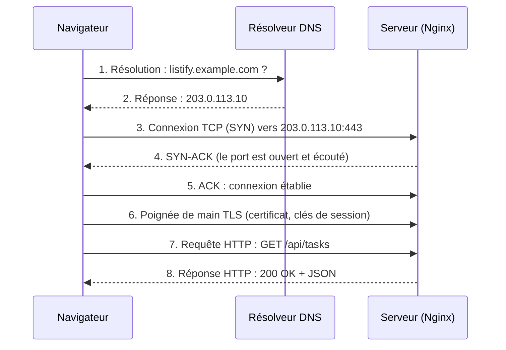
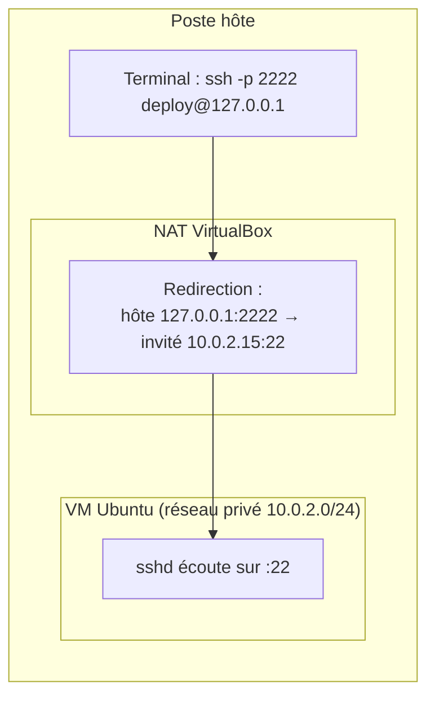
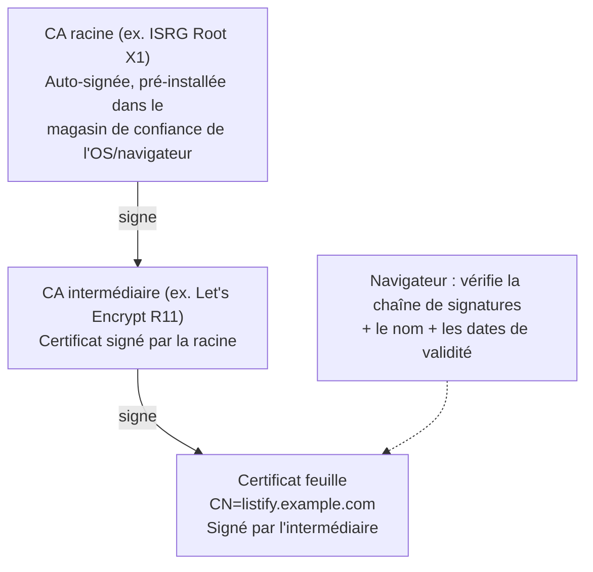

# Chapitre 3 : Le réseau pour le déploiement

!!! abstract "Objectifs du chapitre"
    À l'issue de ce chapitre, vous saurez :

    - suivre le trajet complet d'une requête HTTP à travers le modèle TCP/IP ;
    - expliquer ports, sockets et l'écoute d'un service, et diagnostiquer avec `ss` et `curl` ;
    - décrire la résolution DNS et le rôle du NAT (y compris dans VirtualBox) ;
    - configurer un pare-feu hôte avec ufw et raisonner en « tout fermer sauf » ;
    - expliquer TLS : chiffrement, certificats, chaîne de confiance, et le principe de Let's Encrypt.

    Ce chapitre est volontairement **appliqué** : pas de théorie exhaustive des réseaux (vous l'avez eue en cours de réseaux), mais tout ce qu'un déploiement mobilise concrètement.

## 1. Le trajet d'une requête : TCP/IP appliqué

Quand un navigateur charge `https://listify.example.com`, voici ce qui se passe réellement. Ce déroulé est le squelette de tout diagnostic réseau : quand « ça ne marche pas », on cherche **quelle étape** échoue.



Le modèle TCP/IP en quatre couches donne la grille de lecture, chaque couche ayant son identifiant et ses outils de diagnostic :

| Couche | Rôle | Identifiant | Protocoles | Outils de diagnostic |
|---|---|---|---|---|
| Application | Le dialogue métier | URL, nom de domaine | HTTP, DNS, SSH, TLS | `curl`, `dig`, journaux applicatifs |
| Transport | Multiplexer les conversations, fiabilité | **Port** | TCP, UDP | `ss`, `nc` |
| Internet | Acheminer entre réseaux | **Adresse IP** | IP, ICMP | `ping`, `ip route`, `traceroute` |
| Accès réseau | Le lien physique/local | Adresse MAC | Ethernet, Wi-Fi | `ip link`, `ip neigh` |

!!! tip "La méthode de diagnostic ascendante"
    Devant « le site ne répond pas », on remonte les couches dans l'ordre : la machine est-elle joignable (`ping`) ? Le port est-il ouvert (`nc -zv IP 443`) ? Un service écoute-t-il dessus (`ss -tlnp` sur le serveur) ? Le service répond-il correctement (`curl -v`) ? Chaque étape qui réussit innocente une couche. Cette méthode est exigée en soutenance.

## 2. Ports et sockets : comment un service « écoute »

### 2.1 Le port : multiplexer une adresse IP

Une machine n'a (en général) qu'une adresse IP, mais des dizaines de services. Le **port** (un entier de 0 à 65535) départage : le trafic vers `203.0.113.10:5432` va à PostgreSQL, vers `:443` à Nginx. Conventions à connaître :

- **Ports < 1024** : « privilégiés », réservés historiquement à root (nous verrons au S2 que le rootless de Podman se heurte précisément à cette règle). Standards : 22 SSH, 53 DNS, 80 HTTP, 443 HTTPS.
- **Ports enregistrés** usuels : 5432 PostgreSQL, 3306 MySQL, 6379 Redis, 8000/8080 serveurs d'application en développement.

### 2.2 La socket et la notion d'écoute

Une **socket** est le point de communication qu'un processus demande au noyau. Un serveur fait trois appels systèmes : `bind` (s'attacher à une adresse et un port), `listen` (se déclarer prêt à accepter), `accept` (accepter chaque connexion entrante). D'où le vocabulaire : un service **écoute** sur un port.

Le détail qui change tout en déploiement, c'est **l'adresse de bind** :

| Bind sur... | Signification | Usage |
|---|---|---|
| `127.0.0.1:8000` | N'accepte que les connexions **locales** (loopback) | Gunicorn derrière Nginx : le backend n'est pas exposé au réseau |
| `0.0.0.0:443` | Accepte les connexions de **toutes les interfaces** | Nginx, le seul service volontairement public |
| `10.0.2.15:5432` | N'accepte que via cette interface précise | PostgreSQL sur le réseau privé inter-VM (bloc 2) |

C'est une décision de **sécurité** avant d'être une décision technique : au TP 2, PostgreSQL et Gunicorn n'écouteront que sur `127.0.0.1`. Même sans pare-feu, ils seraient injoignables de l'extérieur.

```bash
# Qui écoute sur quoi ? LA commande à connaître :
sudo ss -tlnp
# -t TCP, -l sockets en écoute, -n ports numériques, -p processus propriétaire
# Exemple de sortie :
# LISTEN  0  244   127.0.0.1:5432   0.0.0.0:*   users:(("postgres",pid=612,...))
# LISTEN  0  2048  127.0.0.1:8000   0.0.0.0:*   users:(("gunicorn",pid=845,...))
# LISTEN  0  511     0.0.0.0:443    0.0.0.0:*   users:(("nginx",pid=901,...))
```

!!! example "Exemple travaillé : lire une erreur de connexion"
    Deux erreurs `curl` différentes, deux diagnostics différents :

    - `Connection refused` : le paquet est **arrivé**, mais aucun processus n'écoute sur ce port (ou un pare-feu a répondu REJECT). Vérifier `ss -tlnp` : le service est-il démarré ? écoute-t-il sur la bonne adresse ?
    - `Connection timed out` : **aucune réponse**. Machine éteinte, mauvaise IP, ou pare-feu qui jette silencieusement (DROP). Vérifier `ping`, puis le pare-feu.

    Sachez réciter cette distinction : elle départage la moitié des pannes réseau du parcours.

## 3. DNS : des noms aux adresses

### 3.1 La résolution

Le DNS (*Domain Name System*) est l'annuaire distribué et hiérarchique qui traduit `listify.example.com` en `203.0.113.10`. La résolution complète interroge en cascade : serveurs racine → serveurs du TLD (`.com`) → serveurs faisant autorité pour `example.com`. En pratique, votre machine délègue tout cela à un **résolveur** (celui du réseau, ou 1.1.1.1, 9.9.9.9...) qui met les réponses en **cache** pendant la durée du **TTL** de chaque enregistrement.

Enregistrements à connaître pour le déploiement :

| Type | Contenu | Exemple |
|---|---|---|
| **A** | Nom → adresse IPv4 | `listify.example.com. 300 IN A 203.0.113.10` |
| **AAAA** | Nom → adresse IPv6 | idem en IPv6 |
| **CNAME** | Nom → autre nom (alias) | `www` → `listify.example.com.` |
| **MX** | Serveurs de courriel du domaine | |
| **TXT** | Texte libre : preuves de propriété, anti-spam (SPF), et... validation Let's Encrypt | |

```bash
dig +short listify.example.com A      # interroger le résolveur
dig @1.1.1.1 example.com ANY          # interroger un résolveur précis
resolvectl status                      # quel résolveur ma machine utilise-t-elle ?
```

### 3.2 Avant le DNS : /etc/hosts

La résolution commence par un fichier local, `/etc/hosts` : des lignes `IP nom`. C'est l'outil parfait des TP (pas de domaine public à acheter) et il servira de « DNS interne » du bloc 2 :

```text
# Sur le poste hôte, pour joindre la VM par un nom :
192.168.56.10   listify.local
```

!!! warning "Le TTL et les migrations"
    Culture d'exploitation : quand on change l'adresse IP d'un service, le monde entier ne le voit qu'à l'expiration des caches (TTL). Toute migration sérieuse commence par abaisser le TTL à 300 s quelques jours avant. Les pannes « ça marche chez moi mais pas chez lui » post-migration sont presque toujours des caches DNS.

## 4. NAT : plusieurs machines derrière une adresse

Le NAT (*Network Address Translation*) permet à des machines aux **adresses privées** (plages réservées par la RFC 1918 : `10.0.0.0/8`, `172.16.0.0/12`, `192.168.0.0/16`) de sortir sur Internet via une unique adresse publique : le routeur réécrit les adresses source et maintient une table des connexions.

Conséquence structurante : le NAT est **asymétrique**. Les machines privées peuvent initier des connexions sortantes, mais rien ne peut les joindre de l'extérieur sans une règle explicite de **redirection de port** (*port forwarding*).

Vous vivez ce phénomène dès le TP 1, car VirtualBox reproduit exactement ce schéma :



En mode NAT, la VM (10.0.2.15) sort librement (téléchargements APT) mais est injoignable depuis l'hôte, sauf redirections déclarées : port hôte 2222 → port invité 22 pour SSH, 8443 → 443 pour HTTPS au TP 3. Le mode **host-only** (réseau `192.168.56.0/24` partagé entre hôte et VM, sans accès Internet) complétera au bloc 2.

## 5. Le pare-feu

### 5.1 Le principe : une politique par défaut, des exceptions

Un pare-feu hôte filtre les paquets entrants et sortants selon des règles. La seule politique défendable pour un serveur : **tout refuser en entrée par défaut**, puis ouvrir explicitement le strict nécessaire (*default deny*). La liste des ports ouverts devient alors la définition exacte de votre **surface d'attaque** réseau ([chapitre 5](05-securite-de-base.md)).

Sous Linux, le filtrage est fait par le noyau (framework **netfilter**), configuré historiquement par `iptables`, aujourd'hui par `nftables`. Ces outils sont puissants mais verbeux ; **ufw** (*Uncomplicated Firewall*, un frontal à iptables/nftables) suffit à nos besoins et sera l'outil des TP :

```bash
sudo ufw default deny incoming     # politique : tout refuser en entrée
sudo ufw default allow outgoing    # ...et tout autoriser en sortie
sudo ufw allow 22/tcp              # exception : SSH
sudo ufw allow 80/tcp              # HTTP (pour la redirection vers HTTPS)
sudo ufw allow 443/tcp             # HTTPS
sudo ufw enable                    # activer (persiste au reboot)
sudo ufw status verbose            # relire la politique
```

!!! danger "Ne jamais s'enfermer dehors"
    Règle d'or sur toute machine distante : **autoriser SSH (22/tcp) AVANT `ufw enable`**. Activer un pare-feu « default deny » sans exception SSH coupe votre propre connexion : sur un vrai serveur, il faudrait un accès console physique pour réparer. En TP vous avez la console VirtualBox, mais prenez le réflexe professionnel tout de suite.

### 5.2 DROP ou REJECT ?

Deux façons de refuser un paquet : **REJECT** répond « non » (le client reçoit *connection refused* immédiatement), **DROP** jette sans répondre (le client attend jusqu'au *timeout*). REJECT est plus poli et plus débogable en interne ; DROP ne donne aucune information à un scanner externe. ufw applique DENY (drop) par défaut : c'est pourquoi la distinction refused/timeout de la section 2.2 est si informative en diagnostic.

## 6. TLS : chiffrer et authentifier

### 6.1 Les deux garanties de TLS

Servir Listify en HTTP nu signifie que tout intermédiaire (Wi-Fi public, FAI, proxy d'entreprise) peut **lire** (mots de passe inclus) et **modifier** (injection de contenu) le trafic. TLS (*Transport Layer Security*, successeur de SSL[^1]) apporte deux garanties distinctes, et l'examen exige de ne pas les confondre :

1. **Confidentialité et intégrité** : la session est chiffrée. Techniquement : un échange de clés asymétrique (aujourd'hui des courbes elliptiques, X25519) établit une clé de session, puis un chiffrement symétrique rapide (AES-GCM, ChaCha20-Poly1305) protège les données.
2. **Authentification du serveur** : la preuve que vous parlez bien à `listify.example.com` et non à un imposteur interposé (attaque de l'homme du milieu). C'est le rôle du **certificat**.

[^1]: SSL (1995, Netscape) est l'ancêtre déprécié ; le nom survit dans le langage courant (« certificat SSL ») et dans OpenSSL. Les versions actuelles sont TLS 1.2 (2008, RFC 5246) et TLS 1.3 (2018, RFC 8446), les seules qu'un serveur moderne devrait accepter.

### 6.2 Certificats et chaîne de confiance (PKI)

Un **certificat** X.509 lie une **clé publique** à une **identité** (un nom de domaine), le tout **signé** par une **autorité de certification** (CA, *Certificate Authority*). La confiance fonctionne en chaîne :



Le navigateur vérifie : la signature de chaque maillon, que la racine est dans son **magasin de confiance** (quelques dizaines de CA pré-installées avec l'OS ou le navigateur), que le nom du certificat correspond au domaine demandé, et les dates de validité. Cette infrastructure (CA, certificats, révocation) s'appelle une **PKI** (*Public Key Infrastructure*).

Un certificat **auto-signé** (signé par sa propre clé, sans CA) chiffre parfaitement la session mais ne prouve rien : le navigateur affiche l'avertissement que vous verrez au TP 3. Utilisable en interne et en TP, jamais pour un service public.

### 6.3 Let's Encrypt : les certificats automatisés et gratuits

Jusqu'en 2015, un certificat s'achetait (des dizaines d'euros par an) via une procédure manuelle : l'une des raisons pour lesquelles la moitié du web restait en HTTP. **Let's Encrypt** (fondation ISRG, soutenue par Mozilla, l'EFF, Cisco...) a tout changé avec trois choix :

- **Gratuit** : plus de barrière économique.
- **Automatisé** : le protocole **ACME** (RFC 8555) automatise la preuve de contrôle du domaine. Deux défis (*challenges*) principaux : **HTTP-01** (déposer un fichier prouvant le contrôle à une URL du domaine, vérifiée par la CA) ou **DNS-01** (poser un enregistrement TXT ; requis pour les certificats *wildcard*).
- **Courte durée** (90 jours) : ce qui paraît une contrainte est une décision d'architecture : la durée courte **force l'automatisation du renouvellement** (l'outil `certbot`, via un timer systemd) et limite la fenêtre d'exploitation d'une clé volée. Retenez le principe général : *ce qui expire vite doit être automatisé, et ce qui est automatisé peut expirer vite.*

Résultat mesurable : plus de 80 % des pages web sont aujourd'hui chargées en HTTPS. En TP, faute de domaine public joignable par Let's Encrypt, vous utiliserez un certificat auto-signé et documenterez dans votre runbook la marche à suivre certbot pour la production.

## Ce qu'il faut retenir

1. Diagnostic réseau = remonter les couches : `ping` (IP) → `nc`/`ss` (port ouvert et écouté) → `curl -v` (application). *Refused* = arrivé mais personne n'écoute ; *timeout* = rien ne répond (souvent un DROP).
2. L'**adresse de bind** est une décision de sécurité : `127.0.0.1` pour les services internes (Gunicorn, PostgreSQL), `0.0.0.0` uniquement pour le point d'entrée public (Nginx).
3. DNS : enregistrements A/CNAME/TXT, caches et TTL ; `/etc/hosts` passe avant le DNS et sert de résolution interne en TP.
4. Le NAT est asymétrique : sortie libre, entrée uniquement par redirection de port explicite ; c'est le modèle réseau par défaut de VirtualBox.
5. Pare-feu : *default deny* en entrée, exceptions minimales ; SSH **avant** `ufw enable` ; la liste des ports ouverts = la surface d'attaque réseau.
6. TLS garantit confidentialité **et** authentification ; celle-ci repose sur la chaîne de certification (feuille ← intermédiaire ← racine du magasin de confiance). Auto-signé = chiffré mais non authentifié. Let's Encrypt/ACME = certificats gratuits, prouvés par challenge, renouvelés automatiquement (90 jours).

## Bibliographie du chapitre

### Sources primaires

- RFC 9293, *Transmission Control Protocol (TCP)*, 2022 (la spécification TCP consolidée) ; RFC 1918, *Address Allocation for Private Internets*, 1996 ; RFC 8446, *TLS 1.3*, 2018 ; RFC 8555, *ACME*, 2019. Toutes sur [rfc-editor.org](https://www.rfc-editor.org/). On ne lit pas une RFC comme un roman : on y vérifie un point précis.
- Let's Encrypt, « How It Works » : [letsencrypt.org/how-it-works](https://letsencrypt.org/how-it-works/). L'explication officielle d'ACME, courte et limpide.
- Documentation ufw : `man ufw` et le wiki Ubuntu [help.ubuntu.com/community/UFW](https://help.ubuntu.com/community/UFW).

### Lectures recommandées

- Julia Evans, *Networking! ACK!* (zine, 2021) et les billets associés sur [jvns.ca](https://jvns.ca/) : la meilleure vulgarisation existante de TCP, DNS et sockets, dessinée, rigoureuse.
- Ilya Grigorik, *High Performance Browser Networking*, O'Reilly, 2013, gratuit en ligne : [hpbn.co](https://hpbn.co/). Chapitres 1 à 4 : latence, TCP, TLS, du point de vue des applications web.
- Evi Nemeth et al., *UNIX and Linux System Administration Handbook*, 5ᵉ éd., chapitres 13 (réseau TCP/IP) et 27 (sécurité), pour approfondir netfilter.

### Pour aller plus loin

- Josh Aas et al., « Let's Encrypt: An Automated Certificate Authority to Encrypt the Entire Web », *ACM CCS*, 2019 : le papier académique racontant la conception de Let's Encrypt.
- Le magasin de CA de votre propre machine : explorez `/etc/ssl/certs/` et le paquet `ca-certificates`. Qui décide de ce qui s'y trouve ? Cherchez « CA/Browser Forum » et l'affaire DigiNotar (2011) pour mesurer les enjeux.
