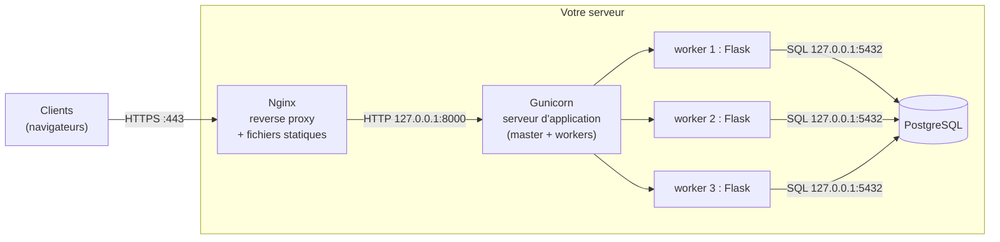
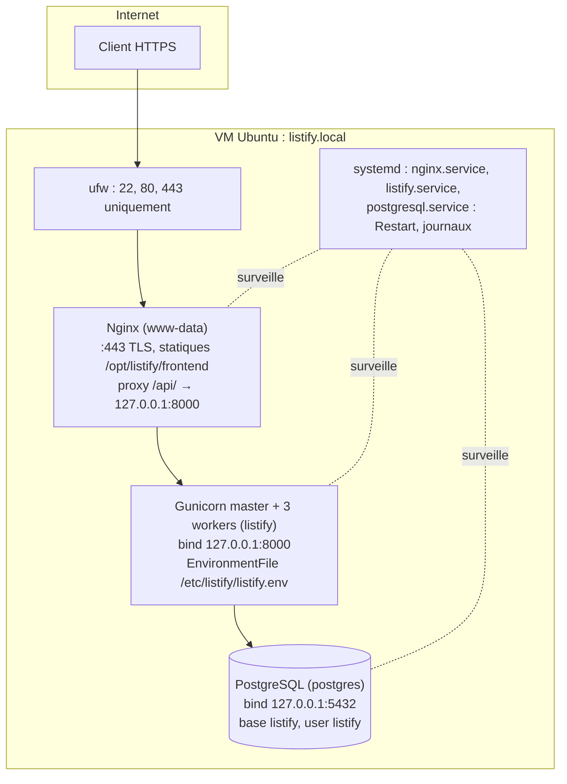

# Chapitre 4 : Architecture d'une application web déployée

!!! abstract "Objectifs du chapitre"
    À l'issue de ce chapitre, vous saurez :

    - expliquer pourquoi on place un reverse proxy (Nginx) devant un serveur d'application (Gunicorn) ;
    - décrire le modèle processus/workers et dimensionner un pool de workers ;
    - justifier la séparation fichiers statiques / API ;
    - appliquer les facteurs 1 à 5 des « 12-factor apps », en particulier la configuration par l'environnement.

    C'est le chapitre d'architecture du bloc : il explique le **pourquoi** de tout ce que vous câblerez au [TP 3](../tp/tp3-frontend-nginx-tls.md).

## 1. Du code au processus : que déploie-t-on exactement ?

En développement, vous lancez `flask run` et tout semble simple. Ce serveur de développement est **monoprocessus, monothread, non durci** : la documentation Flask elle-même interdit de l'utiliser en production.[^1] Déployer, c'est répondre à quatre questions que le développement ignore :

[^1]: « Do not use the development server when deploying to production. It is intended for use only during local development. » : Flask, documentation officielle, section « Deploying to Production ».

1. **Concurrence** : comment servir 200 requêtes simultanées avec un langage qui, comme Python, n'exécute qu'un flot à la fois par processus ?
2. **Robustesse** : que se passe-t-il quand une requête plante ou ne termine jamais ?
3. **Exposition** : qui parle au réseau public, avec quelles protections (TLS, limites, timeouts) ?
4. **Performance** : qui sert les 500 Ko de fichiers statiques sans mobiliser Python ?

La réponse de l'industrie est une **chaîne de trois rôles**, chacun faisant ce qu'il fait le mieux :



## 2. Le serveur d'application : Gunicorn et le modèle workers

### 2.1 WSGI : l'interface standard

Comment Gunicorn « branche-t-il » Flask ? Par **WSGI** (*Web Server Gateway Interface*, PEP 3333) : une convention Python qui définit comment un serveur transmet une requête HTTP à une application et récupère la réponse. Flask, Django ou notre `app.py` exposent un objet WSGI (`wsgi:app` dans notre commande) ; Gunicorn, uWSGI ou mod_wsgi savent l'appeler. Serveur et framework sont ainsi interchangeables indépendamment : c'est un exemple canonique d'**interface de découplage**, motif que vous reverrez sans cesse (OCI au S2, pyfunc au S3).

Le monde asynchrone a son équivalent, **ASGI** (FastAPI, uvicorn) : même idée, avec des applications capables de gérer plusieurs requêtes par processus. Node.js, lui, n'a pas besoin de cette séparation (son runtime est nativement un serveur événementiel), mais on met *aussi* Nginx devant Node : les raisons du reverse proxy (section 3) ne tiennent pas au langage.

### 2.2 Le modèle pre-fork : un master, des workers

Gunicorn suit le modèle **pre-fork** : un processus **master** démarre, charge la configuration, ouvre la socket d'écoute, puis **fork** N processus **workers** identiques qui acceptent chacun des connexions sur cette socket partagée. Le master ne traite aucune requête : il surveille.

Ce modèle apporte trois propriétés d'exploitation majeures :

- **Parallélisme réel** : N workers = N requêtes traitées simultanément, sur N cœurs, sans se soucier du GIL de Python (chaque worker est un processus séparé, mémoire isolée).
- **Auto-réparation locale** : un worker qui crashe ou dépasse le timeout (30 s par défaut) est tué et remplacé par le master. Une requête empoisonnée ne tue pas le service. (Encore l'auto-réparation : après `Restart=` de systemd, avant les ReplicaSets de Kubernetes : notez la gradation : systemd relance le master, le master relance les workers.)
- **Rechargement gracieux** : sur signal `HUP`, le master recharge le code et remplace les workers un par un, sans refuser de connexions : votre premier « déploiement sans interruption ».

### 2.3 Dimensionner les workers

Combien de workers ? La recommandation Gunicorn : **(2 × nombre de cœurs) + 1**.[^2] L'intuition : pour chaque cœur, un worker calcule pendant qu'un autre attend une entrée/sortie (la base de données, typiquement) ; le +1 lisse les transitions.

[^2]: Documentation Gunicorn, « How Many Workers? » : [docs.gunicorn.org/en/stable/design.html](https://docs.gunicorn.org/en/stable/design.html).

!!! example "Exemple travaillé : la VM du TP"
    Notre VM a 2 vCPU : (2 × 2) + 1 = **5 workers** maximum raisonnable ; nous en configurons 3 pour laisser du CPU à PostgreSQL et Nginx qui partagent la machine. Chaque worker Flask consomme ~60 Mo : 3 × 60 = 180 Mo, tenable dans nos 2 Go. À l'inverse, calibrer 20 workers « pour être large » consommerait 1,2 Go pour rien et provoquerait une contention CPU : **plus de workers n'est pas plus de performance** au-delà du point d'équilibre. Chaque worker ouvre aussi ses connexions PostgreSQL : le pool de connexions de la base (par défaut `max_connections=100`) devient une limite système à l'échelle du bloc 2, quand plusieurs backends se la partageront.

## 3. Le reverse proxy : pourquoi Nginx devant ?

### 3.1 Proxy et reverse proxy

Un *forward proxy* est mandaté par des **clients** pour sortir (le proxy d'entreprise). Un **reverse proxy** est mandaté par des **serveurs** pour recevoir : il est le point d'entrée public, reçoit toutes les requêtes et les relaie aux services internes. Le client ne sait même pas qu'il existe.

### 3.2 Les sept raisons de mettre Nginx devant Gunicorn

Question d'examen classique ; sachez en développer au moins cinq.

1. **Terminaison TLS** : Nginx gère certificats et chiffrement en un seul endroit ; le trafic interne continue en HTTP simple sur 127.0.0.1. Les applications n'ont jamais à manipuler de clés.
2. **Fichiers statiques** : servir `index.html`, CSS, JS et images est du pur débit disque→réseau. Nginx (C, événementiel, `sendfile`) le fait des dizaines de fois plus efficacement qu'un worker Python, qu'il serait absurde de mobiliser pour cela.
3. **Protection contre les clients lents** (*slow clients*) : un client sur mobile 3G qui met 30 s à envoyer sa requête occuperait un worker Gunicorn pendant 30 s (attaque *slowloris*, volontaire ou non). Nginx, événementiel, absorbe des milliers de connexions lentes, **bufferise** la requête complète, puis la transmet d'un bloc au worker qui n'est occupé que quelques millisecondes. C'est la raison la moins connue et la plus importante : la documentation Gunicorn exige un proxy bufferisant.
4. **Point d'entrée unique et routage** : `/` vers les statiques, `/api/` vers le backend, demain `/admin/` vers un autre service. Le navigateur ne voit qu'une origine : pas de problèmes CORS, et la topologie interne peut changer sans que les clients le sachent (c'est pour cela que `app.js` appelle `/api` en relatif).
5. **Répartition de charge** : demain (bloc 2), `proxy_pass` pointera vers plusieurs backends avec health checks : l'architecture est déjà prête.
6. **Contrôles d'entrée** : limitation de débit (`limit_req`), taille maximale des corps (`client_max_body_size`), timeouts, filtrage d'en-têtes : le videur à l'entrée de la boîte.
7. **Résilience d'affichage** : si Gunicorn est en cours de redémarrage, Nginx peut répondre une page d'erreur propre (502) ou servir du cache, au lieu de connexions refusées.

### 3.3 La configuration de référence du TP 3

```nginx title="/etc/nginx/sites-available/listify (extrait commenté)"
server {
    listen 443 ssl;
    server_name listify.local;

    ssl_certificate     /etc/nginx/ssl/listify.crt;
    ssl_certificate_key /etc/nginx/ssl/listify.key;

    # Tier 1 : les statiques, servis directement depuis le disque
    root /opt/listify/frontend;
    index index.html;
    location / {
        try_files $uri $uri/ =404;
    }

    # Tier 2 : l'API, relayée au serveur d'application
    location /api/ {
        proxy_pass http://127.0.0.1:8000;
        # Transmettre au backend la réalité du client d'origine :
        proxy_set_header Host              $host;
        proxy_set_header X-Real-IP         $remote_addr;
        proxy_set_header X-Forwarded-For   $proxy_add_x_forwarded_for;
        proxy_set_header X-Forwarded-Proto $scheme;
    }
}
```

Les en-têtes `X-Forwarded-*` répondent à un problème subtil : pour Gunicorn, **tous** les clients semblent être 127.0.0.1 (c'est Nginx qui se connecte). Ces en-têtes transmettent l'adresse réelle et le protocole d'origine, indispensables pour les journaux, la limitation par IP et la génération d'URL absolues. Corollaire de sécurité : le backend ne doit faire confiance à ces en-têtes que s'ils viennent du proxy, pas d'Internet.

## 4. La configuration : les 12-factor apps (facteurs I à V)

En 2011, les ingénieurs de Heroku publient *The Twelve-Factor App*[^3] : douze principes pour des applications « prêtes au déploiement ». Douze ans plus tard, c'est toujours la référence, précisément parce que ces principes ne dépendent d'aucun outil. Les facteurs 1 à 5 concernent directement notre bloc ; les autres seront vus au S2.

[^3]: Adam Wiggins, *The Twelve-Factor App*, 2011, [12factor.net/fr](https://12factor.net/fr/) (traduction française disponible).

**I. Codebase** : *une* base de code par application, suivie en versionnage, d'où partent *tous* les déploiements. Pas de « version corrigée directement sur le serveur » : le drame que vous vivrez au TP 4 et que Git + Ansible résoudront au bloc 3.

**II. Dépendances** : déclarées explicitement et complètement (`requirements.txt` épinglé), installées dans un environnement isolé (venv). Jamais de dépendance implicite au système : « il faut que lxml soit déjà là » n'est pas une dépendance déclarée, c'est un piège pour celui qui redéploie.

**III. Configuration** : **tout ce qui varie entre les déploiements** (adresses des services, identifiants, options) est **hors du code, dans l'environnement**. Le test de validité proposé par le texte original : pourriez-vous publier votre code en open source à l'instant sans divulguer aucun secret ? Notre `app.py` lit `DB_HOST` et `DB_PASSWORD` dans l'environnement précisément pour cela : le même code, sans modification ni rebuild, tournera sur votre VM (S1), en conteneur (S2), dans Kubernetes (config par ConfigMap/Secret) et dans le pipeline de CI. La configuration change, jamais le code.

**IV. Services externes** (*backing services*) : la base de données, le cache, le service de courriel sont des **ressources attachées**, désignées par leur adresse de configuration. Passer d'un PostgreSQL local à un PostgreSQL sur une autre VM (bloc 2) = changer `DB_HOST`. Rien d'autre.

**V. Build, release, run** : séparer strictement **build** (compiler, empaqueter : produit un artefact), **release** (artefact + configuration d'un environnement) et **run** (exécuter la release). On ne modifie jamais le code au stade run : on reconstruit. Cette séparation, embryonnaire au bloc 1 (notre « build » est un `git clone` + `pip install`), deviendra physique au S2 : l'image de conteneur est l'artefact de build, immuable par construction.

!!! example "Exemple travaillé : l'anti-pattern et sa correction"
    Anti-pattern vu dans d'innombrables projets étudiants : `DB_PASSWORD = "supersecret"` dans `settings.py`, commité dans Git. Conséquences en chaîne : le secret est dans l'historique Git pour toujours (même « supprimé » au commit suivant) ; impossible d'avoir un mot de passe différent en dev et en prod sans deux versions du code ; toute personne ayant accès au dépôt a accès à la production. Correction 12-factor, celle du TP 2 : le code lit `os.environ["DB_PASSWORD"]` ; la valeur vit dans `/etc/listify/listify.env` (permissions 640, root:listify), référencé par l'unité systemd via `EnvironmentFile=`. Le dépôt Git ne contient que le code et un `listify.env.example` sans valeurs réelles.

## 5. Vue d'ensemble : le déploiement complet du bloc 1

Le schéma-bilan à savoir redessiner de mémoire (il tombe à l'examen sous la forme « dessinez et justifiez chaque composant ») :



Trois utilisateurs système distincts, trois services systemd, un seul port applicatif exposé, zéro secret dans le code : chaque choix de ce schéma découle d'un principe vu dans les chapitres 2 à 4.

## Ce qu'il faut retenir

1. Le serveur de développement n'est pas déployable ; la production sépare **reverse proxy** (exposition, TLS, statiques, protection) et **serveur d'application** (exécuter le code), reliés par l'interface standard **WSGI**.
2. Modèle **pre-fork** : un master qui surveille, N workers qui traitent ; dimensionnement ≈ 2×cœurs+1, borné par la RAM et les connexions à la base. Auto-réparation à trois étages : master → workers, systemd → master, (bientôt) orchestrateur → machines.
3. Nginx devant Gunicorn : terminaison TLS, statiques, **bufferisation des clients lents**, routage à origine unique, et l'ossature déjà prête pour la répartition de charge.
4. `X-Forwarded-For`/`-Proto` transmettent la réalité du client à travers le proxy ; ne s'y fier que depuis le proxy.
5. 12-factor I-V : une codebase, dépendances déclarées et isolées, **configuration dans l'environnement** (test : « open-sourçable à l'instant ? »), services externes = ressources attachées, build/release/run séparés.

## Bibliographie du chapitre

### Sources primaires

- Adam Wiggins, *The Twelve-Factor App*, 2011 : [12factor.net/fr](https://12factor.net/fr/). Lecture obligatoire des facteurs I à V (15 minutes) ; le reste sera relu au S2.
- PEP 3333, *Python Web Server Gateway Interface v1.0.1* : [peps.python.org/pep-3333](https://peps.python.org/pep-3333/).
- Documentation Gunicorn : « Design » (le modèle pre-fork) et « Deploying Gunicorn » (qui exige un proxy bufferisant) : [docs.gunicorn.org](https://docs.gunicorn.org/en/stable/).
- Documentation Nginx : « NGINX Reverse Proxy » et le guide du débutant : [nginx.org/en/docs](https://nginx.org/en/docs/).

### Lectures recommandées

- Flask, « Deploying to Production » : [flask.palletsprojects.com](https://flask.palletsprojects.com/en/stable/deploying/) : court, et énumère exactement notre chaîne Nginx + Gunicorn.
- Ilya Grigorik, *High Performance Browser Networking*, chapitres 9-10 (HTTP/1.1 et HTTP/2) : pourquoi les connexions persistantes et le multiplexage changent le travail du proxy.
- Betsy Beyer et al., *Site Reliability Engineering*, chapitre 19 (« Load Balancing at the Frontend ») : la version « échelle Google » de la section 3, en préparation du bloc 2.

### Pour aller plus loin

- L'attaque Slowloris expliquée par son auteur (RSnake, 2009) et la parade par bufferisation : cherchez « slowloris nginx mitigation ». Reliez-la à la raison n° 3 du reverse proxy.
- Comparaison des modèles de concurrence serveur : le classique « The C10K problem » de Dan Kegel (1999-2011), à l'origine des architectures événementielles comme celle de Nginx.
