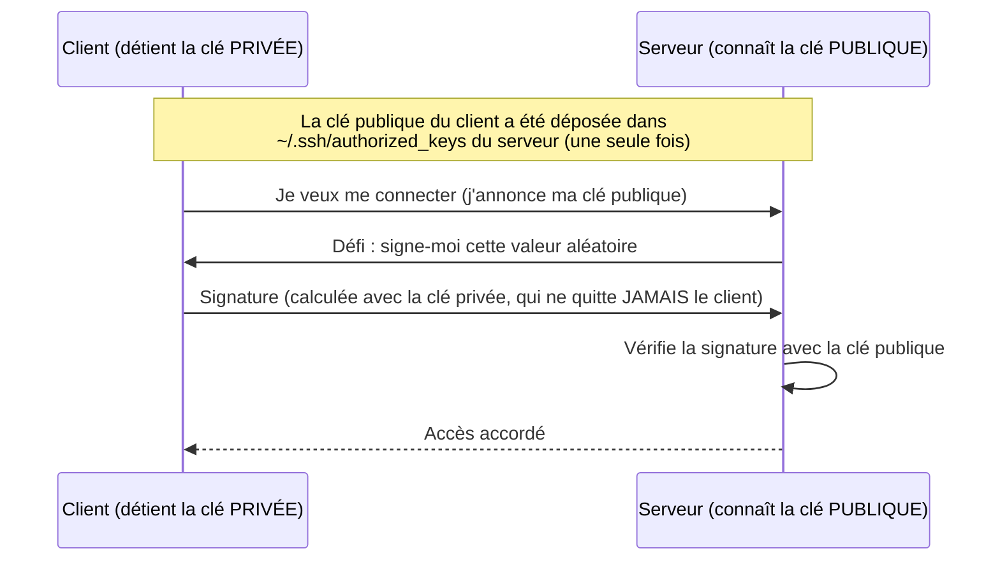

# Chapitre 5 : Sécurité de base

!!! abstract "Objectifs du chapitre"
    À l'issue de ce chapitre, vous saurez :

    - expliquer le fonctionnement de l'authentification SSH par clés et durcir un serveur SSH ;
    - appliquer le principe du moindre privilège aux utilisateurs, processus et réseaux ;
    - analyser la surface d'attaque d'un serveur et la réduire méthodiquement.

    Ce chapitre est enseigné en deux temps : la partie SSH dès la semaine 1 (nécessaire au [TP 1](../tp/tp1-vm-ssh-durcissement.md)), le reste en synthèse de bloc.

## 1. SSH : la porte d'entrée de tous vos serveurs

### 1.1 Ce qu'est SSH

SSH (*Secure Shell*, RFC 4251 et suivantes) est **le** protocole d'administration à distance : un canal chiffré et authentifié vers un shell (ou un transfert de fichiers : scp/sftp, ou un tunnel). Tout ce que vous ferez sur des serveurs pendant trois semestres passera par SSH, directement (TP) ou en dessous (Ansible est « du SSH industrialisé », Vagrant vous ouvre des SSH...). Le service côté serveur est `sshd` (paquet `openssh-server`), configuré dans `/etc/ssh/sshd_config`.

### 1.2 Mots de passe vs clés : pourquoi les clés gagnent toujours

L'authentification par mot de passe a deux défauts rédhibitoires sur un serveur exposé : elle est **devinable** (les robots essaient des millions de combinaisons en continu sur tout port 22 ouvert d'Internet ; regardez `journalctl -u ssh` sur n'importe quel serveur public : des milliers de tentatives par jour) et elle **transite** (le serveur, ou un faux serveur, la reçoit en clair dans le canal).

L'authentification **par clés** repose sur la cryptographie asymétrique :



Propriétés décisives : la clé privée **ne transite jamais** ; rien n'est devinable par force brute en ligne ; une clé se révoque en supprimant une ligne de `authorized_keys` ; et chaque personne a la sienne (traçabilité), là où un mot de passe partagé est anonyme.

```bash
# Génération (sur VOTRE poste, jamais sur le serveur) :
ssh-keygen -t ed25519 -C "prenom.nom@ecole.fr"
# -t ed25519 : l'algorithme recommandé aujourd'hui (courbes elliptiques,
#   clés courtes, rapide, sans les pièges de paramétrage de RSA)
# La passphrase demandée chiffre la clé privée SUR DISQUE : si on vole votre
# portable, la clé est inutilisable. Mettez-en une.

# Dépôt sur le serveur (une fois, tant que le mot de passe est encore permis) :
ssh-copy-id deploy@192.168.56.10
# Ensuite :
ssh deploy@192.168.56.10   # connexion sans mot de passe du serveur
```

!!! warning "La clé privée est un secret absolu"
    `~/.ssh/id_ed25519` ne se copie pas, ne s'envoie pas par mail, ne se commite pas dans Git (des robots scannent GitHub en permanence pour ça). Ce qui se partage, c'est `id_ed25519.pub`, la clé **publique**. SSH refuse d'ailleurs d'utiliser une clé privée lisible par d'autres (`chmod 600` obligatoire).

### 1.3 La vérification de l'hôte : l'autre sens de l'authentification

À la première connexion, SSH affiche l'empreinte de la clé **du serveur** et demande confirmation, puis la mémorise (`~/.ssh/known_hosts`). Si elle change un jour : `WARNING: REMOTE HOST IDENTIFICATION HAS CHANGED`. Neuf fois sur dix c'est une VM réinstallée (votre quotidien en TP : la solution propre est `ssh-keygen -R <ip>`) ; mais la dixième, c'est une attaque de l'homme du milieu : ne prenez jamais l'habitude d'ignorer cet avertissement sans comprendre pourquoi il apparaît.

### 1.4 Durcissement de sshd

Le durcissement du TP 1, dans `/etc/ssh/sshd_config` (ou mieux : un fichier dédié `/etc/ssh/sshd_config.d/50-hardening.conf`) :

```text title="/etc/ssh/sshd_config.d/50-hardening.conf"
# Interdire la connexion directe en root : on se connecte avec son compte
# nominatif, puis on élève avec sudo (traçabilité + pas de compte-cible évident)
PermitRootLogin no

# Une fois les clés en place : supprimer entièrement la surface "mot de passe"
PasswordAuthentication no
KbdInteractiveAuthentication no

# N'autoriser que les comptes prévus pour l'administration
AllowUsers deploy
```

Puis `sudo sshd -t` (**tester la syntaxe** : une erreur ici peut vous enfermer dehors) et `sudo systemctl reload ssh`. Gardez toujours une session SSH ouverte pendant que vous testez la nouvelle configuration depuis une seconde session : si vous vous êtes enfermé, la première session sert de secours.

Compléments professionnels à connaître (traités en démonstration) : `fail2ban` (bannit les IP qui multiplient les échecs), le changement de port (réduit le bruit des robots, mais n'est **pas** une mesure de sécurité : c'est de l'obscurité), et les bastions/jump hosts (un unique point d'entrée SSH durci devant le parc, `ProxyJump` côté client : vous en construirez l'équivalent au bloc 2).

## 2. Le principe du moindre privilège

### 2.1 Énoncé et origine

> Chaque programme et chaque utilisateur du système doit opérer avec le plus petit ensemble de privilèges nécessaire à l'accomplissement de sa tâche.

: Jerome Saltzer et Michael Schroeder, « The Protection of Information in Computer Systems », *Proceedings of the IEEE*, 1975. Un demi-siècle plus tard, ce papier reste la référence des principes de conception sécurisée (avec ses compagnons : *fail-safe defaults*, *economy of mechanism*, *complete mediation*...).

L'idée n'est pas d'empêcher l'attaque : elle finira par arriver. L'idée est de **limiter ce qu'elle rapporte** : si le composant compromis n'avait presque aucun droit, l'attaquant n'a presque rien gagné. On parle de limiter le **rayon d'explosion** (*blast radius*).

### 2.2 Le moindre privilège appliqué à toutes les couches

La force du principe est de s'appliquer identiquement à chaque niveau ; c'est la synthèse de tout le bloc :

| Couche | Application du principe | Vu au |
|---|---|---|
| Comptes humains | Pas de connexion root ; comptes nominatifs + `sudo` ponctuel (et journalisé) | TP 1 |
| Processus | Un utilisateur système par service (`listify`, `postgres`, `www-data`), sans shell | TP 2, ch. 2 |
| Fichiers | Permissions minimales ; le secret `listify.env` en 640 root:listify | TP 2 |
| Base de données | L'utilisateur SQL `listify` n'a de droits que sur SA base, pas de superuser | TP 2 |
| Réseau | Bind sur 127.0.0.1 pour tout ce qui n'est pas public ; ufw *default deny* | TP 2-3, ch. 3 |
| (S2) Conteneurs | Rootless, utilisateurs non-root dans l'image, capabilities réduites | S2 bloc 1 |
| (S2) Orchestrateur | RBAC : chaque composant n'a que les verbes API nécessaires | S2 bloc 2 |

!!! example "Exemple travaillé : dérouler une compromission"
    Exercice type examen : « une faille d'injection dans l'API Listify permet d'exécuter du code arbitraire ; qu'obtient l'attaquant, étape par étape ? » Réponse dans notre architecture : il exécute du code en tant que `listify`. Il peut lire le code de l'application et `listify.env` (donc le mot de passe SQL de la base listify : il lit et modifie **cette** base, dégât réel mais borné). Il ne peut pas : lire `/etc/shadow` (root), toucher les données d'autres bases (l'utilisateur SQL est cantonné), modifier la configuration Nginx ou le pare-feu (root), installer un service persistant (root), ni rebondir facilement (pas d'agent SSH, réseau sortant filtrable). Chaque « ne peut pas » correspond à une décision précise des TP 1-3 : c'est la démonstration que la sécurité est une **architecture**, pas un produit.

### 2.3 sudo : l'élévation contrôlée

`sudo` exécute une commande avec les droits d'un autre utilisateur (root par défaut), selon la politique de `/etc/sudoers` (à éditer exclusivement avec `visudo`, qui valide la syntaxe : un sudoers cassé = plus d'élévation possible du tout). Sur Debian, être membre du groupe `sudo` suffit. Deux vertus par rapport à une session root : chaque commande élevée est **journalisée** avec son auteur réel, et l'élévation est **ponctuelle** : le reste du temps, vos erreurs de frappe n'ont que vos droits.

## 3. La surface d'attaque

### 3.1 Définition et inventaire

La **surface d'attaque** d'un système est l'ensemble des points par lesquels un attaquant peut tenter d'interagir avec lui : ports ouverts, services exposés, comptes existants, logiciels installés (chacun avec ses vulnérabilités potentielles), interfaces d'administration, et... les humains (hameçonnage, hors périmètre de ce cours mais pas de la réalité).

Principe d'ingénierie : **ce qui n'existe pas ne peut pas être attaqué.** Chaque réduction de surface est une classe entière d'attaques éliminée, y compris celles qu'on ne connaît pas encore. D'où la méthode, applicable à tout serveur :

1. **Inventorier ce qui écoute** : `sudo ss -tlnp` : chaque ligne doit être justifiable. Un service inconnu qui écoute = une question à résoudre immédiatement.
2. **Fermer ou confiner** : service inutile → désinstaller ; service interne → bind 127.0.0.1 (ou réseau privé au bloc 2) ; service public → pare-feu + durcissement.
3. **Minimiser l'installé** : c'est la raison de l'installation Debian **minimale** du TP 1 (pas d'interface graphique, pas de services superflus) : moins de paquets = moins de CVE à suivre.
4. **Maintenir à jour** : la majorité des compromissions exploitent des vulnérabilités *déjà corrigées* par l'éditeur. `apt upgrade` régulier, et le paquet `unattended-upgrades` pour les correctifs de sécurité automatiques (installé au TP 1).

### 3.2 Le cas Listify : mesurer la réduction

Comparons deux déploiements de la même application :

| | Déploiement naïf | Notre déploiement (TP 1-3) |
|---|---|---|
| Ports exposés | 22, 80, 5432 (PostgreSQL public !), 8000 (Gunicorn public) | 22, 80 (redirection), 443 |
| SSH | root + mot de passe | clés uniquement, root interdit |
| Processus applicatif | lancé en root « pour simplifier » | utilisateur `listify` sans shell |
| Secrets | dans le code, dans Git | fichier 640 hors dépôt |
| Pare-feu | aucun | default deny + 3 exceptions |

Le déploiement naïf n'est pas une caricature : PostgreSQL exposé sur Internet avec un mot de passe faible reste l'une des causes majeures de fuites de données recensées. Chaque ligne du tableau de droite est un geste précis que vous ferez en TP : la sécurité de base n'est ni chère ni compliquée, elle est une **discipline**.

### 3.3 Défense en profondeur

Dernier principe structurant : aucune mesure n'est fiable seule ; on **superpose** des couches indépendantes, chacune supposant que la précédente a cédé. Notre serveur en est déjà une illustration complète : pare-feu (couche 1) ; si franchi, seuls Nginx durci et sshd à clés écoutent (couche 2) ; si l'application est percée, l'utilisateur système est enfermé (couche 3) ; si la base est lue, les sauvegardes chiffrées hors machine permettent la reconstruction (couche 4, TP 4). Vous retrouverez ce raisonnement en soutenance : face à « que se passe-t-il si X est compromis ? », la bonne réponse énumère les couches restantes.

## Ce qu'il faut retenir

1. SSH par **clés** : la clé privée ne quitte jamais le client et rien n'est devinable ; ed25519 + passphrase ; la clé publique seule se dépose (`authorized_keys`). L'avertissement *host identification changed* mérite toujours dix secondes de réflexion.
2. Durcissement sshd minimal : `PermitRootLogin no`, `PasswordAuthentication no`, `sshd -t` avant reload, une session de secours ouverte pendant les tests.
3. **Moindre privilège** (Saltzer & Schroeder, 1975) : à chaque couche (comptes, processus, fichiers, SQL, réseau), le minimum nécessaire ; l'objectif est de borner le rayon d'explosion, et savoir *dérouler* une compromission hypothétique est un exercice attendu.
4. **Surface d'attaque** : l'inventaire commence par `ss -tlnp` ; réduire = désinstaller, confiner (127.0.0.1), filtrer (ufw), maintenir à jour (`unattended-upgrades`).
5. **Défense en profondeur** : des couches indépendantes, chacune conçue en supposant la chute de la précédente.

## Bibliographie du chapitre

### Sources primaires

- Jerome H. Saltzer, Michael D. Schroeder, « The Protection of Information in Computer Systems », *Proceedings of the IEEE*, vol. 63, n° 9, 1975. Section I.A.3 : les huit principes de conception. [web.mit.edu/Saltzer/www/publications/protection](https://web.mit.edu/Saltzer/www/publications/protection/).
- RFC 4251, *The Secure Shell (SSH) Protocol Architecture*, 2006 ; `man sshd_config`, `man ssh-keygen` : la référence exacte de chaque directive utilisée au TP 1.
- ANSSI, *Recommandations pour un usage sécurisé d'(Open)SSH*, guide NT-007, 2015 : [cyber.gouv.fr](https://cyber.gouv.fr/publications/usage-securise-dopenssh). Le guide de durcissement de référence en français.
- ANSSI, *Recommandations de sécurité relatives à un système GNU/Linux*, guide BP-028 : le pendant système, qui recoupe nos TP 1-2.

### Lectures recommandées

- Evi Nemeth et al., *UNIX and Linux System Administration Handbook*, 5ᵉ éd., chapitre 27 (« Security ») : panorama complet au bon niveau pour ce semestre.
- OWASP, *Top 10 Web Application Security Risks* : [owasp.org/Top10](https://owasp.org/Top10/). Côté application (injection, authentification...) : la face que ce chapitre n'aborde pas, à connaître en tant que développeurs.
- Michael W. Lucas, *SSH Mastery*, 2ᵉ éd., Tilted Windmill Press, 2018 : petit livre entièrement consacré à SSH ; les chapitres sur les clés et l'agent valent l'achat.

### Pour aller plus loin

- fail2ban : documentation et paquet Debian ; à expérimenter sur votre VM en bonus du TP 1.
- Le concept de bastion moderne et l'enregistrement de sessions : cherchez « SSH bastion pattern » ; comparez avec Teleport ou le simple `ProxyJump`.
- Pour mesurer le bruit d'Internet : le projet Shodan (moteur de recherche des services exposés) ; cherchez-y « port:5432 » pour voir combien de PostgreSQL publics existent réellement.
