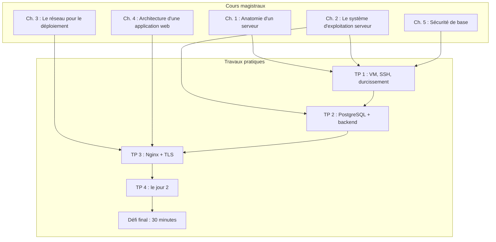

# Bloc 1 : le déploiement « à l'ancienne », tout sur une machine

**Semaines 1 à 5.** Vous allez déployer l'application fil rouge [Listify](../../fil-rouge.md) sur une unique machine virtuelle Ubuntu Server, entièrement à la main : installation du système, base de données, backend en service systemd, reverse proxy Nginx, TLS, sauvegardes. Exactement comme un administrateur système de 2005... et comme, encore aujourd'hui, une part non négligeable des petites structures.

## Pourquoi commencer par là ?

Parce que **tout le reste du parcours est une automatisation de ce bloc**. Ansible écrira pour vous les fichiers que vous allez écrire à la main ; les images de conteneurs figeront les installations que vous allez taper commande par commande ; Kubernetes redémarrera tout seul les services que vous allez surveiller vous-même. Impossible de comprendre ce que ces outils apportent, et surtout de les déboguer, sans avoir fait une fois le travail qu'ils cachent.

À la fin du bloc, l'enseignant vous demandera de redéployer l'application identique sur une VM neuve **en 30 minutes**. Cet exercice est conçu pour être un échec, et cet échec est le vrai livrable du bloc : la démonstration vécue que le déploiement manuel n'est ni reproductible, ni documenté, ni scalable.

## Organisation du bloc

| Semaine | CM | TP |
|---|---|---|
| 1 | [Ch. 1 : Anatomie d'un serveur](cours/01-anatomie-serveur.md) + [Ch. 5 : Sécurité de base](cours/05-securite-de-base.md) (SSH) | [TP 1](tp/tp1-vm-ssh-durcissement.md) : créer et durcir sa VM |
| 2 | [Ch. 2 : Le système d'exploitation serveur](cours/02-systeme-exploitation-serveur.md) | [TP 2](tp/tp2-backend-bdd.md) (début) : PostgreSQL |
| 3 | [Ch. 3 : Le réseau pour le déploiement](cours/03-reseau-deploiement.md) | [TP 2](tp/tp2-backend-bdd.md) (fin) : backend + systemd |
| 4 | [Ch. 4 : Architecture d'une application web déployée](cours/04-architecture-application-web.md) | [TP 3](tp/tp3-frontend-nginx-tls.md) : Nginx, statiques, TLS |
| 5 | Synthèse + fin du Ch. 5 | [TP 4](tp/tp4-jour2.md) : jour 2, puis [défi final](../bloc1/defi-final.md) |

## Ce que vous saurez faire à la fin du bloc

- Installer un Ubuntu Server minimal dans VirtualBox et vous y connecter en SSH par clés, avec un durcissement de base (root login désactivé, pare-feu ufw).
- Installer et sécuriser PostgreSQL, créer une base et un utilisateur applicatif dédiés.
- Écrire vous-même une unité systemd pour un service applicatif, la démarrer, la surveiller, lire ses journaux.
- Configurer Nginx en reverse proxy devant Gunicorn, servir des fichiers statiques, poser un certificat TLS auto-signé et expliquer ce qu'il faudrait pour un vrai certificat.
- Réaliser les opérations de « jour 2 » : mise à jour applicative, sauvegarde et restauration de la base, diagnostic d'une panne à partir des journaux.

## Le journal de bord (runbook), obligatoire dès le TP 1

Pendant chaque TP, vous tenez dans votre dépôt Git un fichier `RUNBOOK.md` : chaque commande exécutée, dans l'ordre, avec les erreurs rencontrées et leurs solutions. Règles :

1. Le runbook doit permettre à un camarade de refaire le TP sans réfléchir.
2. On note aussi les impasses (« j'ai essayé X, ça a échoué parce que Y ») : c'est là que se loge l'apprentissage.
3. Il est relevé et noté en contrôle continu, et c'est votre seule arme autorisée pendant le défi final.

Ce n'est pas une contrainte scolaire : les runbooks sont une pratique professionnelle standard des équipes d'exploitation (voir le chapitre « Effective Troubleshooting » du livre *Site Reliability Engineering* de Google). Et le défi final vous fera découvrir leur limite fondamentale, qui motive tout le bloc 3.
