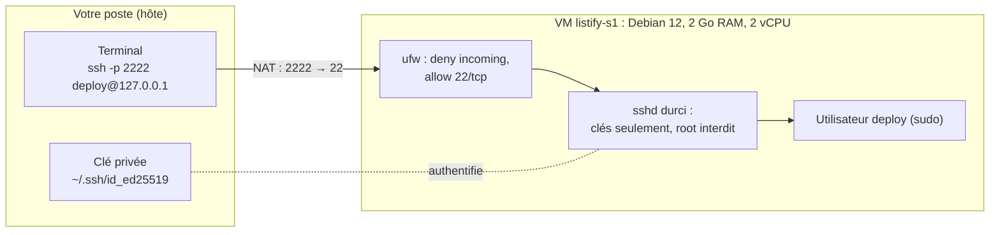

# TP 1 : Créer et durcir sa machine virtuelle

!!! abstract "Fiche du TP"
    - **Durée** : 4 h (2 séances de 2 h)
    - **Prérequis** : chapitre 1 (VM, NAT VirtualBox) et chapitre 5, section 1 (SSH)
    - **Livrables** : une VM `listify-s1` fonctionnelle, accessible en SSH par clés uniquement ; le fichier `RUNBOOK.md` dans votre dépôt Git `listify`
    - **Compétences travaillées** : C1 (comprendre les couches), C6 (opérer)

    À la fin de ce TP, vous disposez du « serveur » qui portera toute l'application pendant le bloc 1.

## Ce que vous allez construire



## Étape 0 : préparer le poste hôte (15 min)

1. Vérifiez que la virtualisation matérielle est active :

    === "Linux"
        ```bash
        egrep -c '(vmx|svm)' /proc/cpuinfo   # doit afficher un nombre > 0
        ```
    === "Windows"
        Gestionnaire des tâches → Performance → CPU → « Virtualisation : activée ». Sinon, activez VT-x/AMD-V dans le BIOS/UEFI.

2. Installez VirtualBox ≥ 7.0 (version exacte : voir le guide d'installation de la semaine 1).
3. Récupérez l'ISO **Debian 12 netinst (amd64)** depuis le miroir local de l'école (`debian-12.x.x-amd64-netinst.iso`, ~650 Mo).

!!! note "Pourquoi « netinst » ?"
    L'image netinst ne contient que le minimum ; le reste est téléchargé à l'installation. C'est le choix « serveur » : on n'installe **que** ce dont on a besoin (réduction de la surface d'attaque, chapitre 5), et on choisit chaque composant consciemment.

## Étape 1 : créer la VM (15 min)

Dans VirtualBox, créez une machine avec ces paramètres :

| Paramètre | Valeur | Pourquoi |
|---|---|---|
| Nom | `listify-s1` | Convention du cours : rôle + semestre |
| Type / Version | Linux / Debian (64-bit) | Active les bons pilotes paravirtualisés |
| RAM | 2048 Mo | Assez pour Nginx + Gunicorn + PostgreSQL (ch. 1, §1.2) |
| CPU | 2 vCPU | Permet de raisonner le dimensionnement des workers (ch. 4) |
| Disque | VDI, 20 Go, alloué dynamiquement | « Dynamique » : le fichier ne grossit qu'à l'usage réel |
| Réseau, carte 1 | NAT | Sortie Internet immédiate ; entrée par redirections (ch. 3, §4) |

!!! danger "Cochez « Skip unattended installation »"
    VirtualBox 7 propose une installation automatique de l'OS. **Refusez-la** : d'une part elle crée des comptes par défaut que nous ne voulons pas, d'autre part... installer un OS serveur à la main est précisément un objectif de ce TP. (Vous automatiserez tout cela au bloc 3 avec Vagrant, en connaissance de cause.)

Configurez tout de suite la **redirection de port SSH** : Configuration → Réseau → Carte 1 → Avancé → Redirection de ports, et ajoutez :

| Nom | IP hôte | Port hôte | IP invité | Port invité |
|---|---|---|---|---|
| ssh | 127.0.0.1 | 2222 | (vide) | 22 |

L'IP hôte `127.0.0.1` restreint la redirection à votre propre poste : personne d'autre sur le réseau de la salle ne pourra tenter de se connecter à votre VM.

## Étape 2 : installer Debian 12 (30 min)

Démarrez la VM sur l'ISO et suivez l'installateur (mode texte « Install », pas besoin du graphique). Points de décision, tout le reste par défaut :

1. **Langue / clavier** : à votre convenance (le serveur, lui, parlera anglais dans ses logs : c'est très bien).
2. **Nom de machine** : `listify-s1` ; domaine : laisser vide.
3. **Mot de passe root** : **laissez vide**. Décision importante : sans mot de passe root, l'installateur désactive le compte root et donne `sudo` au premier utilisateur : exactement la politique du chapitre 5.
4. **Utilisateur** : nom complet libre, identifiant **`deploy`**, mot de passe robuste (il servira pour `sudo`).
5. **Partitionnement** : « Assisté : utiliser un disque entier », tout dans une seule partition. (Le partitionnement fin est un vrai sujet d'admin, hors périmètre du cours.)
6. **Choix des logiciels** : décochez **tout** sauf « **serveur SSH** » et « utilitaires usuels du système ». Pas d'environnement de bureau : notre serveur n'a pas d'écran.

Au redémarrage, vous obtenez une console de login en mode texte. Connectez-vous en `deploy` **dans la console VirtualBox** une seule fois pour vérifier, puis n'y revenez qu'en secours : à partir de maintenant, **tout se fait en SSH**, comme sur un vrai serveur.

??? question "Point de contrôle n° 1 : votre première session"
    Dans la console VM, vérifiez et notez dans le runbook :

    ```bash
    ip -brief addr        # l'IP de la VM : 10.0.2.15/24 (réseau NAT VirtualBox)
    sudo whoami           # doit répondre "root" (deploy a bien sudo)
    systemctl status ssh  # sshd doit être "active (running)"
    ```

    Si `sudo` échoue avec « deploy is not in the sudoers file » : vous avez donné un mot de passe root à l'installation. Réparez : connectez-vous root dans la console, puis `usermod -aG sudo deploy`, déconnectez/reconnectez deploy.

## Étape 3 : première connexion SSH et création du dépôt (20 min)

Depuis un terminal du **poste hôte** :

```bash
ssh -p 2222 deploy@127.0.0.1
```

Trois choses se passent, à comprendre et consigner :

1. La question `The authenticity of host ... can't be established` + empreinte : c'est la **vérification de l'hôte** (ch. 5, §1.3). Répondez `yes` ; l'empreinte part dans `~/.ssh/known_hosts`.
2. Le mot de passe demandé est celui de `deploy` **sur la VM** (authentification par mot de passe, que nous allons précisément supprimer).
3. Vous êtes sur la VM : le prompt affiche `deploy@listify-s1`. Le trafic a suivi : terminal → 127.0.0.1:2222 → NAT VirtualBox → 10.0.2.15:22.

Créez maintenant le dépôt de travail du semestre **sur votre poste hôte** :

```bash
mkdir listify && cd listify && git init
# Récupérez le code de l'application depuis la page "Application fil rouge"
# (archive fournie sur le Moodle du cours), puis :
printf '# Runbook TP1 : création et durcissement de la VM\n\n' > RUNBOOK.md
git add -A && git commit -m "Code initial de Listify + runbook TP1"
```

!!! tip "Le runbook commence maintenant"
    Dès cette étape, chaque commande exécutée sur la VM va dans `RUNBOOK.md`, avec sa raison et son résultat. Format libre mais chronologique. Rappel : c'est noté, et c'est votre seule aide autorisée au défi final.

## Étape 4 : authentification par clés (30 min)

### 4.1 Générer votre paire de clés (poste hôte)

Si vous n'avez pas déjà une clé ed25519 :

```bash
ssh-keygen -t ed25519 -C "prenom.nom@ecole.fr"
# Emplacement : défaut (~/.ssh/id_ed25519)
# Passphrase : OBLIGATOIRE dans ce cours (protège la clé privée sur disque)
```

Observez ce qui a été créé :

```bash
ls -l ~/.ssh/id_ed25519*
# -rw------- id_ed25519      : clé PRIVÉE, permissions 600, ne quitte jamais ce poste
# -rw-r--r-- id_ed25519.pub  : clé PUBLIQUE, celle qu'on distribue
```

### 4.2 Déposer la clé publique sur la VM

```bash
ssh-copy-id -p 2222 deploy@127.0.0.1
# (dernier usage du mot de passe !)
ssh -p 2222 deploy@127.0.0.1   # doit maintenant demander la PASSPHRASE de la clé,
                               # pas le mot de passe du serveur
```

Sur la VM, regardez ce que `ssh-copy-id` a réellement fait : votre clé publique est une ligne dans `~/.ssh/authorized_keys`, et les permissions sont strictes (`700` sur `~/.ssh`, `600` sur le fichier), sans quoi sshd refuserait de s'en servir.

### 4.3 Se simplifier la vie : `~/.ssh/config` (poste hôte)

```text title="~/.ssh/config (à créer ou compléter)"
Host listify-s1
    HostName 127.0.0.1
    Port 2222
    User deploy
```

Désormais : `ssh listify-s1`. Ce fichier est aussi une **documentation** de votre parc : Ansible saura le lire au bloc 3.

??? question "Point de contrôle n° 2"
    - `ssh listify-s1` vous connecte en demandant la passphrase de la clé (ou rien si un agent SSH tourne), **pas** le mot de passe deploy.
    - Dans `journalctl -u ssh -n 20` sur la VM, la ligne de votre connexion indique `Accepted publickey for deploy`.

## Étape 5 : durcissement de sshd (30 min)

!!! danger "Filet de sécurité obligatoire"
    Gardez **deux** terminaux : le premier reste connecté en SSH pendant toute l'étape (session de secours) ; le second teste. En cas d'erreur fatale, il reste aussi la console VirtualBox : c'est votre « accès physique ».

Sur la VM, créez le fichier de durcissement (on ne modifie pas `sshd_config` directement : les fichiers de `sshd_config.d/` sont inclus et survivent mieux aux mises à jour du paquet) :

```bash
sudo tee /etc/ssh/sshd_config.d/50-hardening.conf > /dev/null <<'EOF'
PermitRootLogin no
PasswordAuthentication no
KbdInteractiveAuthentication no
AllowUsers deploy
EOF

sudo sshd -t          # test de syntaxe : AUCUNE sortie = OK
sudo systemctl reload ssh
```

Vérifiez depuis le **second** terminal du poste hôte :

```bash
ssh listify-s1                                   # doit fonctionner (clé)
ssh -p 2222 -o PubkeyAuthentication=no \
    -o PreferredAuthentications=password deploy@127.0.0.1
# doit échouer : "Permission denied (publickey)"
ssh -p 2222 root@127.0.0.1                       # doit échouer aussi
```

Ces tests négatifs vont dans le runbook : prouver qu'une porte est fermée fait partie du travail, pas seulement prouver que la vôtre est ouverte.

## Étape 6 : pare-feu ufw (20 min)

```bash
sudo apt update && sudo apt install -y ufw
sudo ufw default deny incoming
sudo ufw default allow outgoing
sudo ufw allow 22/tcp        # AVANT enable : ne pas s'enfermer dehors (ch. 3, §5.1)
sudo ufw enable
sudo ufw status verbose
```

La sortie attendue de `status verbose` : politique `deny (incoming), allow (outgoing)`, et l'unique règle `22/tcp ALLOW IN Anywhere`. Aux TP 2 et 3, nous ouvrirons 80 et 443 **au moment où nous en aurons besoin**, jamais avant.

## Étape 7 : hygiène de base du système (20 min)

```bash
# Tout mettre à jour (ch. 5 : la majorité des compromissions exploitent du déjà-corrigé)
sudo apt update && sudo apt upgrade -y

# Correctifs de sécurité automatiques
sudo apt install -y unattended-upgrades
systemctl status unattended-upgrades   # doit être active

# Fuseau horaire cohérent (des logs datés juste, ça compte au TP 4)
sudo timedatectl set-timezone Europe/Paris
timedatectl                             # vérifier que NTP est actif ("synchronized: yes")
```

Enfin, prenez votre premier **snapshot** : VM éteinte (`sudo poweroff`), VirtualBox → Instantanés → « Prendre » → nom `tp1-durci`. C'est votre point de restauration pour tout le bloc.

## Point de contrôle final : la grille d'auto-évaluation

À cocher (et faire vérifier par l'enseignant en fin de séance) :

- [ ] `ssh listify-s1` fonctionne par clé, avec passphrase
- [ ] La connexion par mot de passe est refusée (test négatif consigné)
- [ ] La connexion root est refusée
- [ ] `sudo ufw status` : deny incoming + 22/tcp uniquement
- [ ] `sudo ss -tlnp` ne montre **que** sshd en écoute non-locale, et vous savez justifier chaque ligne
- [ ] `unattended-upgrades` actif, NTP synchronisé
- [ ] Snapshot `tp1-durci` pris
- [ ] `RUNBOOK.md` committé : toutes les commandes, les deux tests négatifs, l'explication de la redirection NAT 2222→22

## Pour aller plus loin (bonus)

1. **fail2ban** : installez-le, provoquez 5 échecs de connexion et observez le bannissement (`sudo fail2ban-client status sshd`). Pourquoi est-il moins crucial maintenant que `PasswordAuthentication no` est posé ?
2. **Agent SSH** : configurez `ssh-agent` (ou celui de votre bureau) pour ne taper la passphrase qu'une fois par session. Quel nouveau risque introduit un agent avec *forwarding* activé ? (Réponse au ch. 5 du cours de S2 sur les rebonds.)
3. **Bannière légale** : ajoutez un avertissement pré-connexion avec la directive `Banner` de sshd. Dans quel cadre juridique une bannière a-t-elle un intérêt réel ?

## Questions de compréhension (à préparer pour le TD)

1. Expliquez le trajet complet d'un paquet lors de `ssh listify-s1`, en nommant chaque traduction d'adresse et de port.
2. Pourquoi `PasswordAuthentication no` rend-il fail2ban largement redondant *pour SSH* ? Quel service futur (TP 3) remettra fail2ban dans la discussion ?
3. Un camarade a perdu la passphrase de sa clé. Peut-il la récupérer ? Que doit-il faire, étape par étape, pour retrouver l'accès à sa VM sans la réinstaller ?
4. `ufw default deny incoming` : pourquoi cette politique n'empêche-t-elle pas `apt` de fonctionner, alors que les réponses des miroirs Debian sont bien des paquets entrants ? (Indice : pare-feu *à états*.)
