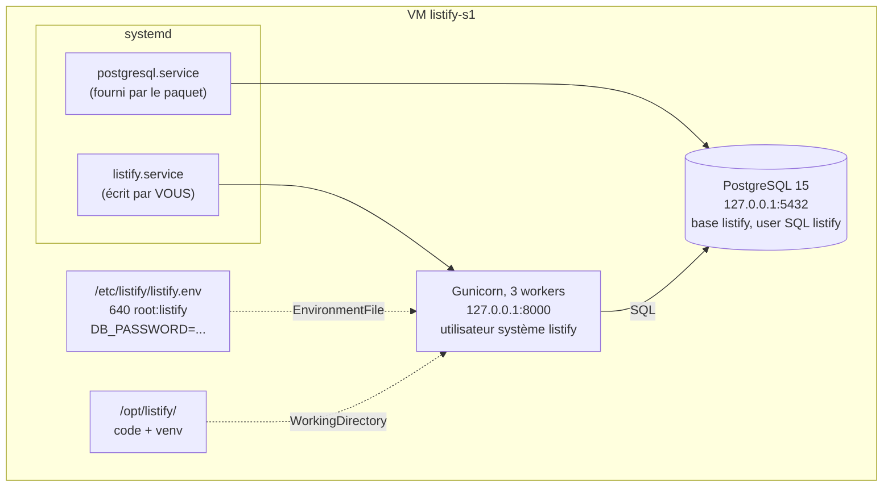

# TP 2 : Déployer la base de données et le backend à la main

!!! abstract "Fiche du TP"
    - **Durée** : 4 h (2 séances de 2 h : PostgreSQL, puis backend + systemd)
    - **Prérequis** : TP 1 terminé (VM durcie, SSH par clés) ; chapitre 2 (paquets, utilisateurs, systemd)
    - **Livrables** : PostgreSQL opérationnel avec base et utilisateur dédiés ; le backend Listify en service systemd `listify.service` démarrant au boot ; runbook à jour
    - **Compétences travaillées** : C1, C6

    C'est le TP le plus formateur du bloc : vous faites **à la main, en le comprenant, tout ce qu'Ansible fera pour vous au TP 8**. Chaque étape pénible d'aujourd'hui est un argument de vente de l'automatisation de demain : notez la douleur, elle est au programme.

## Ce que vous allez construire



## Séance 1 : PostgreSQL

### Étape 1 : installer et observer (30 min)

```bash
ssh listify-s1
sudo apt update && sudo apt install -y postgresql
```

Avant de configurer quoi que ce soit, **inventoriez ce que le paquet a fait** : c'est l'exercice central du chapitre 2, et cela vous servira à chaque nouveau logiciel de votre carrière.

```bash
systemctl status postgresql            # un service est apparu... et déjà démarré
sudo ss -tlnp | grep 5432              # qui écoute, sur quelle adresse ?
id postgres                            # un utilisateur système a été créé
dpkg -L postgresql-15 | head -30       # où sont les fichiers ?
ls /etc/postgresql/15/main/            # les configurations
sudo ls /var/lib/postgresql/15/main/   # les données (permissions : postgres only)
ls /var/log/postgresql/                # les journaux fichier
```

À consigner au runbook, sous forme de tableau : service, utilisateur, port et adresse de bind, chemin config, chemin données, chemin logs. Constat important : PostgreSQL écoute sur `127.0.0.1:5432` **par défaut** : sécurité par défaut raisonnable (Debian), que nous ne changerons pas au bloc 1.

!!! note "Pourquoi le service démarre-t-il tout seul ?"
    Politique Debian : un service installé est un service voulu, donc démarré et `enabled`. C'est le script `postinst` du paquet qui a tout fait : création de l'utilisateur, initialisation du répertoire de données (`initdb`), démarrage. Sur RHEL, la politique inverse s'applique (installé ≠ démarré). Moralité : ne présumez jamais, vérifiez avec `systemctl status`.

### Étape 2 : comprendre l'authentification PostgreSQL (20 min)

PostgreSQL a **ses propres** utilisateurs (rôles SQL), distincts des utilisateurs Linux. Le lien entre les deux est réglé par `pg_hba.conf` (*host-based authentication*). Regardez :

```bash
sudo grep -vE '^\s*(#|$)' /etc/postgresql/15/main/pg_hba.conf
```

Les deux lignes qui nous concernent :

```text
local   all   postgres                 peer
local   all   all                      peer
host    all   all      127.0.0.1/32   scram-sha-256
```

- **`peer`** (connexions locales par socket Unix) : PostgreSQL demande au noyau *quel utilisateur Linux* se connecte et l'accepte comme rôle SQL du même nom, sans mot de passe. C'est pourquoi `sudo -u postgres psql` fonctionne : Linux `postgres` → rôle SQL `postgres`.
- **`scram-sha-256`** (connexions TCP vers 127.0.0.1) : mot de passe, haché avec l'état de l'art. C'est le chemin qu'empruntera notre backend.

### Étape 3 : créer le rôle et la base de l'application (30 min)

Principe du moindre privilège, version SQL : l'application n'utilise **jamais** le superutilisateur `postgres` ; elle a son rôle, propriétaire de sa seule base.

```bash
# Générer un mot de passe fort et le NOTER temporairement (il ira dans listify.env)
openssl rand -base64 24

sudo -u postgres psql
```

```sql
-- Dans psql :
CREATE ROLE listify LOGIN PASSWORD 'COLLEZ_ICI_LE_MOT_DE_PASSE';
CREATE DATABASE listify OWNER listify;
\du            -- lister les rôles : listify ne doit avoir AUCUN attribut spécial
\l             -- lister les bases : listify, propriétaire listify
\q
```

Chargez le schéma **en tant que `listify`**, pas en tant que postgres (ainsi les tables appartiennent au bon rôle) :

```bash
# Depuis le poste hôte, copier le schéma sur la VM :
scp db/schema.sql listify-s1:/tmp/schema.sql

# Sur la VM :
psql "postgresql://listify@127.0.0.1:5432/listify" -f /tmp/schema.sql
# (le mot de passe est demandé : c'est bien le chemin scram par TCP)
```

??? question "Point de contrôle n° 1"
    ```bash
    psql "postgresql://listify@127.0.0.1:5432/listify" \
         -c "INSERT INTO tasks (title) VALUES ('test tp2');" \
         -c "SELECT * FROM tasks;"
    ```
    Une ligne revient avec `id`, `title`, `created_at`. Rejouez le chargement du schéma : `psql ... -f /tmp/schema.sql` ne produit **aucune erreur** à la seconde exécution : première démonstration concrète d'**idempotence** (le `IF NOT EXISTS`), consignez-la explicitement au runbook.

    Test négatif : `psql "postgresql://listify@127.0.0.1:5432/postgres" -c "SELECT 1;"` : le rôle listify peut-il se connecter à la base `postgres` ? (Oui par défaut : les bases acceptent les connexions de tous les rôles ; il ne peut par contre rien y lire. Pour l'interdire complètement : `REVOKE CONNECT ON DATABASE postgres FROM PUBLIC;` : question 3 en fin de TP.)

## Séance 2 : le backend en service systemd

### Étape 4 : préparer utilisateur, arborescence et code (30 min)

```bash
# 1. L'utilisateur système (ch. 2, §3.2) : sans shell, home = /opt/listify
sudo adduser --system --group --home /opt/listify --shell /usr/sbin/nologin listify

# 2. Les dépendances système : Python et son module venv
sudo apt install -y python3 python3-venv

# 3. Déployer le code : depuis le POSTE HÔTE
scp -r backend listify-s1:/tmp/backend
```

```bash
# Sur la VM : mettre en place et attribuer
sudo mv /tmp/backend /opt/listify/backend
sudo chown -R listify:listify /opt/listify/backend
```

!!! note "scp : la méthode d'aujourd'hui, la douleur de demain"
    Copier le code par `scp` est fragile (quelle version ? des fichiers en trop restent-ils ?) : notez-le au runbook. Au TP 4, la mise à jour par scp vous le fera vivre ; au bloc 3, Ansible synchronisera depuis Git.

### Étape 5 : l'environnement virtuel et les dépendances (20 min)

Le venv appartient à l'application, donc à son utilisateur. On utilise `sudo -u listify` pour exécuter chaque commande sous la bonne identité :

```bash
sudo -u listify python3 -m venv /opt/listify/venv
sudo -u listify /opt/listify/venv/bin/pip install -r /opt/listify/backend/requirements.txt
# Vérification :
sudo -u listify /opt/listify/venv/bin/pip list
```

Pourquoi pas `pip install` tout court ? Relisez le chapitre 2, §2.3 : Debian 12 refuse (`externally-managed-environment`), et c'est une bonne chose : les dépendances de Listify vivent dans `/opt/listify/venv`, ni dans le système, ni chez un autre service.

### Étape 6 : la configuration dans l'environnement (20 min)

Le facteur III des 12-factor (ch. 4) : les secrets hors du code, dans un fichier d'environnement aux permissions strictes.

```bash
sudo mkdir -p /etc/listify
sudo tee /etc/listify/listify.env > /dev/null <<'EOF'
DB_HOST=127.0.0.1
DB_PORT=5432
DB_NAME=listify
DB_USER=listify
DB_PASSWORD=COLLEZ_ICI_LE_MOT_DE_PASSE
EOF
sudo chown root:listify /etc/listify/listify.env
sudo chmod 640 /etc/listify/listify.env
```

Vérifiez la politique de permissions **par les tests négatifs** (ch. 2, exemple travaillé) :

```bash
sudo -u listify cat /etc/listify/listify.env    # OK : le service lit
sudo -u www-data cat /etc/listify/listify.env 2>&1 || true   # www-data n'existe pas encore
cat /etc/listify/listify.env                     # deploy : Permission denied ? 
```

Surprise probable : `deploy` **peut** le lire s'il utilise sudo, et c'est normal (sudo = root). Mais `cat` sans sudo doit échouer. Consignez.

### Étape 7 : premier lancement à la main (20 min)

Toujours tester la commande **avant** de l'emballer dans systemd : si elle échoue, l'erreur est plus lisible ici.

```bash
sudo -u listify bash -c '
  set -a; source /etc/listify/listify.env; set +a
  cd /opt/listify/backend
  /opt/listify/venv/bin/gunicorn --workers 3 --bind 127.0.0.1:8000 wsgi:app
'
```

Dans un **second** terminal SSH :

```bash
curl -s http://127.0.0.1:8000/api/health
# {"api":"ok","database":"ok"}
curl -s http://127.0.0.1:8000/api/tasks
# [{"created_at":"...","id":1,"title":"test tp2"}]
```

Observez aussi les processus : `ps -u listify -f` montre le master Gunicorn et ses 3 workers (ch. 4, §2.2). Arrêtez avec ++ctrl+c++ dans le premier terminal.

### Étape 8 : l'unité systemd (40 min)

Le cœur du TP. Écrivez l'unité (chaque directive est expliquée au chapitre 2, §4.2 : réexpliquez-les avec vos mots dans le runbook) :

```bash
sudo tee /etc/systemd/system/listify.service > /dev/null <<'EOF'
[Unit]
Description=Listify backend (Gunicorn)
After=network-online.target postgresql.service
Wants=postgresql.service

[Service]
User=listify
Group=listify
WorkingDirectory=/opt/listify/backend
EnvironmentFile=/etc/listify/listify.env
ExecStart=/opt/listify/venv/bin/gunicorn --workers 3 --bind 127.0.0.1:8000 wsgi:app
Restart=on-failure
RestartSec=2

[Install]
WantedBy=multi-user.target
EOF

sudo systemctl daemon-reload
sudo systemctl enable --now listify
systemctl status listify
```

`status` doit afficher `active (running)`, le PID du master, et les dernières lignes de log Gunicorn (`Booting worker with pid...`).

### Étape 9 : éprouver l'auto-réparation et le boot (30 min)

Un service qui marche, c'est bien ; un service qui **survit**, c'est le but. Trois expériences, à consigner avec observations :

```bash
# Expérience 1 : crash du master → systemd relance (Restart=on-failure)
MASTER=$(systemctl show -p MainPID --value listify)
sudo kill -9 "$MASTER"
sleep 3
systemctl status listify        # active à nouveau, nouveau PID, un "restart" au compteur
journalctl -u listify -n 20     # l'histoire complète : kill, relance

# Expérience 2 : crash d'un WORKER → c'est GUNICORN qui répare, pas systemd
ps -u listify -f                # repérez un pid de worker (fils du master)
sudo kill -9 <pid_worker>
ps -u listify -f                # un nouveau worker est né ; systemctl status : 0 restart
# → les deux étages d'auto-réparation du ch. 4 §2.2, vus en vrai

# Expérience 3 : le reboot
sudo reboot
# (attendre ~30 s) puis depuis le poste hôte :
ssh listify-s1 'curl -s http://127.0.0.1:8000/api/health'
# {"api":"ok","database":"ok"} sans AUCUNE intervention : c'est enable + After qui jouent
```

## Point de contrôle final

- [ ] `sudo ss -tlnp` : exactement 22 (sshd), 5432 sur 127.0.0.1 (postgres), 8000 sur 127.0.0.1 (gunicorn)
- [ ] `curl /api/health` répond `ok/ok` ; POST puis GET sur `/api/tasks` fonctionnent (montrez un exemple au runbook)
- [ ] Le rôle SQL `listify` n'est pas superuser ; le schéma est rechargeable sans erreur (idempotence notée)
- [ ] `listify.env` en 640 root:listify, tests négatifs consignés
- [ ] Kill du master → relance systemd ; kill d'un worker → relance Gunicorn ; reboot → tout revient
- [ ] Snapshot `tp2-backend` pris ; `RUNBOOK.md` committé

## Pour aller plus loin (bonus)

1. **Durcissement systemd** : ajoutez à `[Service]` les directives `NoNewPrivileges=true`, `ProtectSystem=strict`, `ReadWritePaths=`, `PrivateTmp=true`, puis relancez. Vérifiez avec `systemd-analyze security listify` : quel score obtenez-vous, avant et après ?
2. **Limites de ressources** : `MemoryMax=300M` dans l'unité, puis provoquez une surconsommation (endpoint de test qui alloue). Qui tue quoi ? Que dit `journalctl` ? (Avant-goût de l'OOMKill du S2.)
3. **Socket activation** : documentez-vous sur `gunicorn.socket` + activation par socket systemd : quel avantage au boot ?

## Questions de compréhension (à préparer pour le TD)

1. Pourquoi `After=postgresql.service` sans `Wants=` serait-il insuffisant ? Et pourquoi `Requires=` serait-il excessif pour notre cas ? (Testez : que fait votre API si PostgreSQL est arrêté ? Quel code HTTP renvoie `/api/health` ? Qui a prévu ce comportement ?)
2. Listez tout ce que le paquet PostgreSQL a fait « gratuitement » et qu'il a fallu faire à la main pour Listify. Qu'est-ce que cela vous apprend sur ce qu'est *vraiment* un paquet ?
3. Le rôle `listify` peut se connecter à la base `postgres` (sans pouvoir y lire les tables). Écrivez et testez la commande qui l'interdit, et expliquez `PUBLIC`.
4. Chronométrez honnêtement : combien de temps pour ce TP ? Combien de fichiers touchés, sur combien de chemins différents ? Gardez ces chiffres : ils serviront de référence au TP 9.
