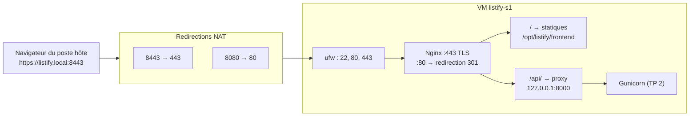

# TP 3 : Frontend, Nginx en reverse proxy et TLS

!!! abstract "Fiche du TP"
    - **Durée** : 4 h
    - **Prérequis** : TP 2 terminé (backend en service) ; chapitres 3 (TLS, pare-feu) et 4 (reverse proxy)
    - **Livrables** : l'application complète accessible en HTTPS depuis le navigateur du poste hôte à l'adresse `https://listify.local:8443` ; certificat auto-signé documenté ; runbook à jour
    - **Compétences travaillées** : C1, C6

    À la fin de ce TP, l'application 3-tiers est **entièrement déployée** : un utilisateur avec un navigateur peut créer et supprimer des tâches.

## Ce que vous allez construire



## Étape 1 : installer Nginx et comprendre sa structure (30 min)

```bash
ssh listify-s1
sudo apt install -y nginx
```

Rituel d'inventaire (le même qu'au TP 2, il doit devenir un réflexe) :

```bash
systemctl status nginx          # démarré et enabled (politique Debian)
sudo ss -tlnp | grep nginx      # écoute sur 0.0.0.0:80 : premier service PUBLIC
id www-data                     # l'utilisateur système de Nginx
ls /etc/nginx/                  # la configuration
ls /var/log/nginx/              # access.log et error.log
```

La structure de configuration Debian, à comprendre avant de toucher quoi que ce soit :

- `/etc/nginx/nginx.conf` : configuration globale, qui inclut les deux répertoires suivants ; on n'y touche pas.
- `/etc/nginx/sites-available/` : un fichier par site, **disponibles**.
- `/etc/nginx/sites-enabled/` : des **liens symboliques** vers les sites réellement actifs. Activer/désactiver un site = créer/supprimer un lien, sans rien effacer.

Le site `default` (page « Welcome to nginx ») est actif ; vérifiez depuis la VM : `curl -s http://127.0.0.1 | head -5`. Nous le remplacerons à l'étape 4.

Ouvrez le pare-feu, maintenant que le service public existe (et pas avant : discipline du ch. 5) :

```bash
sudo ufw allow 80/tcp
sudo ufw allow 443/tcp
sudo ufw status verbose
```

Côté VirtualBox, ajoutez les redirections NAT (Configuration → Réseau → Redirection de ports) :

| Nom | IP hôte | Port hôte | Port invité |
|---|---|---|---|
| http | 127.0.0.1 | 8080 | 80 |
| https | 127.0.0.1 | 8443 | 443 |

??? question "Point de contrôle n° 1"
    Depuis le **poste hôte** : `curl -s http://127.0.0.1:8080 | head -5` affiche la page d'accueil Nginx. Décrivez au runbook le trajet complet du paquet (hôte:8080 → NAT → VM:80 → ufw → nginx), couche par couche : c'est l'exercice de la méthode ascendante du chapitre 3.

## Étape 2 : déployer le frontend (20 min)

```bash
# Depuis le poste hôte :
scp -r frontend listify-s1:/tmp/frontend
```

```bash
# Sur la VM :
sudo mv /tmp/frontend /opt/listify/frontend
sudo chown -R root:root /opt/listify/frontend
sudo chmod -R a+rX /opt/listify/frontend
```

!!! question "Pourquoi root:root et pas listify, ni www-data ?"
    Réfléchissez avant de lire. Les statiques sont des fichiers que Nginx doit seulement **lire**. S'ils appartenaient à `www-data`, un Nginx compromis pourrait les **modifier** (défiguration). La règle : le propriétaire d'un fichier servi n'est pas celui qui le sert ; `www-data` n'a besoin que de la lecture (`a+rX` : lecture pour tous, traversée des répertoires). Même logique que le `listify.env` en 640 : les permissions expriment une politique.

## Étape 3 : le certificat TLS auto-signé (40 min)

Nous générons une paire clé/certificat pour le nom `listify.local` (ch. 3, §6.2 : un certificat lie une clé publique à un **nom**).

```bash
sudo mkdir -p /etc/nginx/ssl
sudo openssl req -x509 -newkey ec -pkeyopt ec_paramgen_curve:prime256v1 \
  -keyout /etc/nginx/ssl/listify.key \
  -out    /etc/nginx/ssl/listify.crt \
  -days 365 -nodes \
  -subj "/CN=listify.local" \
  -addext "subjectAltName=DNS:listify.local"
sudo chmod 600 /etc/nginx/ssl/listify.key
```

Décortiquons, car chaque option est une notion du cours :

- `-x509` : produire directement un certificat **auto-signé** (au lieu d'une demande de signature CSR destinée à une CA).
- `-newkey ec ... prime256v1` : générer une clé sur courbe elliptique P-256, l'état de l'art (comme ed25519 pour SSH).
- `-days 365` : validité ; comparez aux 90 jours de Let's Encrypt et rappelez-vous pourquoi court = vertueux (ch. 3, §6.3).
- `-nodes` : clé privée non chiffrée par passphrase, car Nginx doit pouvoir démarrer sans humain ; la protection est le `chmod 600`.
- `-addext "subjectAltName=..."` : les navigateurs modernes ignorent le CN et exigent un **SAN** ; sans lui, erreur de certificat garantie même après acceptation.

Inspectez votre œuvre (exercice : retrouvez émetteur, sujet, dates, SAN) :

```bash
sudo openssl x509 -in /etc/nginx/ssl/listify.crt -noout -text | head -20
```

Émetteur = sujet : la signature ne prouve rien, c'est bien un auto-signé (ch. 3 : il **chiffrera** parfaitement, il n'**authentifiera** rien).

## Étape 4 : la configuration du site (50 min)

Créez le site (c'est la configuration commentée au chapitre 4, complétée de la redirection HTTP→HTTPS) :

```bash
sudo tee /etc/nginx/sites-available/listify > /dev/null <<'EOF'
# Port 80 : ne sert qu'à rediriger vers HTTPS
server {
    listen 80;
    server_name listify.local;
    return 301 https://$host:8443$request_uri;
}

server {
    listen 443 ssl;
    server_name listify.local;

    ssl_certificate     /etc/nginx/ssl/listify.crt;
    ssl_certificate_key /etc/nginx/ssl/listify.key;
    ssl_protocols       TLSv1.2 TLSv1.3;

    # Tier 1 : fichiers statiques
    root /opt/listify/frontend;
    index index.html;
    location / {
        try_files $uri $uri/ =404;
    }

    # Tier 2 : API relayée au serveur d'application
    location /api/ {
        proxy_pass http://127.0.0.1:8000;
        proxy_set_header Host              $host;
        proxy_set_header X-Real-IP         $remote_addr;
        proxy_set_header X-Forwarded-For   $proxy_add_x_forwarded_for;
        proxy_set_header X-Forwarded-Proto $scheme;
    }
}
EOF

# Activer listify, désactiver default (liens symboliques !)
sudo ln -s /etc/nginx/sites-available/listify /etc/nginx/sites-enabled/listify
sudo rm /etc/nginx/sites-enabled/default

sudo nginx -t                # comme sshd -t : TOUJOURS tester avant de recharger
sudo systemctl reload nginx  # reload, pas restart : zéro coupure (ch. 2, §4.3)
```

!!! note "Détail qui compte : la redirection porte `:8443`"
    En production, la redirection serait `https://$host$request_uri` (port 443 implicite). Ici, le navigateur du poste hôte passe par la redirection NAT 8443→443 : une redirection vers le 443 « nu » échouerait depuis l'hôte. Notez ce détail au runbook : c'est un exemple minuscule mais réel de **configuration dépendante de l'environnement** (le facteur III frappe même Nginx).

Côté poste hôte, donnez un nom à votre serveur (ch. 3, §3.2 : `/etc/hosts` passe avant le DNS) :

```bash
echo "127.0.0.1 listify.local" | sudo tee -a /etc/hosts
```

## Étape 5 : tester, couche par couche (30 min)

Sur la VM d'abord (au plus près, en éliminant NAT et hosts) :

```bash
curl -sk https://127.0.0.1/api/health          # -k : accepter l'auto-signé
curl -s  -o /dev/null -w '%{http_code}\n' http://127.0.0.1/   # 301
```

Depuis le poste hôte ensuite :

```bash
curl -sk https://listify.local:8443/api/health
curl -sk https://listify.local:8443/ | head -5      # le HTML de Listify
curl -s  -o /dev/null -w '%{redirect_url}\n' http://listify.local:8080/
```

Puis **au navigateur** : `https://listify.local:8443`. L'avertissement de sécurité est attendu : lisez-le vraiment (quel est le message exact ? quelle CA manque ?), acceptez l'exception, et utilisez l'application : créez des tâches, supprimez-en. Vous devez voir la tâche `test tp2` créée... au TP 2 : la persistance traverse les tiers.

Enfin, observez le travail du proxy dans les journaux :

```bash
sudo tail -f /var/log/nginx/access.log
# (créez une tâche dans le navigateur)
# → une ligne POST /api/tasks ... 201
journalctl -u listify -n 5
# → la même requête vue par Gunicorn : arrivée depuis 127.0.0.1 !
```

C'est le phénomène `X-Forwarded-For` du chapitre 4, §3.3, constaté en vrai : pour Gunicorn, tout vient de Nginx.

## Étape 6 : et Let's Encrypt ? (discussion guidée, 20 min)

Notre certificat chiffre mais n'authentifie pas. En production publique, la marche à suivre exacte (à documenter au runbook, section « pour la production ») :

1. Posséder un domaine réel avec un enregistrement A vers l'IP publique du serveur.
2. `sudo apt install certbot python3-certbot-nginx`.
3. `sudo certbot --nginx -d listify.example.com` : certbot prouve le contrôle du domaine (challenge HTTP-01 servi via Nginx), obtient le certificat, modifie la configuration, et installe un **timer systemd** de renouvellement (`systemctl list-timers | grep certbot`).

Pourquoi est-ce impossible en TP ? Le challenge HTTP-01 exige que la CA joigne votre port 80 **depuis Internet** : notre VM est derrière deux NAT sans domaine public. Questions débattues en séance : que protégerait un certificat Let's Encrypt que notre auto-signé ne protège pas, *pour nos utilisateurs* ? Et pourquoi une entreprise utilise-t-elle quand même des CA **privées** en interne ?

## Point de contrôle final

- [ ] `https://listify.local:8443` fonctionne au navigateur ; l'application est utilisable de bout en bout
- [ ] HTTP redirige en 301 vers HTTPS (montrer la commande curl)
- [ ] `sudo ss -tlnp` : 22, 80, 443 (0.0.0.0) + 5432, 8000 (127.0.0.1 seulement) : récitez la justification de chaque ligne
- [ ] `nginx -t` passé avant chaque reload (au runbook)
- [ ] Le certificat contient un SAN `listify.local` ; vous savez expliquer pourquoi le navigateur râle quand même
- [ ] Une requête suivie dans access.log **et** journalctl, avec l'explication du 127.0.0.1
- [ ] Snapshot `tp3-complet` ; runbook committé, section « pour la production : certbot » incluse

## Pour aller plus loin (bonus)

1. **Devenez votre propre CA** : créez une CA racine locale (`openssl req -x509` pour la CA, puis signez une CSR du serveur), importez la racine dans le magasin du navigateur : plus d'avertissement ! Vous venez de reconstruire la chaîne de confiance du ch. 3 §6.2 de vos mains. (Outil moderne équivalent : `mkcert`.)
2. **Durcissement TLS** : testez votre configuration avec `testssl.sh` (dépôt local fourni). Ajoutez HSTS (`add_header Strict-Transport-Security`). Quels risques HSTS introduit-il avec un certificat auto-signé ?
3. **Limitation de débit** : ajoutez `limit_req_zone`/`limit_req` sur `/api/`, testez avec un petit `for` en curl : qui renvoie les 503, Nginx ou Gunicorn ? Pourquoi est-ce la bonne place ?

## Questions de compréhension (à préparer pour le TD)

1. Dessinez de mémoire le schéma-bilan du chapitre 4 (§5) en y ajoutant les redirections NAT du TP. Justifiez chaque bind (0.0.0.0 vs 127.0.0.1).
2. Le backend voit `127.0.0.1` comme adresse client. Citez deux fonctionnalités réelles que cela casserait en production et montrez précisément quel en-tête `proxy_set_header` répare chacune.
3. Pourquoi `reload` et pas `restart` pour Nginx après un changement de configuration ? Que se passe-t-il pour les connexions en cours dans chaque cas ?
4. Un auto-signé « chiffre parfaitement » : contre quel attaquant protège-t-il quand même, et contre lequel ne protège-t-il pas du tout ? (Réponse structurée : passif vs actif.)
