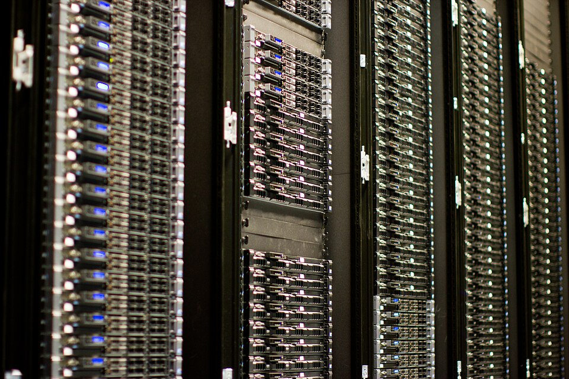
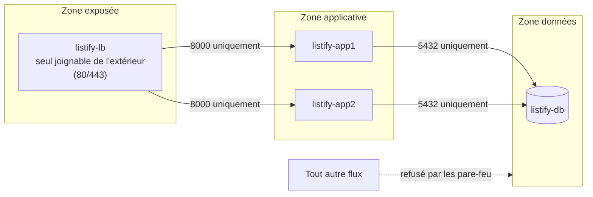

# Chapitre 6 : Pourquoi séparer les services

!!! abstract "Objectifs du chapitre"
    À l'issue de ce chapitre, vous saurez :

    - énumérer et illustrer les quatre raisons de séparer les services sur des machines distinctes ;
    - définir rigoureusement montée en charge **verticale** et **horizontale**, et choisir entre les deux ;
    - raisonner la sécurité d'une architecture en **zones** reliées par des liens contrôlés ;
    - énoncer le prix de la distribution : le réseau devient un composant interne, et il n'est pas fiable.

## 1. Le bilan honnête du tout-sur-une-machine

Votre VM `listify-s1` du bloc 1 fonctionne. Pourquoi y toucher ? Parce qu'en production, cette architecture accumule des risques que vous avez déjà entrevus en TP sans les nommer :

| Vécu au bloc 1 | Problème général |
|---|---|
| Le `systemctl restart listify` du TP 4 a coupé l'API | **Tout couplage des cycles de vie** : mettre à jour un composant fait trembler les autres |
| PostgreSQL, Gunicorn et Nginx se partagent 2 Go et 2 vCPU | **Contention des ressources** : un pic sur l'un dégrade tous les autres (le TP 4, panne « disque plein », a cassé les trois services d'un coup) |
| Une compromission de l'API donnait accès à la machine de la base | **Rayon d'explosion maximal** : tout incident, sécurité ou panne, a le système entier pour périmètre |
| Impossible d'ajouter de la capacité « juste pour l'API » | **Dimensionnement solidaire** : on paie pour le tout, on sature par le maillon le plus faible |
| La machine redémarre ? Tout est indisponible | **Point de défaillance unique** (*SPOF, single point of failure*) au sens le plus littéral |

La séparation des services répond point par point à ce tableau. Détaillons les quatre raisons canoniques, car l'examen demande de savoir les **argumenter**, pas les réciter.

<figure markdown>
  
  <figcaption>Des rangées de serveurs d'un datacenter réel (ceux de la Wikimedia Foundation) : chaque machine y a un rôle assigné, base de données, cache, application, exactement la logique de ce chapitre. Photo : Victor Grigas, CC BY-SA 3.0, via Wikimedia Commons.</figcaption>
</figure>

## 2. Raison 1 : l'isolation des pannes

### 2.1 Le rayon d'explosion

Le **rayon d'explosion** (*blast radius*) d'un incident est l'ensemble de ce qu'il emporte. Sur `listify-s1`, le rayon de *toute* panne est « tout ». Séparons les tiers, et chaque incident se retrouve borné par les frontières des machines :

- la VM backend manque de mémoire → la base et les statiques continuent ; les utilisateurs voient des erreurs sur l'API, pas une page blanche ;
- la VM base sature ses I/O → l'API répond 503 proprement (votre `/api/health` du TP 2 a été conçu pour cela), le frontend s'affiche ;
- un noyau panique sur le load balancer → *lui seul* doit être remplacé, les données sont intactes ailleurs.

C'est le motif de la **cloison étanche** (*bulkhead*), emprunté à la construction navale : les compartiments d'une coque limitent une voie d'eau à un compartiment.[^1] Retenez la formulation générale, elle guide toutes les architectures du parcours : **une frontière de machine (ou de conteneur, ou de namespace) est une frontière de panne**.

[^1]: Le terme est popularisé en architecture logicielle par Michael T. Nygard, *Release It!* (Pragmatic Bookshelf, 2007, 2ᵉ éd. 2018), chapitre « Stability Patterns ». Lecture recommandée de ce chapitre.

### 2.2 L'isolation n'est pas gratuite : les pannes partielles

Honnêteté intellectuelle : en séparant, on échange une panne totale évidente contre des **pannes partielles** plus subtiles. « Le site est lent mais seulement pour les écritures » est plus difficile à diagnostiquer que « le serveur est éteint ». Le TP 6 vous fera vivre les deux et la méthode de diagnostic s'enrichira d'une question : *quelle* machine, *quel* lien ?

## 3. Raison 2 : le dimensionnement indépendant

### 3.1 Verticale vs horizontale : les définitions

Montée en charge **verticale** (*scale up*)
:   Augmenter les ressources **d'une machine** : plus de vCPU, plus de RAM, un disque plus rapide. Sur VirtualBox : deux clics, VM éteinte. Chez un hébergeur : changer de gamme.

Montée en charge **horizontale** (*scale out*)
:   Augmenter le **nombre de machines** qui rendent le même service, derrière un répartiteur de charge. C'est le TP 6 : un deuxième backend.

### 3.2 Le match, argument par argument

| Critère | Verticale | Horizontale |
|---|---|---|
| Simplicité | Aucun changement d'architecture | Exige un LB + du *stateless* (ch. 8) |
| Plafond | **Dur** : la plus grosse machine achetable, et le prix devient très non linéaire bien avant | Théoriquement très haut (on ajoute des machines) |
| Disponibilité | Inchangée : toujours 1 machine, redémarrages requis pour grossir | **Améliorée** : N machines tolèrent la perte d'une (et on grossit sans coupure) |
| Granularité des coûts | Marches d'escalier (gammes de machines) | Fine : une petite machine à la fois, dans les deux sens |
| Limite réelle | Physique et économique | La partie **stateful** (la base !) ne se multiplie pas si simplement |

Deux conclusions structurantes :

1. **On commence toujours par la verticale** (simple, immédiate) et on passe à l'horizontale quand la disponibilité l'exige ou que le prix de la machine suivante décroche. Ce n'est pas un aveu d'échec, c'est de l'ingénierie économique.
2. **L'horizontale ne s'applique facilement qu'aux tiers sans état.** Doubler le backend Listify : trivial (TP 6). Doubler PostgreSQL : un tout autre sujet (réplication, élection de primaire...), évoqué honnêtement au ch. 8 et repoussé hors du périmètre du semestre. C'est pour cela que l'architecture cible du bloc met le pluriel sur `app` et le singulier sur `db`.

!!! example "Exemple travaillé : dimensionner Listify pour un pic à 600 requêtes/s"
    Mesures (hypothèses réalistes pour notre stack) : un backend à 3 workers traite ~200 req/s ; la base en traite 1 500 ; Nginx, 10 000.
    Verticale : passer le backend de 2 à 8 vCPU permet ~4× plus de workers, soit ~800 req/s : ça passe, jusqu'au pic suivant, et le pic de 3 h du matin paie 8 vCPU toute l'année.
    Horizontale : 3 backends de 2 vCPU = ~600 req/s, ajoutés pour la saison haute, retirés après ; la panne d'un backend laisse 400 req/s au lieu de 0.
    Le goulot suivant : à 1 500 req/s, ce sera la base, et là, ni 2 clics ni un clone ne suffiront. Savoir **où est le prochain goulot** fait partie de la réponse attendue à toute question de dimensionnement (compétence C1).

## 4. Raison 3 : la sécurité par segmentation

Au bloc 1, le moindre privilège s'appliquait *dans* la machine (utilisateurs système, permissions). La séparation permet de l'appliquer **au réseau** : chaque tier ne peut parler qu'à qui son rôle l'exige.

Ce découpage en **zones** (exposée / applicative / données, la zone exposée étant l'héritière des « DMZ » des architectures réseau classiques) transforme la compromission en parcours du combattant : l'attaquant qui tient le load balancer ne voit de la base... rien du tout, elle n'est pas routable pour lui autrement qu'à travers l'API. Chaque flèche du schéma est une règle de pare-feu que vous écrirez au TP 5 ; **tout ce qui n'est pas une flèche est interdit**. Reprenez l'exercice du chapitre 5 (dérouler une compromission) sur cette architecture : chaque saut de zone coûte une vulnérabilité de plus à l'attaquant. C'est la défense en profondeur, version réseau.

Corollaire opérationnel souvent oublié : la segmentation protège aussi **de nous-mêmes**. Un `DROP TABLE` lancé « sur le mauvais terminal » ne peut plus arriver depuis le load balancer : la base n'y est pas joignable. Une part importante des incidents de production sont des erreurs d'opérateur ; une bonne segmentation en absorbe une partie.

## 5. Le prix à payer : le réseau devient un composant interne

Jusqu'ici, le réseau était *devant* le système (entre l'utilisateur et Nginx). Désormais, il est *dedans* : chaque requête traverse deux liens réseau internes avant de toucher la base. Il faut le dire avec gravité, car c'est l'origine de la moitié des difficultés des semestres 2 et 3 :

1. **La latence s'additionne.** Un aller-retour local (loopback) coûte ~0,05 ms ; un aller-retour entre VM, ~0,5 ms ; entre deux zones d'un cloud, quelques ms. Une page qui déclenche 30 requêtes SQL paie 30 fois ce trajet : les architectures distribuées punissent les dialogues bavards.
2. **De nouvelles pannes existent.** Un câble, un pare-feu trop zélé, une carte saturée : « la base est en marche » et « le backend joint la base » sont devenus deux propositions distinctes, à tester séparément (votre méthode ascendante du ch. 3 gagne une dimension : *depuis quelle machine* je teste).
3. **On ne « débogue » plus une machine, on débogue un système.** D'où l'importance des journaux datés juste (NTP, TP 1 !) et, plus tard, de l'observabilité centralisée (S2, bloc 3).

Cette lucidité a un texte fondateur : les **huit illusions de l'informatique distribuée** (*fallacies of distributed computing*), attribuées à Peter Deutsch et James Gosling (Sun, années 1990). Les trois premières suffisent pour ce semestre : *le réseau est fiable ; la latence est nulle ; la bande passante est infinie*. Toute architecture qui suppose l'une d'elles échouera en production.[^2]

[^2]: La liste complète et son exégèse : Arnon Rotem-Gal-Oz, « Fallacies of Distributed Computing Explained », 2006 (article librement accessible). Les huit : réseau fiable, latence nulle, bande passante infinie, réseau sûr, topologie stable, un seul administrateur, transport gratuit, réseau homogène.

## Ce qu'il faut retenir

1. Le tout-sur-une-machine couple **cycles de vie, ressources, sécurité et capacité** : quatre bonnes raisons de séparer, à savoir argumenter avec des exemples.
2. **Une frontière de machine est une frontière de panne** (bulkhead) : le rayon d'explosion se conçoit, il ne se subit pas. En échange, on accepte des pannes partielles plus subtiles.
3. Verticale = grossir une machine (simple, plafond dur, disponibilité inchangée) ; horizontale = multiplier les machines (LB + stateless requis, disponibilité accrue). On commence vertical ; le stateful ne se multiplie pas facilement : la base reste au singulier ce semestre.
4. Segmentation : des **zones** reliées par des liens explicitement autorisés ; tout le reste est interdit. Chaque flèche du schéma = une règle ufw du TP 5.
5. Le réseau devient interne : latence additive, pannes nouvelles, diagnostic par machine ET par lien. Les trois premières *fallacies* sont au programme de l'examen.

## Bibliographie du chapitre

### Sources primaires

- Michael T. Nygard, *Release It! Design and Deploy Production-Ready Software*, 2ᵉ éd., Pragmatic Bookshelf, 2018 : chapitres « Stability Antipatterns » et « Stability Patterns » (bulkheads, rayon d'explosion). L'ouvrage de référence sur les pannes réelles.
- Arnon Rotem-Gal-Oz, « Fallacies of Distributed Computing Explained », 2006. Le commentaire canonique des huit illusions.
- Betsy Beyer et al. (dir.), *Site Reliability Engineering*, O'Reilly, 2016, chapitre 3 (« Embracing Risk ») : pourquoi viser 100 % de disponibilité est une erreur d'ingénierie. [Gratuit en ligne](https://sre.google/sre-book/embracing-risk/).

### Lectures recommandées

- Martin Kleppmann, *Designing Data-Intensive Applications*, O'Reilly, 2017, chapitre 8 (« The Trouble with Distributed Systems ») : la version approfondie de la section 5, qui vous resservira au S3.
- AWS, *Well-Architected Framework*, pilier « Reliability » (en ligne) : la même grille (blast radius, scaling) dans le vocabulaire d'un cloud réel.

### Pour aller plus loin

- L'étude d'incident « AWS S3 outage, 28 février 2017 » (post-mortem public d'Amazon) : une commande de maintenance mal ciblée, un rayon d'explosion continental ; à lire avec la grille de ce chapitre.
- Werner Vogels, « A Conversation with Werner Vogels », *ACM Queue*, 2006 : l'architecte d'Amazon explique le passage au « tout service », ancêtre direct des microservices.
