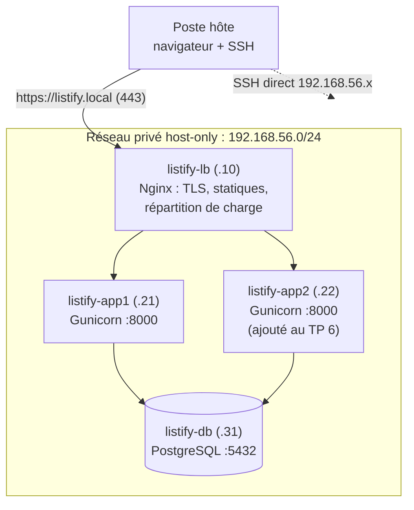

# Bloc 2 : architecture multi-machines, un service par VM

**Semaines 6 à 8.** Au bloc 1, les trois tiers de Listify cohabitaient sur une seule machine. Vous allez maintenant les **éclater sur des VM distinctes**, reliées par un réseau privé, puis ajouter un deuxième backend derrière un répartiteur de charge. Toujours à la main : la douleur du bloc 1, multipliée par le nombre de machines, est précisément ce qui rendra l'Infrastructure as Code du bloc 3 désirable.

## Pourquoi cette étape ?

Parce que c'est l'architecture réelle de la quasi-totalité des systèmes en production : on ne fait pas tourner la base de données sur le serveur web. Les raisons (isolation des pannes, dimensionnement indépendant, sécurité par segmentation, montée en charge horizontale) sont le cœur théorique du bloc, et elles resteront valables au S2 : Kubernetes ne fera qu'automatiser ce que vous allez câbler à la main.

Et parce que ce bloc fait émerger **le** problème qui justifie la suite du semestre : à 4 machines, maintenir la configuration cohérente à la main devient ingérable. Vous allez vivre le *configuration drift* dans votre propre infrastructure, avant de lui donner un nom au chapitre 9.

## L'architecture cible

Chaque VM garde en plus sa carte NAT pour accéder à Internet (installation de paquets) : le réseau privé, lui, ne transporte que le trafic entre nos machines. Ce schéma en « tiers » (entrée publique → applicatif → données) est celui que vous retrouverez partout, du datacenter d'entreprise aux VPC des clouds publics.

## Organisation du bloc

| Semaine | CM | TP |
|---|---|---|
| 6 | [Ch. 6 : Pourquoi séparer les services](cours/06-pourquoi-separer-les-services.md) + [Ch. 7 : Réseau privé entre machines](cours/07-reseau-prive-entre-machines.md) | [TP 5](tp/tp5-eclater-application.md) (début) : réseau host-only, VM de base, clones |
| 7 | [Ch. 8 : Répartition de charge](cours/08-repartition-de-charge.md) | [TP 5](tp/tp5-eclater-application.md) (fin) : éclatement des trois tiers, pare-feu inter-VM |
| 8 | [Ch. 9 : Le problème de la configuration distribuée](cours/09-configuration-distribuee.md) | [TP 6](tp/tp6-load-balancer.md) : 2ᵉ backend, load balancer, health checks |

## Ce que vous saurez faire à la fin du bloc

- Concevoir et justifier un plan d'adressage privé, et le mettre en œuvre avec les réseaux host-only de VirtualBox et netplan.
- Cloner proprement des VM (MAC, hostname, clés d'hôte SSH) et mesurer ce que le clonage ne résout pas.
- Segmenter un réseau interne au pare-feu : seul le load balancer atteint les backends, seuls les backends atteignent la base.
- Déplacer une base de données d'une machine à une autre avec une sauvegarde du TP 4.
- Configurer Nginx en répartiteur de charge (round-robin, retries, exclusion passive d'un backend mort) et observer le comportement sous panne, chronomètre en main.
- Nommer précisément ce qui rend cette architecture pénible à opérer à la main : *configuration drift*, serveurs « flocons de neige », *pets vs cattle*.

## Prérequis matériels

Quatre VM tourneront simultanément au TP 6. Avec la VM de base à 1 Go de RAM chacune, comptez **4 Go de RAM pour les invités** : confortable sur un poste à 16 Go, faisable à 8 Go en fermant le reste (ou en abaissant chaque VM à 768 Mo). La VM `listify-s1` du bloc 1 reste **éteinte** mais n'est pas supprimée : elle sert de source pour la migration de données du TP 5, et de témoin pour les comparaisons du bloc 3.
