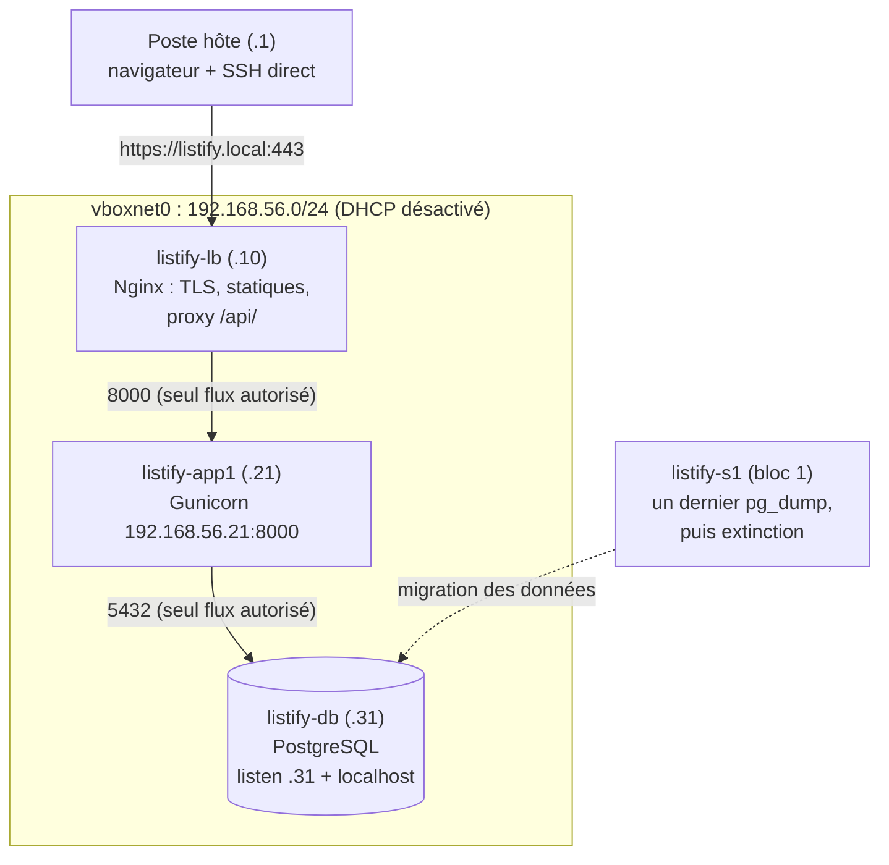

# TP 5 : Éclater l'application sur trois machines

!!! abstract "Fiche du TP"
    - **Durée** : 6 h (3 séances de 2 h : réseau + VM de base et clones ; base de données ; backend + load balancer)
    - **Prérequis** : bloc 1 terminé (dont la copie de sauvegarde hors-VM du TP 4) ; chapitres 6 et 7
    - **Livrables** : l'application répartie sur `listify-lb`, `listify-app1` et `listify-db`, accessible en `https://listify.local` (sans numéro de port !) ; le **tableau du plan d'adressage** dans le README du dépôt ; les données du bloc 1 migrées ; runbook à jour
    - **Compétences travaillées** : C1, C6

    À la fin de ce TP, chaque tier vit sur sa machine, le réseau est segmenté au pare-feu, et vos tâches du bloc 1 ont déménagé avec la base.

## Ce que vous allez construire



Chaque VM garde sa carte NAT (Internet pour APT) ; tout le trafic applicatif passe par le réseau privé.

!!! danger "Règle de manipulation : connectez-vous d'abord, collez ensuite"
    Dans tout ce TP, les blocs qui commencent par une ligne `ssh listify-xxx` se déroulent **en deux temps** : lancez la connexion **seule**, attendez l'invite `deploy@listify-xxx`, et **seulement alors** collez la suite des commandes. Si vous collez le bloc entier d'un coup, la connexion s'ouvre pendant que le reste du texte arrive encore : des lignes se perdent ou fusionnent (vous verrez des commandes hybrides absurdes, du type `...443/tcpetc/nginx/...`), et vous passerez du temps à diagnostiquer un problème qui n'existe pas.

    Réflexe associé, avant chaque bloc : `hostname`. Une commande juste sur la mauvaise machine reste une commande fausse, et c'est l'erreur la plus fréquente d'un TP multi-machines.

## Étape 0 : le réseau host-only, côté hôte (15 min)

Dans VirtualBox : **Fichier → Outils → Gestionnaire de réseau** (Network Manager), onglet « Réseaux hôte uniquement » :

1. Si `vboxnet0` n'existe pas, cliquez **Créer**.
2. Vérifiez l'adressage : IPv4 `192.168.56.1/24` (l'hôte est donc `.1`, comme au plan du chapitre 7).
3. Onglet « Serveur DHCP » : **décochez « Activer le serveur »**. Des serveurs ont des adresses statiques (ch. 7, §3.2) ; un DHCP concurrent produirait des conflits.

Équivalent en ligne de commande, et vérification :

```bash
VBoxManage list hostonlyifs          # vboxnet0, IPAddress 192.168.56.1
VBoxManage list dhcpservers          # le serveur de vboxnet0 : Enabled: No
# Pour le désactiver si besoin :
VBoxManage dhcpserver modify --interface vboxnet0 --disable
```

## Étape 1 : la VM de base (45 min)

Installer Ubuntu quatre fois serait de la friction sans valeur ; la friction intéressante du bloc est ailleurs. Nous créons donc **une** VM de base soignée, puis nous la clonerons. (Notez l'idée au passage : préparer une machine-modèle puis l'instancier, c'est déjà le concept d'**image**, central au S2.)

Créez `listify-base` comme au TP 1, avec ces différences :

| Paramètre | Valeur | Pourquoi |
|---|---|---|
| Nom | `listify-base` | |
| RAM / CPU | 1024 Mo / 1 vCPU | Chaque machine ne porte plus qu'un service |
| Disque | 15 Go dynamique | |
| Réseau, carte 1 | NAT | Internet (APT) |
| **Réseau, carte 2** | **Réseau privé hôte (host-only), vboxnet0** | Le réseau du chapitre 7 |

!!! note "La carte 2 pendant l'installation : ne rien configurer"
    À l'écran réseau de l'installateur, seule `enp0s3` doit être configurée (automatique/DHCP : c'est la carte NAT, laissez-la telle quelle). Si `enp0s8` apparaît, laissez-la **non configurée** : la base n'a volontairement aucun réglage host-only, chaque clone recevra le sien. Si `enp0s8` n'apparaît **pas du tout**, c'est que la carte 2 n'était pas activée au démarrage (l'assistant de création ne règle que la carte 1) : terminez l'installation normalement, puis, VM éteinte, activez-la dans Configuration → Réseau → Carte 2 → « Activer la carte réseau » → Réseau privé hôte (vboxnet0). Aucune réinstallation n'est nécessaire. Vérification depuis l'hôte : `VBoxManage showvminfo listify-base | grep -i "NIC 2"`.

Installez Ubuntu Server 24.04 (procédure du TP 1, étape 2), hostname `listify-base`, utilisateur `deploy`, **OpenSSH coché**. Puis configurez la base par SSH : ajoutez temporairement la redirection NAT `ssh` (TCP, 127.0.0.1, 2222 → 22, comme au TP 1) et déroulez :

```bash
# Depuis le poste hôte : déposer votre clé (options anti multi-clés du TP 1)
ssh-copy-id -i ~/.ssh/id_ed25519.pub \
  -o PubkeyAuthentication=no -o PreferredAuthentications=password \
  -p 2222 deploy@127.0.0.1
ssh -p 2222 -o IdentitiesOnly=yes -i ~/.ssh/id_ed25519 deploy@127.0.0.1
```

!!! danger "« REMOTE HOST IDENTIFICATION HAS CHANGED! » : attendu ici, et instructif"
    Vous avez utilisé `127.0.0.1:2222` au bloc 1 pour joindre `listify-s1`. Ce même guichet mène désormais à `listify-base`, une **autre machine**, avec d'autres clés d'hôte : SSH refuse la connexion, exactement comme il le doit (ch. 5, §1.3). À cause du NAT, `127.0.0.1:2222` ne désigne pas une machine mais une **redirection**, qui a changé d'occupant : l'adresse ne fait pas l'identité. Le réseau host-only de ce bloc supprimera ce piège en donnant à chaque VM sa propre adresse.

    Ne supprimez pas l'entrée à l'aveugle : prenez le réflexe de **vérifier l'empreinte**. Dans la console VirtualBox de la VM, affichez la sienne et comparez-la à celle qu'annonce le message d'erreur :

    ```bash
    sudo ssh-keygen -lf /etc/ssh/ssh_host_ed25519_key.pub
    ```

    Si elle correspond, supprimez l'ancienne entrée depuis l'hôte, puis relancez la commande (SSH proposera d'accepter la nouvelle empreinte) :

    ```bash
    ssh-keygen -f ~/.ssh/known_hosts -R '[127.0.0.1]:2222'
    ```

    Vous rejouerez ce geste à l'étape 2.2, après la régénération volontaire des clés des clones : ce sera alors la preuve que chaque machine a bien reçu sa propre identité.

```bash
# Sur la VM : le socle du TP 1, en accéléré (votre runbook du bloc 1 sert enfin !)
sudo tee /etc/ssh/sshd_config.d/00-hardening.conf > /dev/null <<'EOF'
PermitRootLogin no
PasswordAuthentication no
KbdInteractiveAuthentication no
AllowUsers deploy
EOF
sudo sshd -t && sudo systemctl reload ssh

sudo ufw default deny incoming && sudo ufw default allow outgoing
sudo ufw allow 22/tcp && sudo ufw enable

sudo apt update && sudo apt upgrade -y
sudo timedatectl set-timezone Europe/Paris

# La résolution interne (ch. 7, §5) : le même bloc sur TOUTES les machines
sudo tee -a /etc/hosts > /dev/null <<'EOF'
192.168.56.10   listify-lb
192.168.56.21   listify-app1
192.168.56.22   listify-app2
192.168.56.31   listify-db
EOF
```

Éteignez (`sudo poweroff`), puis :

1. **Supprimez la redirection de port 2222** de `listify-base`. Impératif : les clones héritent des réglages de la VM, et trois clones revendiquant le port hôte 2222 entreraient en conflit au premier démarrage simultané.
2. Prenez un snapshot **`base-prete`**.

!!! note "Ce que la base ne contient volontairement pas"
    Ni netplan pour `enp0s8` (chaque clone recevra **son** adresse), ni PostgreSQL, ni Nginx, ni le code : la base est un socle **générique**. Tout ce qui est spécifique à un rôle sera posé sur le bon clone, et nulle part ailleurs : c'est la surface d'attaque minimale du ch. 5, appliquée par construction.

## Étape 2 : cloner et individualiser (45 min)

### 2.1 Les trois clones

Pour chaque nom (`listify-lb`, `listify-app1`, `listify-db`) : clic droit sur `listify-base` → **Cloner** : nom du clone, **Clone intégral** (*full clone*), et dans « Options » : **« Générer de nouvelles adresses MAC pour toutes les cartes réseau »**. Sans cette option, trois cartes porteraient la même MAC sur le même réseau : le genre de panne réseau qu'on met des heures à soupçonner.

### 2.2 Individualiser chaque clone

Un clone est une **copie parfaite**, y compris de tout ce qui devrait être unique. Démarrez chaque clone et, **dans la console VirtualBox** (pas de SSH possible : la carte host-only n'a pas encore d'adresse), déroulez, en remplaçant nom et adresse (`listify-lb` = `.10`, `listify-app1` = `.21`, `listify-db` = `.31`) :

!!! tip "Comment coller du texte dans la console VirtualBox ?"
    Le presse-papiers partagé (Périphériques → Presse-papiers partagé) **ne fonctionne pas** ici : il exige les Additions invité **et une session graphique**, que notre serveur n'a pas. Trois façons de s'en sortir, du plus confortable au plus rapide :

    1. **La méthode recommandée : éviter la console.** Le clone a toujours sa carte NAT, son sshd et votre clé (héritée de la base). VM éteinte, donnez-lui une redirection NAT temporaire sur un port hôte **distinct** (`listify-lb` → 2210, `listify-app1` → 2221, `listify-db` → 2231), démarrez-la, puis connectez-vous et collez le bloc d'un seul coup :

        ```bash
        ssh -p 2221 -o IdentitiesOnly=yes -i ~/.ssh/id_ed25519 deploy@127.0.0.1
        ```

        Après la régénération des clés d'hôte (étape 3 du bloc), votre PC signalera un changement d'empreinte sur ce port : c'est **attendu**, c'est même la preuve que l'opération a réussi ; nettoyez avec `ssh-keygen -f ~/.ssh/known_hosts -R '[127.0.0.1]:2221'`. Supprimez la redirection une fois l'adresse privée en place.

    2. **Faire taper VirtualBox**, uniquement pour **une commande courte à la fois** : `VBoxManage controlvm listify-app1 keyboardputstring "sudo hostnamectl set-hostname listify-app1"`. Deux limites à connaître : la touche Entrée n'est **pas** envoyée (tapez-la vous-même), et les frappes suivent la disposition clavier de l'invité, donc relisez la ligne avant de valider. N'essayez **pas** d'y coller un bloc multi-lignes contenant des apostrophes ou un heredoc (`<<'EOF'`) : le guillemet ouvrant ne se refermerait jamais et votre shell resterait bloqué sur une invite `dquote>` (sortez par ++ctrl+c++).

    3. **Taper à la main** : les commandes ci-dessous sont courtes, et les saisir une fois n'est pas du temps perdu (vous verrez au bloc 3 ce que ce geste répétitif deviendra).

Le bloc est le même sur les trois machines, aux **deux valeurs d'identité** près (le nom et l'adresse) ; l'étape 3, elle, est rigoureusement identique partout. Chaque onglet ci-dessous est prêt à coller sur la machine correspondante :

=== "listify-lb (.10)"

    ```bash
    # 1. L'identité : hostname + l'entrée locale 127.0.1.1 d'Ubuntu
    sudo hostnamectl set-hostname listify-lb
    sudo sed -i 's/^127\.0\.1\.1.*/127.0.1.1 listify-lb/' /etc/hosts

    # 2. L'adresse privée : netplan (ch. 7, §4.2)
    sudo tee /etc/netplan/60-hostonly.yaml > /dev/null <<'EOF'
    network:
      version: 2
      ethernets:
        enp0s8:
          addresses:
            - 192.168.56.10/24
    EOF
    sudo chmod 600 /etc/netplan/60-hostonly.yaml
    sudo netplan apply        # en console, pas besoin de netplan try
    ip -brief addr            # enp0s8 doit porter l'adresse

    # 3. Les clés d'hôte SSH : chaque serveur doit avoir les SIENNES
    sudo rm /etc/ssh/ssh_host_*
    sudo dpkg-reconfigure openssh-server
    sudo systemctl restart ssh
    ```

=== "listify-app1 (.21)"

    ```bash
    # 1. L'identité : hostname + l'entrée locale 127.0.1.1 d'Ubuntu
    sudo hostnamectl set-hostname listify-app1
    sudo sed -i 's/^127\.0\.1\.1.*/127.0.1.1 listify-app1/' /etc/hosts

    # 2. L'adresse privée : netplan (ch. 7, §4.2)
    sudo tee /etc/netplan/60-hostonly.yaml > /dev/null <<'EOF'
    network:
      version: 2
      ethernets:
        enp0s8:
          addresses:
            - 192.168.56.21/24
    EOF
    sudo chmod 600 /etc/netplan/60-hostonly.yaml
    sudo netplan apply        # en console, pas besoin de netplan try
    ip -brief addr            # enp0s8 doit porter l'adresse

    # 3. Les clés d'hôte SSH : chaque serveur doit avoir les SIENNES
    sudo rm /etc/ssh/ssh_host_*
    sudo dpkg-reconfigure openssh-server
    sudo systemctl restart ssh
    ```

=== "listify-db (.31)"

    ```bash
    # 1. L'identité : hostname + l'entrée locale 127.0.1.1 d'Ubuntu
    sudo hostnamectl set-hostname listify-db
    sudo sed -i 's/^127\.0\.1\.1.*/127.0.1.1 listify-db/' /etc/hosts

    # 2. L'adresse privée : netplan (ch. 7, §4.2)
    sudo tee /etc/netplan/60-hostonly.yaml > /dev/null <<'EOF'
    network:
      version: 2
      ethernets:
        enp0s8:
          addresses:
            - 192.168.56.31/24
    EOF
    sudo chmod 600 /etc/netplan/60-hostonly.yaml
    sudo netplan apply        # en console, pas besoin de netplan try
    ip -brief addr            # enp0s8 doit porter l'adresse

    # 3. Les clés d'hôte SSH : chaque serveur doit avoir les SIENNES
    sudo rm /etc/ssh/ssh_host_*
    sudo dpkg-reconfigure openssh-server
    sudo systemctl restart ssh
    ```

Trois fois le même geste, avec deux valeurs qui changent : gardez cette sensation, c'est exactement ce qu'une boucle sur un inventaire Ansible supprimera au bloc 3.

!!! warning "Pourquoi régénérer les clés d'hôte ?"
    Les trois clones partagent les clés d'hôte de la base : trois serveurs présentant la **même identité** SSH. C'est un problème de sécurité (compromettre une clé = usurper les trois) et une source de confusion pour `known_hosts`. La régénération rend à chacun son identité, celle que vous vérifierez à la première connexion (ch. 5, §1.3). Cas d'école de ce qu'un clonage ne règle pas : l'**identité** ne se copie pas, elle s'attribue. (Dans la même famille, pour les curieux : `/etc/machine-id`, dupliqué aussi ; sans conséquence dans nos TP, mais à savoir pour les parcs réels.)

### 2.3 Côté hôte : l'accès direct

Complétez `~/.ssh/config` (fini les ports 2222 !) :

```text title="~/.ssh/config (à compléter)"
Host listify-lb
    HostName 192.168.56.10
Host listify-app1
    HostName 192.168.56.21
Host listify-db
    HostName 192.168.56.31
Host listify-lb listify-app1 listify-app2 listify-db
    User deploy
    IdentityFile ~/.ssh/id_ed25519
    IdentitiesOnly yes
```

!!! danger "Purger les empreintes des trois machines, **depuis votre PC**"
    Vos premières connexions vont déclencher « REMOTE HOST IDENTIFICATION HAS CHANGED! » : c'est le résultat **attendu** de la régénération des clés (et si votre PC avait déjà rencontré ces adresses lors d'une session précédente, à plus forte raison). Purgez les trois d'un coup, puis reconnectez-vous en acceptant les nouvelles empreintes :

    ```bash
    ssh-keygen -f ~/.ssh/known_hosts -R '192.168.56.10'
    ssh-keygen -f ~/.ssh/known_hosts -R '192.168.56.21'
    ssh-keygen -f ~/.ssh/known_hosts -R '192.168.56.31'
    ```

    Deux pièges qui font perdre du temps :

    - **Ces commandes se lancent sur l'hôte, jamais dans la VM.** `known_hosts` est la mémoire du **client** SSH : c'est votre PC qui a mémorisé l'identité des serveurs, donc c'est chez lui qu'il faut corriger. Dans la VM, le fichier n'existe même pas (elle n'a encore joué que le rôle de serveur). Repère général : `ssh`, `scp`, `ssh-copy-id`, `ssh-keygen -R` et `~/.ssh/config` sont des commandes **client** (sur votre PC) ; `sshd`, `/etc/ssh/sshd_config` et `authorized_keys` vivent côté **serveur**, dans la VM.
    - **Ne mettez pas le `~` entre guillemets** : le shell ne le développe qu'en dehors des quotes. `-f '~/.ssh/known_hosts'` échoue avec « no such file or directory » alors que le fichier existe ; utilisez `~/.ssh/known_hosts` sans quotes, ou le chemin absolu.

??? question "Point de contrôle n° 1 : le réseau est câblé"
    - Depuis l'hôte : `ssh listify-db 'hostname'` répond `listify-db` (idem pour les trois). Première connexion : l'empreinte présentée est **différente** pour chaque machine, preuve que la régénération des clés a fonctionné.
    - Entre VM : `ssh listify-app1 'ping -c2 listify-db'` fonctionne **par le nom** (le /etc/hosts de la base fait effet).
    - `ssh listify-app1 'ip -brief addr'` : l'adresse NAT (10.0.2.15) **et** la privée (.21) : deux cartes, deux rôles.

## Étape 3 : la base de données déménage (1 h)

### 3.1 Le dernier service de listify-s1

Démarrez `listify-s1` (bloc 1) une dernière fois, produisez un dump **frais** (celui du TP 4 date d'avant vos dernières tâches), rapatriez-le, éteignez :

!!! warning "Le retour de « host key changed » sur `[127.0.0.1]:2222`, et l'occasion de vérifier une empreinte"
    Entre-temps, ce même guichet NAT a servi à joindre `listify-base` (étape 1) : votre PC a donc mémorisé l'identité de la base pour `[127.0.0.1]:2222`, et `listify-s1` présente de nouveau la sienne. Nettoyez et reconnectez :

    ```bash
    ssh-keygen -f ~/.ssh/known_hosts -R '[127.0.0.1]:2222'
    ```

    Profitez-en pour faire ce que la sécurité réclame et qu'on néglige toujours : l'empreinte que SSH vous présente maintenant doit être **exactement celle que vous avez acceptée au TP 1** pour cette machine (elle est dans votre runbook : c'est précisément à cela que sert de la consigner). Si elle correspond, vous avez la preuve formelle que c'est bien votre ancienne VM. Un guichet NAT change d'occupant ; une clé d'hôte, non.

```bash
ssh -t listify-s1 'sudo -u postgres pg_dump -Fc -f /tmp/listify-final.dump listify'
scp listify-s1:/tmp/listify-final.dump ./backups/
ls -lh ./backups/listify-final.dump      # VÉRIFIER que le dump est arrivé...
ssh -t listify-s1 'sudo poweroff'        # ... AVANT d'éteindre définitivement
```

Le `-t` est indispensable partout où une commande distante appelle `sudo` : sans pseudo-terminal, `sudo` refuse de demander le mot de passe (« a terminal is required », TP 4, partie A). Il en va de même pour toutes les commandes `ssh ... 'sudo ...'` de ce TP et du suivant. Et vérifiez toujours l'arrivée du dump **avant** d'éteindre la source : une extinction ne se rattrape qu'en rallumant, mais l'ordre des gestes est ce qui distingue une migration d'un incident.

Une sauvegarde qui sert à **déménager** : les sauvegardes ne sont pas que pour les catastrophes, ce sont les valises des données.

### 3.2 Installer et ouvrir PostgreSQL au réseau privé

Sur `listify-db` (rituel d'inventaire du TP 2 compris, il va vite désormais) :

```bash
ssh listify-db
```

```bash
# Sur listify-db :
hostname                         # vérifier la machine AVANT toute chose
sudo apt update && sudo apt install -y postgresql
sudo ss -tlnp | grep 5432        # 127.0.0.1 uniquement : il faut ouvrir au privé
```

Deux fichiers à modifier, et **seulement** ceux-là :

```bash
# 1. Écouter AUSSI sur l'adresse privée (jamais 0.0.0.0 : ch. 3, le bind est une
#    décision de sécurité ; la carte NAT n'a aucune raison de porter PostgreSQL)
sudo sed -i "s/^#listen_addresses = 'localhost'/listen_addresses = 'localhost, 192.168.56.31'/" \
  /etc/postgresql/16/main/postgresql.conf

# 2. Autoriser le rôle listify DEPUIS app1 uniquement (pg_hba, vu au TP 2)
echo 'host    listify    listify    192.168.56.21/32    scram-sha-256' | \
  sudo tee -a /etc/postgresql/16/main/pg_hba.conf

sudo systemctl restart postgresql
sudo ss -tlnp | grep 5432        # localhost ET .31 désormais
```

### 3.3 Recréer le rôle, restaurer les données

```bash
# Générer un NOUVEAU mot de passe (celui du bloc 1 a vécu ; il ira dans le
# listify.env de app1 à l'étape 4)
openssl rand -base64 24

sudo -u postgres psql -c "CREATE ROLE listify LOGIN PASSWORD 'LE_NOUVEAU_MDP';"
sudo -u postgres psql -c "CREATE DATABASE listify OWNER listify;"
```

```bash
# Depuis l'hôte : livrer le dump, puis restaurer EN TANT QUE listify
scp ./backups/listify-final.dump listify-db:/tmp/
ssh listify-db 'pg_restore -d "postgresql://listify@127.0.0.1:5432/listify" \
                --clean --if-exists /tmp/listify-final.dump'
ssh listify-db 'psql "postgresql://listify@127.0.0.1:5432/listify" \
                -c "SELECT count(*) FROM tasks;"'
# Le compte doit être celui du bloc 1 : les données ont déménagé.
```

### 3.4 Le pare-feu de la zone données

```bash
ssh listify-db
```

```bash
# Sur listify-db :
sudo ufw allow from 192.168.56.21 to any port 5432 proto tcp
sudo ufw status verbose
```

??? question "Point de contrôle n° 2 : la segmentation est réelle"
    Trois tests, **deux doivent échouer** (à consigner : ce sont les preuves) :

    ```bash
    ssh listify-app1 'nc -zvw 3 listify-db 5432'   # OK : le flux autorisé
    ssh listify-lb   'nc -zvw 3 listify-db 5432'   # timeout : le LB n'a rien à faire là
    nc -zvw 3 192.168.56.31 5432                    # timeout : l'hôte non plus
    ```

    Notez la forme de l'échec : **timeout**, pas *refused* : le pare-feu jette (DENY/DROP), il ne répond pas (ch. 3, §5.2). Et remarquez que la défense est **double** : même sans ufw, pg_hba n'accepterait que `.21` ; c'est la défense en profondeur du ch. 5, en version réseau.

## Étape 4 : le backend sur sa machine (45 min)

Sur `listify-app1`, rejouez l'installation du TP 2, avec **trois différences** qui sont toute la leçon :

```bash
ssh listify-app1
```

```bash
# Sur listify-app1 :
hostname                         # vérifier la machine AVANT toute chose
sudo adduser --system --group --home /opt/listify --shell /usr/sbin/nologin listify
sudo apt update && sudo apt install -y python3 python3-venv
```

```bash
# Depuis l'hôte : livrer le code (v1.1)
scp -r backend listify-app1:/tmp/backend
ssh -t listify-app1 'sudo mv /tmp/backend /opt/listify/backend &&
                     sudo chown -R listify:listify /opt/listify/backend'
```

```bash
# Sur app1 : venv, configuration, unité
sudo -u listify python3 -m venv /opt/listify/venv
sudo -u listify /opt/listify/venv/bin/pip install -r /opt/listify/backend/requirements.txt

sudo mkdir -p /etc/listify
sudo tee /etc/listify/listify.env > /dev/null <<'EOF'
DB_HOST=listify-db
DB_PORT=5432
DB_NAME=listify
DB_USER=listify
DB_PASSWORD=LE_NOUVEAU_MDP
EOF
sudo chown root:listify /etc/listify/listify.env
sudo chmod 640 /etc/listify/listify.env

sudo tee /etc/systemd/system/listify.service > /dev/null <<'EOF'
[Unit]
Description=Listify backend (Gunicorn)
After=network-online.target
Wants=network-online.target

[Service]
User=listify
Group=listify
WorkingDirectory=/opt/listify/backend
EnvironmentFile=/etc/listify/listify.env
ExecStart=/opt/listify/venv/bin/gunicorn --workers 3 --bind 192.168.56.21:8000 wsgi:app
Restart=on-failure
RestartSec=2

[Install]
WantedBy=multi-user.target
EOF
sudo systemctl daemon-reload
sudo systemctl enable --now listify

# Le pare-feu de la zone applicative : 8000 pour le LB seulement
sudo ufw allow from 192.168.56.10 to any port 8000 proto tcp
```

Les trois différences avec le TP 2, à expliquer dans le runbook :

1. **`DB_HOST=listify-db`** : un nom du réseau privé, plus `127.0.0.1`. Le code n'a pas changé d'une ligne : c'est le facteur III et le facteur IV (ch. 4) qui livrent exactement ce qu'ils promettaient.
2. **`--bind 192.168.56.21:8000`** : le backend écoute sur le réseau privé (le LB doit le joindre), sur son adresse **précise**, pas `0.0.0.0` (la carte NAT n'a pas à porter l'API).
3. **Plus de `After=postgresql.service`** : PostgreSQL n'est plus une unité locale, c'est un service **distant**. systemd ne peut plus rien ordonnancer : la dépendance est devenue réseau, invisible pour lui. C'est un petit deuil et une grande leçon (ch. 6, §5) ; notre API sait attendre (503 propre), c'est elle qui absorbe.

??? question "Point de contrôle n° 3"
    ```bash
    ssh listify-app1 'curl -s http://192.168.56.21:8000/api/health'
    # {"api":"ok","database":"ok"}  ← ok/ok À TRAVERS le réseau privé
    curl -m 3 http://192.168.56.21:8000/api/health   # depuis l'hôte : timeout (ufw)
    ```

## Étape 5 : le load balancer, porte d'entrée unique (45 min)

Sur `listify-lb` : Nginx, les statiques, le TLS, et le proxy qui pointe désormais vers une **autre machine** :

Connectez-vous d'abord (commande seule), puis collez le bloc suivant une fois l'invite affichée :

```bash
ssh listify-lb
```

```bash
# Sur listify-lb :
hostname                         # vérifier la machine AVANT toute chose
sudo apt update && sudo apt install -y nginx
nginx -v                         # confirme l'installation : /etc/nginx existe désormais
sudo mkdir -p /opt/listify
```

```bash
# Depuis l'hôte : les statiques (v1.1)
scp -r frontend listify-lb:/tmp/frontend
ssh -t listify-lb 'sudo mv /tmp/frontend /opt/listify/frontend &&
                   sudo chown -R root:root /opt/listify/frontend &&
                   sudo chmod -R a+rX /opt/listify/frontend'
# (pas de chmod o+x du parent ici : /opt/listify vient d'un mkdir root en 755,
#  ce n'est pas un home 750 ; comparez avec le piège du TP 3 et expliquez)
```

```bash
# Sur lb : certificat (TP 3, étape 3, à l'identique) puis le site
sudo mkdir -p /etc/nginx/ssl
sudo openssl req -x509 -newkey ec -pkeyopt ec_paramgen_curve:prime256v1 \
  -keyout /etc/nginx/ssl/listify.key -out /etc/nginx/ssl/listify.crt \
  -days 365 -nodes -subj "/CN=listify.local" \
  -addext "subjectAltName=DNS:listify.local"
sudo chmod 600 /etc/nginx/ssl/listify.key

sudo tee /etc/nginx/sites-available/listify > /dev/null <<'EOF'
server {
    listen 80;
    server_name listify.local;
    return 301 https://$host$request_uri;
}

server {
    listen 443 ssl;
    server_name listify.local;

    ssl_certificate     /etc/nginx/ssl/listify.crt;
    ssl_certificate_key /etc/nginx/ssl/listify.key;
    ssl_protocols       TLSv1.2 TLSv1.3;

    root /opt/listify/frontend;
    index index.html;
    location / {
        try_files $uri $uri/ =404;
    }

    location /api/ {
        proxy_pass http://listify-app1:8000;
        proxy_set_header Host              $host;
        proxy_set_header X-Real-IP         $remote_addr;
        proxy_set_header X-Forwarded-For   $proxy_add_x_forwarded_for;
        proxy_set_header X-Forwarded-Proto $scheme;
    }
}
EOF
sudo ln -s /etc/nginx/sites-available/listify /etc/nginx/sites-enabled/listify
sudo rm /etc/nginx/sites-enabled/default
sudo nginx -t && sudo systemctl reload nginx

sudo ufw allow 80/tcp && sudo ufw allow 443/tcp
```

Deux détails qui closent des dossiers ouverts au TP 3 :

- La redirection est redevenue **`https://$host$request_uri`**, la forme « production » : plus de NAT entre le navigateur et Nginx, donc plus de `:8443`. La verrue du TP 3 disparaît avec sa cause : notez la boucle.
- `proxy_pass http://listify-app1:8000;` : un **nom**, résolu via `/etc/hosts` au chargement de la configuration. Si l'adresse de app1 change un jour : un fichier hosts à corriger, zéro configuration Nginx.

Côté hôte, mettez à jour la résolution : **remplacez** la ligne du TP 3 (`127.0.0.1 listify.local`) par :

```text
192.168.56.10   listify.local
```

## Étape 6 : la traversée complète (30 min)

```bash
# Depuis l'hôte, la chaîne entière :
curl -sk https://listify.local/api/health          # {"api":"ok","database":"ok"}
curl -sk https://listify.local/ | head -5           # le HTML
curl -s -o /dev/null -w '%{redirect_url}\n' http://listify.local/
```

Puis **au navigateur** : `https://listify.local` (acceptez le nouveau certificat). Vos tâches du **bloc 1** s'affichent : elles ont traversé un pg_dump, un scp, un pg_restore et trois machines. Créez-en une nouvelle, cochez-la : la requête parcourt hôte → lb → app1 → db et revient.

Terminez par la preuve de segmentation complète, tableau à remplir au runbook (chaque case = une commande `nc -zvw 3` et son résultat) :

| Depuis ↓ vers → | lb :443 | app1 :8000 | db :5432 |
|---|---|---|---|
| hôte | OK | timeout | timeout |
| lb | : | OK | timeout |
| app1 | : | : | OK |

## Point de contrôle final

- [ ] `https://listify.local` fonctionne au navigateur, **avec les données du bloc 1** (migration prouvée par le comptage)
- [ ] Le tableau de segmentation est rempli, avec les échecs en timeout expliqués
- [ ] Chaque VM : `sudo ss -tlnp` ne montre que les ports de son rôle, sur les bonnes adresses (récitez la justification)
- [ ] Les trois clones ont des hostnames, adresses, et **empreintes SSH** distincts
- [ ] Plan d'adressage documenté dans le README ; `~/.ssh/config` et `/etc/hosts` de l'hôte à jour
- [ ] `listify-s1` éteinte, conservée ; snapshot `tp5-eclate` pris sur les trois VM ; runbook committé

## Pour aller plus loin (bonus)

1. **DNS interne** : installez dnsmasq sur `listify-lb`, faites-en le résolveur des trois VM (netplan `nameservers:`), et supprimez les blocs `/etc/hosts`. Qu'a-t-on centralisé, et qu'a-t-on fragilisé ? (Indice : que se passe-t-il si lb tombe ?)
2. **Zone données étanche** : ajoutez une carte « réseau interne » VirtualBox entre app1 et db et faites passer PostgreSQL dessus : la base disparaît même du réseau host-only. Quel prix pour l'administration ?
3. **Chronométrage prospectif** : notez précisément le temps passé sur ce TP. Au TP 9, Vagrant + Ansible referont tout ceci en une commande ; l'écart chiffré ira dans votre compte rendu.

## Questions de compréhension (à préparer pour le TD)

1. Reconstituez le trajet complet d'un `POST /api/tasks` depuis le navigateur, en nommant chaque machine, chaque adresse, chaque port traversé, et l'endroit exact où chaque règle ufw et pg_hba intervient.
2. Pourquoi avoir mis `listen_addresses = 'localhost, 192.168.56.31'` et non `'*'` ? Donnez les deux lignes de défense que cette décision complète.
3. La panne « un seul /etc/hosts oublié » : décrivez précisément les symptômes si le fichier de `listify-lb` n'avait pas l'entrée `listify-app1` (que dit `nginx -t` ? et au chargement ? et les autres machines ?).
4. Le clonage a copié les clés d'hôte SSH et aurait copié une adresse netplan si la base en avait eu une. Généralisez : qu'est-ce qui, dans l'état d'une machine, est « rôle » (clonable) et qu'est-ce qui est « identité » (à attribuer) ? Cette distinction resservira mot pour mot au S2 (images vs configuration d'instance).
