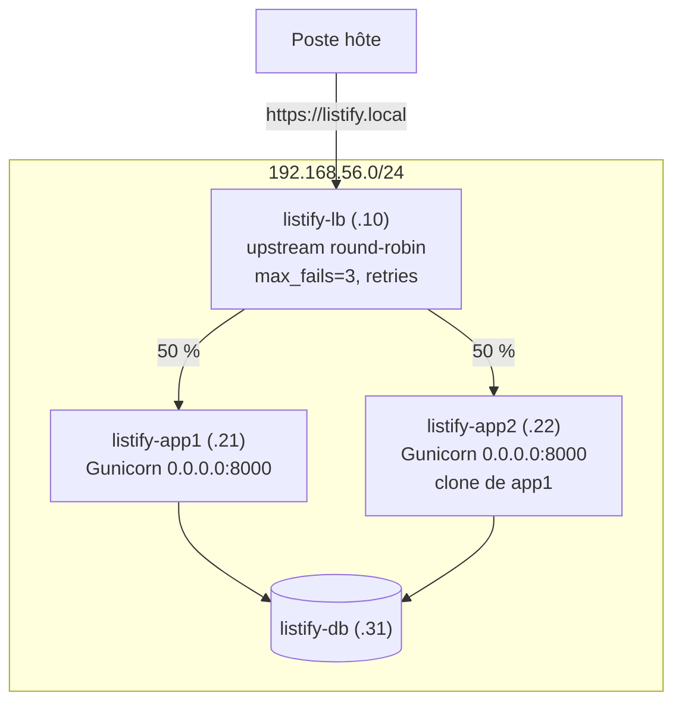

# TP 6 : Un deuxième backend et un répartiteur de charge

!!! abstract "Fiche du TP"
    - **Durée** : 4 h
    - **Prérequis** : TP 5 terminé ; chapitre 8 (et chapitre 9 pour la synthèse)
    - **Livrables** : deux backends derrière Nginx en round-robin ; les **mesures chiffrées** du comportement sous panne, avec et sans tolérance ; la liste exhaustive de tout ce qu'il a fallu toucher « juste pour ajouter un backend » ; runbook à jour
    - **Compétences travaillées** : C1, C6

    Ce TP contient une panne **prévue par le scénario** : ne la contournez pas, elle est le cœur de la séance.

## Ce que vous allez construire



## Étape 1 : cloner app1... et diagnostiquer la panne prévue (45 min)

### 1.1 Le clone

Cette fois, on ne clone pas la base générique mais **app1 configurée** : le clone embarque l'utilisateur `listify`, le venv, le code, `listify.env`, l'unité systemd, les règles ufw. Clic droit sur `listify-app1` (éteinte le temps du clonage) → Cloner → `listify-app2`, **clone intégral**, **nouvelles adresses MAC**.

Individualisez comme au TP 5 (console VirtualBox) : hostname `listify-app2`, ligne `127.0.1.1`, netplan avec **`192.168.56.22/24`**, régénération des clés d'hôte SSH. Redémarrez app1 et app2.

### 1.2 La panne au premier démarrage

Sur app2, vérifiez le service... qui doit être **en échec** :

```bash
ssh listify-app2
systemctl status listify        # failed (ou activating/auto-restart)
journalctl -u listify -n 20
```

Cherchez la ligne fautive avant de lire la suite. Vous devez trouver :

```text
OSError: [Errno 99] Cannot assign requested address
```

**Analyse** (à rédiger au runbook avec vos mots) : l'unité clonée dit `--bind 192.168.56.21:8000`, or **aucune interface de app2 ne porte l'adresse .21** : le noyau refuse le bind. Le clone a copié du « rôle » (le service backend) mais aussi un morceau d'« identité » (l'adresse de app1) figé dans un fichier de rôle : exactement la distinction de la question 4 du TP 5.

### 1.3 La décision d'architecture

Deux corrections possibles ; choisissez en connaissance de cause :

| Option | Geste | Conséquence |
|---|---|---|
| A. Éditer le bind sur chaque machine (`.21` ici, `.22` là) | Un fichier **différent** par backend | L'unité cesse d'être clonable : chaque ajout de machine exige une édition manuelle ; c'est un germe de drift (ch. 9) |
| B. `--bind 0.0.0.0:8000` partout, et laisser **ufw** restreindre (8000 depuis .10 seulement, règle déjà en place et... clonée avec la machine) | Un fichier **identique** partout | L'unité devient générique ; la restriction d'accès passe du bind au pare-feu, qui la fait déjà |

Nous retenons **B** : la configuration d'un rôle doit être identique sur toutes les machines du rôle (c'est la condition du « bétail », ch. 9), et la défense en profondeur reste double (ufw + le réseau NAT ne route de toute façon pas vers 8000). Le bind précis du ch. 3 reste la règle pour un service **unique** ; pour un rôle **multiplié**, la généricité l'emporte. Appliquez sur **les deux** backends (les deux, sinon vous créez du drift à l'instant même où le cours vous en parle) :

```bash
# Sur app2 PUIS sur app1 :
sudo sed -i 's/--bind 192\.168\.56\.[0-9]*:8000/--bind 0.0.0.0:8000/' \
  /etc/systemd/system/listify.service
sudo systemctl daemon-reload
sudo systemctl restart listify
curl -s http://localhost:8000/api/health    # bonus du 0.0.0.0 : le test local revient
```

### 1.4 Les effets de bord en cascade

app2 tourne ? Vérifiez son accès à la base :

```bash
ssh listify-app2 'curl -s http://localhost:8000/api/health'
# {"api":"ok","database":"error: OperationalError"} ... et c'est normal !
```

La base ne connaît pas app2 : ni `pg_hba.conf`, ni le pare-feu de db. Ajouter un backend touche **d'autres machines** : comptez-les au fur et à mesure, le total sert la synthèse finale.

```bash
ssh listify-db
echo 'host    listify    listify    192.168.56.22/32    scram-sha-256' | \
  sudo tee -a /etc/postgresql/16/main/pg_hba.conf
sudo systemctl reload postgresql
sudo ufw allow from 192.168.56.22 to any port 5432 proto tcp
```

```bash
ssh listify-app2 'curl -s http://localhost:8000/api/health'
# {"api":"ok","database":"ok"}
```

??? question "Point de contrôle n° 1"
    Les deux backends répondent ok/ok ; `ssh listify-app2 'sudo ufw status'` montre les règles **héritées du clone** (8000 depuis .10 : notez que le pare-feu, lui, était clonable tel quel : pourquoi ?) ; et votre compteur de machines touchées est à jour (app2, app1, db... et ce n'est pas fini).

## Étape 2 : l'upstream Nginx (30 min)

Sur `listify-lb`, remplacez le bloc `location /api/` et ajoutez l'upstream (c'est la configuration de référence du ch. 8, §5) :

```bash
ssh listify-lb
sudo tee /etc/nginx/sites-available/listify > /dev/null <<'EOF'
upstream listify_backend {
    server listify-app1:8000 max_fails=3 fail_timeout=10s;
    server listify-app2:8000 max_fails=3 fail_timeout=10s;
}

server {
    listen 80;
    server_name listify.local;
    return 301 https://$host$request_uri;
}

server {
    listen 443 ssl;
    server_name listify.local;

    ssl_certificate     /etc/nginx/ssl/listify.crt;
    ssl_certificate_key /etc/nginx/ssl/listify.key;
    ssl_protocols       TLSv1.2 TLSv1.3;

    root /opt/listify/frontend;
    index index.html;
    location / {
        try_files $uri $uri/ =404;
    }

    location /api/ {
        proxy_pass http://listify_backend;
        proxy_next_upstream error timeout http_502 http_503;
        add_header X-Upstream $upstream_addr always;
        proxy_set_header Host              $host;
        proxy_set_header X-Real-IP         $remote_addr;
        proxy_set_header X-Forwarded-For   $proxy_add_x_forwarded_for;
        proxy_set_header X-Forwarded-Proto $scheme;
    }
}
EOF
sudo nginx -t && sudo systemctl reload nginx
```

L'en-tête `X-Upstream` est notre instrument de mesure : chaque réponse dira **quel backend** l'a servie. Observez le round-robin depuis l'hôte :

```bash
for i in $(seq 1 6); do
  curl -sk -D - -o /dev/null https://listify.local/api/health | grep -i x-upstream
done
# x-upstream: 192.168.56.21:8000
# x-upstream: 192.168.56.22:8000
# x-upstream: 192.168.56.21:8000
# ... l'alternance stricte du round-robin (ch. 8, §2)
```

## Étape 3 : tuer un backend en pleine charge (1 h)

Le clou du TP : mesurer, chiffres à l'appui, ce que la tolérance aux pannes change pour l'utilisateur. Le protocole utilise deux terminaux.

### 3.1 Scénario A : configuration tolérante (celle en place)

```bash
# Terminal 1 (hôte) : 200 requêtes, comptées par code HTTP
for i in $(seq 1 200); do
  curl -sk -o /dev/null -w '%{http_code}\n' https://listify.local/api/health
done | sort | uniq -c
```

Pendant que la boucle tourne, **terminal 2** :

```bash
ssh listify-app2 'sudo systemctl stop listify'
```

Résultat attendu du terminal 1 : **200 réponses 200**, ou presque. Expliquez-le avec le ch. 8 : les requêtes tombées sur app2 mort ont échoué en connexion (*error*), `proxy_next_upstream` les a **rejouées** sur app1, et après 3 échecs (`max_fails=3`), app2 est sorti du pool pour 10 s (`fail_timeout`), renouvelés tant qu'il reste mort. L'utilisateur n'a rien vu. Vérifiez la trace côté LB :

```bash
ssh listify-lb 'sudo tail -5 /var/log/nginx/error.log'
# ... connect() failed (111: Connection refused) while connecting to upstream ...
```

### 3.2 Scénario B : la même panne, sans tolérance

Remontez app2 (`sudo systemctl start listify` dessus), puis **dégradez volontairement** la configuration du LB : dans l'upstream, passez les deux serveurs à `max_fails=0` (ne jamais exclure) et remplacez la ligne `proxy_next_upstream ...` par `proxy_next_upstream off;` (ne jamais rejouer). `nginx -t && reload`, puis rejouez exactement le protocole : 200 requêtes, stop de app2 en plein vol.

Résultat attendu : **environ la moitié de 502**, tant que la boucle dure : une requête sur deux part vers le cadavre, échoue, et n'est ni rejouée ni évitée. C'est le « mur » que le ch. 8 promettait aux LB aveugles.

### 3.3 Mesures et restauration

Consignez le tableau (vos chiffres réels) :

| Scénario | Réponses 200 | Réponses 502 | Vécu utilisateur |
|---|---|---|---|
| A : max_fails=3 + retries | ~200 | ~0 | Rien, ou une latence ponctuelle |
| B : max_fails=0, sans retry | ~100 | ~100 | Un site cassé une fois sur deux |

Puis **restaurez la configuration tolérante** (scénario A), revérifiez l'alternance `X-Upstream`, et observez une dernière chose : app2 arrêté puis redémarré **revient tout seul dans le pool** après `fail_timeout` : personne n'a touché au LB. Première rencontre avec un système qui **converge** vers son état nominal ; gardez le mot, il fera le S2.

!!! warning "Et les retries sur POST ?"
    Refaites mentalement le scénario A avec des `POST /api/tasks` : `proxy_next_upstream` par défaut refuse de rejouer les méthodes non idempotentes, et c'est une protection (ch. 8, §4.2 : le POST rejoué peut créer un doublon). Testez si le temps le permet : boucle de POST pendant un stop de backend → quelques 502 **assumés** sur les requêtes non rejouables. Un LB ne remplace pas une conception idempotente ; il la complète.

## Étape 4 : synthèse « qu'a coûté un backend de plus ? » (30 min)

Dressez la liste exhaustive, machine par machine, de ce que l'ajout de app2 a exigé (votre compteur des étapes 1-2) : clonage + individualisation (hostname, netplan, clés SSH), correction du bind **sur les deux** backends, pg_hba **sur db**, ufw **sur db**, upstream **sur lb**... et rien sur `/etc/hosts` ni `~/.ssh/config` uniquement parce que le TP 5 avait pré-provisionné app2 partout (relisez cette phrase : la « prévoyance manuelle » est aussi une forme de dette).

Puis répondez par écrit, c'est le livrable de synthèse du bloc : **combien coûterait app3 ?** Listez les fichiers, les machines, les occasions d'oubli. Ce document est votre meilleure préparation au bloc 3 : chaque ligne deviendra une ligne d'inventaire ou de rôle Ansible, et app3 coûtera une ligne.

## Point de contrôle final

- [ ] Round-robin prouvé par l'alternance `X-Upstream`
- [ ] Scénarios A et B mesurés, tableau chiffré au runbook, configuration tolérante restaurée
- [ ] Le retour automatique de app2 dans le pool observé et expliqué
- [ ] La panne `Cannot assign requested address` diagnostiquée et analysée (rôle vs identité)
- [ ] Les deux backends strictement identiques (unité, env) : vérifiez par `diff` via ssh, c'est votre premier audit anti-drift
- [ ] La synthèse « coût de app3 » rédigée
- [ ] Snapshots `tp6-lb` ; runbook committé

## Pour aller plus loin (bonus)

1. **HAProxy et sa page de statistiques** : sur `listify-lb`, installez HAProxy avec la configuration du ch. 8 (§5, onglet HAProxy) sur un port dédié, faites-y pointer Nginx (`proxy_pass http://127.0.0.1:8000` → HAProxy → backends), et ouvrez la page stats (`:8404`). Tuez app2 et regardez la ligne passer DOWN **en direct**, puis UP au retour : la sonde **active** sur `/api/health`, visualisée. Comparez la vitesse de détection avec le passif de Nginx.
2. **least_conn et requêtes inégales** : ajoutez temporairement un `time.sleep(2)` dans une route de app1 (et pas app2), chargez, comparez la distribution avec et sans `least_conn`.
3. **Pondération** : `server listify-app1:8000 weight=3;` : vérifiez la proportion 3:1 avec votre boucle `X-Upstream`.

## Questions de compréhension (à préparer pour le TD)

1. Reprenez le tableau des algorithmes du ch. 8 et dites, pour notre Listify réel, ce que chacun changerait concrètement (ou pas) et pourquoi.
2. Pourquoi les règles ufw de app1 étaient-elles clonables telles quelles alors que le bind ne l'était pas ? Formulez le critère général (indice : la règle parle de **l'autre bout** du flux).
3. Le scénario B montrait ~50 % d'erreurs. Avec 4 backends dont 1 mort, quel taux ? Avec N ? Qu'en déduire sur l'« amortissement » d'une panne par la taille du pool, et sur la détection des pannes dans les grands pools (une panne à 2 % d'erreurs se voit-elle à l'œil nu ?) : vous venez de motiver le monitoring du S2.
4. Notre LB est un SPOF assumé (ch. 8, §1.2). Rédigez le paragraphe « risques et limites » de l'architecture actuelle tel que vous l'écririez dans un dossier remis à un client : c'est un exercice de C1, et il tombe en soutenance.
