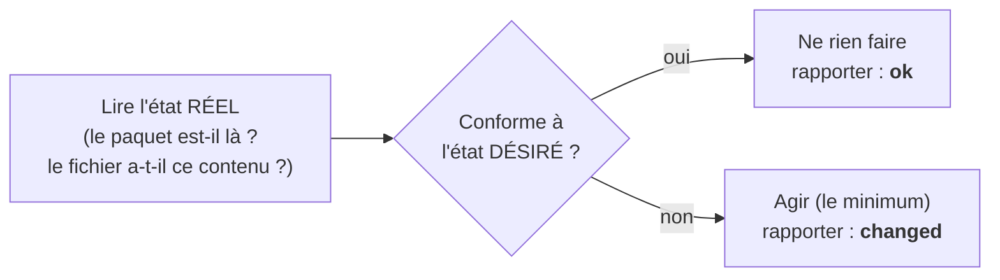

# Chapitre 10 : L'Infrastructure as Code, les trois problèmes et les concepts

!!! abstract "Objectifs du chapitre"
    À l'issue de ce chapitre, vous saurez :

    - définir l'Infrastructure as Code et situer tout outil du domaine sur la carte provisionner / configurer / orchestrer ;
    - opposer rigoureusement **déclaratif** et **impératif**, avec des exemples que vous avez déjà manipulés ;
    - définir formellement l'**idempotence** et expliquer pourquoi elle est la propriété centrale du semestre ;
    - raisonner en **état désiré / état réel / convergence**, le modèle mental qui structurera aussi les semestres 2 et 3.

    C'est le chapitre le plus important du semestre sur le plan conceptuel : tout ce qui suit (Vagrant, Ansible, Terraform, mais aussi Kubernetes au S2 et Airflow au S3) est une déclinaison de ces quelques idées.

## 1. Définition

**Infrastructure as Code (IaC)**
:   Approche consistant à définir l'infrastructure (machines, réseaux, configurations, services) dans des **fichiers de définition lisibles par une machine**, gérés comme du code source (versionnés, relus, testés), et appliqués par des outils automatiques plutôt que par des opérations manuelles.[^1]

[^1]: La formulation canonique est celle de Kief Morris, *Infrastructure as Code*, 2ᵉ éd., O'Reilly, 2020, chapitre 1. Morris insiste sur un point souvent oublié : l'IaC n'est pas d'abord une affaire d'outils mais de **pratiques** héritées du génie logiciel (versionnage, revue, tests, petits changements fréquents).

Relisez le cahier des charges que vous avez écrit au chapitre 9 (§4) : écrit, versionné, exécutable, idempotent, déclaratif, factorisé. L'IaC est exactement cela. La définition est simple ; toute la valeur est dans les propriétés, que ce chapitre établit une à une.

## 2. Les trois problèmes à résoudre

Toute mise en production décompose son automatisation en trois problèmes distincts, et la première compétence du domaine est de savoir **lequel un outil résout** :

**Provisionner** (*provision*)
:   Faire **exister** les ressources : créer les machines (VM, serveurs cloud), les réseaux, les disques, les adresses. Au bloc 2, c'était vos clics dans VirtualBox : création de VM, clonage, cartes réseau, redirections.

**Configurer** (*configure*)
:   Amener chaque machine existante dans l'**état voulu** : paquets installés, fichiers de configuration, utilisateurs, services démarrés. Au bloc 2 : tout ce que vous avez tapé en SSH.

**Orchestrer** (*orchestrate*)
:   Coordonner l'ensemble **dans le temps** : le bon ordre (la base avant le backend), la bonne échelle (3 backends aux heures de pointe), les remplacements et les reprises. Au bloc 2 : votre discipline personnelle, et c'est bien le problème : elle n'était écrite nulle part.

### 2.1 La carte des outils

| Outil | Provisionne | Configure | Orchestre | Positionnement |
|---|---|---|---|---|
| **Vagrant** | ✔ (VM locales) | via *provisioners* (délégation) | : | Environnements de développement et de TP reproductibles |
| **Terraform / OpenTofu** | ✔ (cloud, et bien plus) | : | : | Le standard du provisionnement déclaratif multi-fournisseurs |
| CloudFormation, Bicep, Pulumi | ✔ | : | : | Équivalents liés à un cloud (AWS, Azure) ou pilotés par un langage général (Pulumi) |
| **Ansible** | un peu (modules cloud) | ✔ | un peu (ordre des plays) | Le standard de la configuration *agentless* ; notre outil central |
| Puppet, Chef, Salt | : | ✔ | : | Générations précédentes, à agents ; encore présents dans les grands parcs |
| cloud-init | : | ✔ (premier démarrage) | : | La « configuration de naissance » d'une machine cloud ; vous l'avez croisé (le `50-cloud-init` du TP 1 !) |
| Kubernetes (S2) | : | : | ✔ (services) | Orchestrateur de conteneurs à boucles de réconciliation |
| Airflow (S3) | : | : | ✔ (tâches) | Orchestrateur de traitements finis (DAG) |

Deux lectures de cette carte, à retenir pour l'examen : d'abord, **aucun outil ne couvre tout**, et les architectures réelles en combinent plusieurs (notre bloc : Vagrant + Ansible ; un cloud réel : Terraform + Ansible ou Terraform + images immuables). Ensuite, la frontière provisionner/configurer recoupe une frontière technique : le provisionneur parle à une **API** (VirtualBox, AWS), le configurateur parle à un **système d'exploitation** (SSH, agents).

## 3. Déclaratif vs impératif

### 3.1 Les définitions

Approche **impérative**
:   Décrire la **suite d'actions** à exécuter : « installe nginx, copie ce fichier, redémarre le service ». C'est un *chemin*. Vos runbooks des blocs 1-2 sont impératifs.

Approche **déclarative**
:   Décrire l'**état final voulu** : « nginx est installé, ce fichier a ce contenu, le service tourne ». C'est une *destination* ; l'outil calcule lui-même le chemin, différent selon l'état de départ.

Vous avez déjà pratiqué les deux sans le nommer : le SQL est déclaratif (vous décrivez le résultat, l'optimiseur choisit le plan), netplan est déclaratif (le YAML décrit l'adresse, pas les commandes `ip addr add`), et le `CREATE TABLE IF NOT EXISTS` du fil rouge est un pas du côté déclaratif (« cette table existe ») quand `CREATE TABLE` nu est une action.

### 3.2 Pourquoi le déclaratif gagne pour l'infrastructure

L'argument décisif tient en une phrase : **une suite d'actions n'est correcte que pour un état de départ donné ; une déclaration d'état est correcte pour tous**. Le runbook du bloc 1 supposait une VM vierge : rejoué sur une VM à moitié configurée, il échoue ou détruit. La déclaration « le paquet nginx est présent » est appliquable sur une machine vierge (il s'installe), une machine conforme (rien à faire) ou une machine déviante (l'écart se corrige). Le déclaratif est ce qui rend l'outil **rejouable**, et le rejouable est ce qui corrige le drift.

Honnêteté d'ingénieur : le déclaratif a aussi ses limites, que vous rencontrerez. Il décrit mal les **transitions** qui ont un ordre métier (une migration de schéma, un enchaînement de déploiement), et le « comment » ne disparaît pas : il se déplace dans l'outil, qu'il faut comprendre quand il se trompe. D'où la survie d'îlots impératifs (handlers, scripts de migration) au sein d'ensembles déclaratifs : savoir doser est un art que le TP 8 commence à enseigner.

## 4. L'idempotence, concept central du semestre

### 4.1 Définition

Une opération `f` est **idempotente** si l'appliquer plusieurs fois produit le même état qu'une fois : `f(f(x)) = f(x)`. En exploitation : **exécuter, ré-exécuter, toujours aboutir au même état final**, sans erreur ni effet cumulatif.

### 4.2 Le test des trois exécutions

Pour chaque geste d'administration, demandez-vous ce qui se passe à la deuxième exécution :

| Geste | 1ʳᵉ exécution | 2ᵉ exécution | Idempotent ? |
|---|---|---|---|
| `mkdir /opt/listify` | crée | **erreur** « File exists » | Non |
| `mkdir -p /opt/listify` | crée | rien à faire | **Oui** |
| `useradd listify` | crée | **erreur** « already exists » | Non |
| `echo '...' >> pg_hba.conf` | ajoute la ligne | **duplique la ligne** | Non, et silencieusement : le pire cas |
| `CREATE TABLE IF NOT EXISTS` | crée | rien à faire | **Oui** (prouvé au TP 2) |
| module Ansible `user: name=listify state=present` | crée | constate, ne change rien | **Oui** |

La ligne du `>>` mérite un arrêt : c'est exactement ce que vous avez fait au TP 5 (`tee -a` dans pg_hba.conf). Rejouez votre runbook du bloc 2 et cette ligne se duplique à chaque passage : pas d'erreur, juste une configuration qui enfle et dérive. **Les non-idempotences silencieuses sont plus dangereuses que les bruyantes.**

### 4.3 Pourquoi un module Ansible est idempotent là où un script ne l'est pas

Ce n'est pas de la magie, c'est une **structure** : chaque module Ansible suit le cycle *vérifier, comparer, agir si nécessaire* :

Un script shell n'exécute que la branche « agir » ; le module exécute d'abord la lecture et la comparaison. C'est pour cela que la sortie d'Ansible distingue `ok` (déjà conforme) de `changed` (une action a eu lieu) : et c'est pour cela que la **preuve d'idempotence** du TP 8 sera : deuxième exécution du playbook → `changed=0`. Cette sortie n'est pas cosmétique : un `changed` inattendu au deuxième passage signale soit un rôle mal écrit, soit... du drift détecté. L'outil devient un instrument de mesure.

### 4.4 Le fil rouge du concept

L'idempotence vous suivra tout le parcours, à trois échelles : propriété d'un **geste** (scripts SQL, modules Ansible : S1), propriété d'un **protocole** (les méthodes HTTP rejouables du ch. 8 : S1-S2), propriété d'une **tâche de données** (les tâches Airflow ré-exécutables lors des reprises : S3). La question d'examen transversale type : « définissez l'idempotence et donnez-en une illustration à chaque semestre ».

## 5. État désiré, état réel, convergence

Le déclaratif et l'idempotence se combinent en un modèle mental unique, le plus fécond de tout le parcours :

- L'**état désiré** est écrit dans des fichiers, versionnés dans Git.
- L'**état réel** est ce que portent effectivement les machines.
- L'outil **compare** les deux et applique le **minimum d'actions** qui les fait coïncider : il fait **converger** le réel vers le désiré.
- Le **drift** (ch. 9) est l'écart qui se creuse entre les deux ; la convergence rejouée régulièrement est son antidote.

Chaque outil du parcours instancie ce modèle avec une politique différente, et ce tableau est à savoir reconstruire :

| | Qui détient l'état désiré ? | Quand la convergence a-t-elle lieu ? |
|---|---|---|
| **Ansible** (S1) | Les playbooks dans Git | Quand un humain (ou la CI) exécute le playbook |
| **Terraform** (S1) | Les fichiers `.tf` + le *state* | À chaque `terraform apply`, après un `plan` qui **montre** l'écart |
| **Kubernetes** (S2) | Les manifests, stockés dans etcd | **En continu** : des boucles de contrôle comparent et corrigent en permanence |
| **GitOps** (S2) | Le dépôt Git, point final | En continu : un agent synchronise le cluster sur le dépôt |
| Promotion de modèles (S3) | Les critères de promotion | À chaque évaluation : le meilleur modèle « désiré » remplace le champion |

Vous avez même déjà vu une convergence **en continu** fonctionner : le pool Nginx du TP 6, qui réintégrait app2 tout seul après `fail_timeout`. Kubernetes, c'est cette idée généralisée à tout un système.

## 6. Immutabilité et versionnage : les deux pratiques qui complètent le modèle

**Infrastructure immuable** : plutôt que de faire converger une machine qui vit longtemps, on peut la **remplacer** à chaque changement par une machine neuve construite depuis la définition (le serveur phénix du ch. 9, systématisé). Moins de convergence à calculer, zéro drift possible entre deux reconstructions. Ce semestre applique la version faible (`vagrant destroy && vagrant up` à volonté) ; le S2 en donnera la forme aboutie : l'**image de conteneur**, artefact immuable par construction.

**L'infrastructure dans Git** : une fois l'état désiré dans des fichiers, tout l'outillage du code s'applique gratuitement : historique (« qui a changé le pare-feu, quand, pourquoi ? » : le message de commit remplace l'archéologie), revue par les pairs avant application (une revue d'infrastructure attrape les erreurs *avant* la production), retour arrière (`git revert` + re-convergence), et reproduction d'environnements (la branche = un environnement d'essai). Poussée au bout, cette logique fera du dépôt Git **l'unique source de vérité** que des agents appliquent en continu : c'est le GitOps, au programme du S2.

## Ce qu'il faut retenir

1. IaC = l'infrastructure définie dans des **fichiers versionnés**, appliquée par des outils : autant une pratique (génie logiciel) qu'une technologie.
2. Trois problèmes, à distinguer systématiquement : **provisionner** (faire exister : Vagrant, Terraform : parle à une API), **configurer** (mettre dans l'état voulu : Ansible : parle à un OS), **orchestrer** (coordonner dans le temps : K8s, Airflow, plus tard).
3. **Impératif** = un chemin, correct pour un seul état de départ ; **déclaratif** = une destination, appliquable depuis tout état. Le déclaratif rend rejouable, le rejouable corrige le drift ; des îlots impératifs restent nécessaires (transitions, migrations).
4. **Idempotence** : `f(f(x)) = f(x)` ; test des trois exécutions ; méfiez-vous des non-idempotences **silencieuses** (`>>`). Un module Ansible est idempotent par structure : lire, comparer, agir si besoin ; `changed=0` au deuxième passage est une **preuve**, et un `changed` inattendu un détecteur de drift.
5. Le modèle **état désiré / état réel / convergence** unifie tout le parcours ; sachez remplir le tableau « qui détient l'état désiré, quand converge-t-on » pour Ansible, Terraform, Kubernetes, GitOps.
6. Immutabilité (remplacer plutôt que converger) et Git (historique, revue, revert) complètent le modèle ; leurs formes abouties (images, GitOps) arrivent au S2.

## Bibliographie du chapitre

### Sources primaires

- Kief Morris, *Infrastructure as Code*, 2ᵉ éd., O'Reilly, 2020 : chapitres 1 à 4. **La** référence du chapitre ; le vocabulaire de l'examen est le sien.
- Mark Burgess, « A Site Configuration Engine », *USENIX Computing Systems*, 1995 : le papier de CFEngine où convergence et idempotence sont formalisées pour l'administration système, vingt-cinq ans avant vos TP.
- Martin Fowler, « InfrastructureAsCode » (bliki, 2016) : la définition courte et ses implications, par un observateur extérieur au domaine.

### Lectures recommandées

- Jez Humble, David Farley, *Continuous Delivery*, 2010, chapitre 11 : la gestion d'environnements vue depuis la livraison logicielle.
- W. Curtis Preston et al., la section « Automation » du *UNIX and Linux System Administration Handbook*, 5ᵉ éd., chapitre 23 : panorama outillé, complémentaire de la carte de la section 2.

### Pour aller plus loin

- Le débat « convergence vs immutabilité » : Chad Fowler, « Trash Your Servers and Burn Your Code » (2013) contre la tradition CFEngine/Puppet ; les deux camps ont gagné (Ansible converge les hôtes, les conteneurs sont immuables).
- Google, *Site Reliability Engineering*, chapitre 7 (« The Evolution of Automation at Google ») : une typologie de la maturité de l'automatisation, utile pour situer où ce semestre vous mène.
