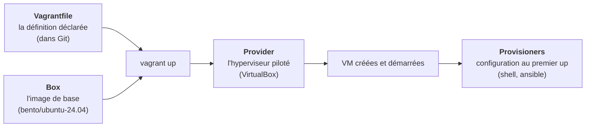

# Chapitre 11 : Vagrant, décrire des machines

!!! abstract "Objectifs du chapitre"
    À l'issue de ce chapitre, vous saurez :

    - expliquer le rôle de Vagrant et ses quatre notions : Vagrantfile, box, provider, provisioner ;
    - lire et écrire un Vagrantfile multi-machines avec réseau privé ;
    - manier le cycle de vie (`up`, `halt`, `destroy`, `reload`, `ssh`) et comprendre pourquoi `destroy && up` est un geste **désirable** ;
    - situer honnêtement Vagrant : formidable pour les environnements locaux, hors de propos en production.

## 1. L'outil-pont

Vagrant (créé par Mitchell Hashimoto en 2010, première brique de ce qui deviendra HashiCorp) répond à un problème que vous connaissez intimement depuis le TP 5 : créer des VM VirtualBox à la main est long, cliquable, non versionnable, non reproductible. Vagrant remplace tous ces clics par **un fichier**, le `Vagrantfile`, posé à la racine du projet et committé avec lui.

C'est l'outil-pont idéal entre le VirtualBox manuel des blocs 1-2 et l'IaC : même hyperviseur, mêmes VM, mêmes réseaux ; seule la *manière de les obtenir* change. Tout ce que vous avez cliqué (création, RAM, cartes réseau, redirections) devient une ligne de code, et le chapitre 10 s'incarne : le Vagrantfile est l'**état désiré** de votre parc local.

!!! note "Une précision de licence"
    Depuis 2023, HashiCorp distribue ses outils (Vagrant, Terraform...) sous licence BUSL : le code est public et l'usage gratuit, mais ce n'est plus de l'open source au sens strict (restrictions pour les offres concurrentes). Sans conséquence pour nos usages ni pour la quasi-totalité des usages en entreprise ; pour Terraform, un fork communautaire existe (OpenTofu, ch. 13). À savoir, car la question des licences fait partie du métier.

## 2. Les quatre notions



**Le Vagrantfile.** Un fichier Ruby, mais utilisé comme un langage de description : vous n'écrirez presque jamais de « vraie » logique, seulement des blocs de configuration (et une boucle, très lisible, pour nos quatre machines). Sa présence à la racine du dépôt suffit : `vagrant up` le trouve et l'applique.

**La box.** L'image de départ : un disque de VM pré-installé et compressé, téléchargé une fois puis mis en cache local (`~/.vagrant.d/boxes`). C'est exactement votre `listify-base` du TP 5, industrialisée : quelqu'un a fait « l'installation propre » une fois, l'a empaquetée, et tout le monde l'instancie. Nous utilisons **`bento/ubuntu-24.04`** : les boxes Bento (projet public de Chef) sont maintenues, minimales et documentées, et Canonical ne publie plus de boxes officielles récentes. Réflexe de sécurité : une box est du code qu'on exécute ; on ne prend que des sources connues, et on **épingle la version** dans le Vagrantfile (reproductibilité, encore).

**Le provider.** Le moteur qui exécute réellement : VirtualBox pour nous ; libvirt/KVM, VMware, Hyper-V ou Docker ailleurs. Le Vagrantfile reste largement portable d'un provider à l'autre : première rencontre avec un motif que Terraform généralisera (une description, des fournisseurs interchangeables).

**Les provisioners.** Ce que Vagrant exécute *dans* la VM après son premier démarrage : un script shell, ou un playbook Ansible. C'est la passerelle assumée vers le problème « configurer » : Vagrant crée, puis **délègue** la configuration ; au TP 9, son provisioner appellera Ansible, soudant les deux moitiés du bloc.

## 3. Le cycle de vie, et le geste qui change tout

| Commande | Effet |
|---|---|
| `vagrant up` | Crée (si besoin) et démarre les machines, applique les provisioners au premier up |
| `vagrant status` | État des machines du projet |
| `vagrant ssh app1` | Session SSH dans une machine (clés gérées automatiquement) |
| `vagrant halt` | Extinction propre (l'équivalent de vos `sudo poweroff`) |
| `vagrant reload` | Redémarre en réappliquant la configuration machine (RAM, réseau...) |
| `vagrant provision` | Rejoue les provisioners sans toucher aux machines |
| `vagrant destroy -f` | **Détruit** les machines : disques compris |
| `vagrant box list / update` | Gestion du cache local de boxes |

Le geste central est le couple **`vagrant destroy -f && vagrant up`** : détruire tout, reconstruire tout, en minutes et sans un clic. Mesurez le renversement psychologique : aux blocs 1-2, détruire une VM était une catastrophe (des heures de travail manuel perdues) ; désormais c'est un geste **banal et même hygiénique**, le serveur phénix du chapitre 9 à portée de main. Quand la définition est dans Git, les machines deviennent du bétail au sens plein : ce qui a de la valeur, c'est le fichier, plus jamais l'instance.

Sous le capot, Vagrant garde son état dans le répertoire caché `.vagrant/` (identifiants des VM, clés SSH privées par machine) : il va donc dans `.gitignore`, comme tout état local. Le TP 8 exploitera d'ailleurs ces clés pour connecter Ansible.

## 4. Multi-machines et réseau : l'infra du bloc 2 en trente lignes

Le Vagrantfile du TP 7, cœur du chapitre ; chaque ligne correspond à un geste manuel des TP 1 et 5 :

```ruby title="Vagrantfile"
# -*- mode: ruby -*-
# Les 4 machines du bloc 2 : nom => [adresse privée, RAM en Mo]
MACHINES = {
  "lb"   => ["192.168.56.10", 1024],
  "app1" => ["192.168.56.21", 1024],
  "app2" => ["192.168.56.22", 1024],
  "db"   => ["192.168.56.31", 1024],
}

Vagrant.configure("2") do |config|
  # La box commune, version épinglée (reproductibilité)
  config.vm.box = "bento/ubuntu-24.04"
  config.vm.box_version = "202508.03.0"

  MACHINES.each do |name, (ip, ram)|
    config.vm.define name do |machine|
      machine.vm.hostname = "listify-#{name}"
      # Carte 2 : le réseau privé host-only du ch. 7 (la carte 1 NAT est créée d'office)
      machine.vm.network "private_network", ip: ip
      machine.vm.provider "virtualbox" do |vb|
        vb.name   = "listify-#{name}"
        vb.memory = ram
        vb.cpus   = 1
      end
    end
  end
end
```

Relisez la boucle `MACHINES.each` avec les yeux du chapitre 9 : le rôle est écrit **une fois**, les identités sont des **données** (un nom, une adresse), et ajouter app3 = ajouter une ligne au dictionnaire. C'est le « factorisé » de votre cahier des charges, obtenu par la structure même du fichier. Notez aussi tout ce qui a *disparu* : la redirection de port SSH (Vagrant la gère), le hostname à poser à la main, l'adresse netplan, la question des MAC dupliquées, la régénération des clés d'hôte : chaque box démarre neuve, avec son identité propre. La moitié des pièges du TP 5 n'existent structurellement plus.

## 5. Ce que Vagrant n'est pas

Cadrage honnête, car la confusion est fréquente : Vagrant est un outil d'**environnements locaux** (développement, TP, tests, reproduction de bugs), pas un outil de production. En production, on provisionne des ressources cloud ou des hyperviseurs de datacenter, avec Terraform et consorts : même *concept* (décrire, appliquer), autre outillage. La bonne analogie : le Vagrantfile est à votre poste ce que Terraform sera au datacenter. Vagrant vous rend un autre service, immense : l'environnement de TP entier tient dans un dépôt Git, et « ça marche chez moi » devient vérifiable : il suffit de cloner et `vagrant up`.

## Ce qu'il faut retenir

1. Vagrant = les clics VirtualBox remplacés par un **Vagrantfile** versionné : l'état désiré du parc local. Quatre notions : Vagrantfile, box (image de base, source connue, version épinglée), provider (VirtualBox), provisioner (délègue la configuration).
2. Cycle de vie : `up`, `ssh`, `halt`, `provision`, `reload`, et surtout **`destroy && up`**, le geste-phénix qui rend les machines jetables et la définition précieuse. `.vagrant/` = état local, dans `.gitignore`.
3. Le multi-machines s'écrit en une boucle sur un dictionnaire nom → identité : rôle factorisé, identités en données ; les pièges d'identité du clonage manuel (MAC, hostname, clés d'hôte) disparaissent par construction.
4. Vagrant est fait pour le **local** ; la production relève de Terraform. Même concept, autre théâtre d'opérations.

## Bibliographie du chapitre

### Sources primaires

- Documentation Vagrant : [developer.hashicorp.com/vagrant/docs](https://developer.hashicorp.com/vagrant/docs) : sections « Vagrantfile », « Multi-Machine », « Networking », « Provisioning ». Courte et bien faite ; la section Multi-Machine est la lecture préparatoire du TP 7.
- Le projet Bento (boxes) : [github.com/chef/bento](https://github.com/chef/bento) : ce qu'il y a dans nos boxes, et comment elles sont construites (avec Packer, l'outil-frère de fabrication d'images, à connaître de nom).

### Lectures recommandées

- Mitchell Hashimoto, *Vagrant: Up and Running*, O'Reilly, 2013 : daté sur les détails, mais le chapitre d'introduction raconte le problème d'origine (les environnements de développement divergents) mieux que quiconque.
- Kief Morris, *Infrastructure as Code*, 2ᵉ éd., chapitre sur les « infrastructure stacks » : où situer un parc local dans une stratégie d'IaC globale.

### Pour aller plus loin

- Packer ([developer.hashicorp.com/packer](https://developer.hashicorp.com/packer)) : l'outil qui fabrique les boxes (et les images cloud, et bientôt vos images de conteneurs) ; fermez la boucle conceptuelle : Packer fabrique l'image, Vagrant/Terraform l'instancient.
- Le provider libvirt (vagrant-libvirt) : la voie 100 % libre KVM/QEMU, utile si VirtualBox pose problème sur vos machines Linux personnelles.
