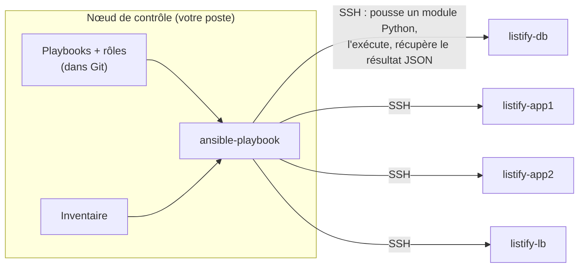

# Chapitre 12 : Ansible, configurer par l'état désiré

!!! abstract "Objectifs du chapitre"
    À l'issue de ce chapitre, vous saurez :

    - expliquer l'architecture *agentless* d'Ansible et ce qu'elle doit à SSH ;
    - manier les objets du langage : inventaire, modules, tâches, plays, playbooks, rôles, handlers ;
    - écrire des templates Jinja2 alimentés par l'inventaire, et chiffrer les secrets avec ansible-vault ;
    - prouver et interpréter l'idempotence d'un playbook (`ok` / `changed`, `--check`, `--diff`).

    C'est l'outil central du semestre : le TP 8 transformera l'intégralité de vos runbooks des blocs 1-2 en rôles rejouables.

## 1. L'architecture : agentless, sur SSH

Ansible (Michael DeHaan, 2012, aujourd'hui porté par Red Hat) a gagné la bataille de la gestion de configuration sur un choix d'architecture : **rien à installer sur les machines gérées**. Là où Puppet et Chef exigeaient un agent résident sur chaque serveur (avec son cycle de vie, ses certificats, sa propre mise à jour... une infrastructure pour gérer l'infrastructure), Ansible n'exige que ce que tout serveur a déjà : **SSH et Python**.



Le fonctionnement réel, qu'il faut connaître pour déboguer : pour chaque tâche, Ansible **copie** par SSH un petit programme Python (le module, avec ses arguments) sur la cible, l'exécute, récupère un résultat JSON, puis nettoie. C'est du **push** déclenché depuis le nœud de contrôle : pas de démon qui tourne, pas de port à ouvrir en plus du 22, et l'élévation de privilèges passe par le `sudo` des machines (mot-clé `become`, dont vous comprenez désormais toutes les implications TTY et mot de passe). Tout votre investissement des blocs 1-2 (clés, durcissement, `~/.ssh/config`) est directement réutilisé : **Ansible, c'est votre SSH, industrialisé**.

Le prix de ce choix, pour être honnête : à très grande échelle (dizaines de milliers de nœuds), le push séquentiel sur SSH devient lent, et c'est une des raisons de survie des architectures à agents. À notre échelle, et à celle de la grande majorité des parcs, l'agentless gagne sur tous les tableaux, la simplicité d'abord.

## 2. Les objets du langage

### 2.1 L'inventaire : QUI

L'inventaire liste les machines et les range en **groupes**, généralement par rôle. Format INI (ou YAML) :

```ini title="inventories/vagrant/hosts.ini"
[loadbalancer]
lb ansible_host=192.168.56.10

[backend]
app1 ansible_host=192.168.56.21
app2 ansible_host=192.168.56.22

[database]
db ansible_host=192.168.56.31
```

Les groupes portent le nom des **rôles**, pas des machines : nommer un groupe comme son unique hôte (`[db]` contenant `db`) provoque l'avertissement `Found both group and host with same name`. L'inventaire est le document que le chapitre 9 réclamait : le plan d'adressage, **exécutable**. Ajouter app3 = une ligne ici, et rien d'autre : les rôles et templates s'adaptent seuls (§4). Les variables propres à un groupe ou un hôte vivent dans des fichiers dédiés à côté (`group_vars/backend.yml`, `host_vars/db.yml`) : les données séparées du code, comme toujours.

### 2.2 Modules et tâches : QUOI

Le **module** est l'unité de travail idempotente (ch. 10, §4.3) ; la **tâche** est l'invocation nommée d'un module avec ses arguments, en YAML :

```yaml
- name: Le paquet nginx est présent
  ansible.builtin.apt:
    name: nginx
    state: present
```

Lisez le `name` : il décrit un **état**, pas une action (« est présent », pas « installer »). Cette discipline de nommage n'est pas cosmétique : elle force à penser déclaratif, et elle fait de la sortie d'exécution une documentation lisible. Quelques modules à connaître dès maintenant, en face de vos gestes manuels :

| Geste des blocs 1-2 | Module |
|---|---|
| `apt install` | `ansible.builtin.apt` |
| `adduser --system ...` | `ansible.builtin.user` |
| éditer un fichier de conf | `ansible.builtin.template` (ou `lineinfile` pour une ligne) |
| `systemctl enable --now`, `daemon-reload` | `ansible.builtin.systemd_service` |
| `ufw allow ...` | `community.general.ufw` |
| `CREATE ROLE`, `CREATE DATABASE` | `community.postgresql.postgresql_user` / `postgresql_db` |
| ligne dans pg_hba.conf | `community.postgresql.postgresql_pg_hba` |

Les préfixes (`ansible.builtin.`, `community.postgresql.`) désignent des **collections** : les modules sont distribués par familles ; le paquet `ansible` complet en embarque des centaines, et `ansible-galaxy` en installe d'autres. Règle d'or associée : **si un module existe, on n'utilise pas `shell`**. Le module `ansible.builtin.shell` existe (échappatoire parfois nécessaire), mais chaque `shell` réintroduit exactement la non-idempotence que l'outil devait éliminer ; il faut alors la reconstruire à la main (conditions `creates:`, `changed_when:`), et le TP 8 vous en fera écrire une, pour comprendre le coût.

### 2.3 Plays et playbooks : QUI fait QUOI

Le **play** associe des hôtes (un groupe de l'inventaire) à une liste de tâches ou de rôles ; le **playbook** enchaîne des plays. Notre `site.yml` du TP 8 tient en quatre plays qui racontent l'architecture entière :

```yaml title="site.yml (structure)"
- name: Socle commun
  hosts: all
  become: true
  roles: [common]

- name: Tier données
  hosts: database
  become: true
  roles: [database]

- name: Tier applicatif
  hosts: backend
  become: true
  roles: [backend]

- name: Tier exposé
  hosts: loadbalancer
  become: true
  roles: [loadbalancer]
```

L'**ordre des plays** est notre orchestration minimale : la base avant les backends, les backends avant le LB. `become: true` demande l'élévation sudo sur les cibles. À l'intérieur d'un play, Ansible exécute chaque tâche sur tous les hôtes (en parallèle, par défaut 5 à la fois) avant de passer à la suivante.

### 2.4 Les rôles : l'unité de réutilisation

Un **rôle** empaquette tout ce qui fait un composant : ses tâches, ses templates, ses fichiers, ses valeurs par défaut, ses handlers, dans une arborescence **conventionnelle** que l'outil charge automatiquement :

```text
roles/backend/
├── tasks/main.yml        # les tâches (chargées d'office)
├── handlers/main.yml     # les handlers (§5)
├── templates/            # les templates Jinja2 (.j2)
├── files/                # les fichiers copiés tels quels
└── defaults/main.yml     # les variables par défaut (surchargées par l'inventaire)
```

La convention n'est pas une contrainte, c'est le contrat qui rend les rôles **partageables** : n'importe quel rôle publié (Ansible Galaxy en héberge des milliers) s'utilise comme les vôtres. Vous écrirez quatre rôles au TP 8 : `common`, `database`, `backend`, `loadbalancer` : un par zone de l'architecture, ce qui n'est pas un hasard.

## 3. L'idempotence, instrumentée

Chaque tâche rapporte son résultat, et cette sortie est un **instrument de mesure** (ch. 10, §4.3) :

- `ok` : l'état réel était déjà conforme, rien n'a été fait ;
- `changed` : un écart existait, il a été corrigé ;
- `failed` : l'action a échoué (le play s'arrête pour cet hôte).

Le récapitulatif final (`PLAY RECAP`) compte ces états par machine, et fonde la **preuve d'idempotence** du TP 8 : première exécution, beaucoup de `changed` (on construit) ; deuxième exécution immédiate, **`changed=0`** partout (tout était déjà conforme). Si un deuxième passage produit du `changed`, c'est un défaut du rôle (une tâche non idempotente, souvent un `shell` mal gardé) : à corriger, pas à ignorer.

Deux options démultiplient cet instrument : **`--check`** (mode simulation : Ansible évalue et rapporte ce qu'il *ferait*, sans rien faire : l'équivalent du `terraform plan` du ch. 13) et **`--diff`** (montre les différences de contenu des fichiers modifiés). `--check --diff` sur une machine en production, c'est un **détecteur de drift** : tout `changed` affiché est un écart entre l'état désiré (Git) et l'état réel.

## 4. Variables et templates Jinja2 : la configuration qui se calcule

### 4.1 Les variables

Les variables alimentent tâches et templates ; elles viennent de partout (defaults des rôles, `group_vars`, `host_vars`, ligne de commande...), avec une précédence documentée dont il suffit de retenir la logique : **du plus général au plus spécifique** (un default de rôle < une variable de groupe < une variable d'hôte < la ligne de commande). S'y ajoutent les **facts** : les données que Ansible collecte automatiquement sur chaque cible en début de play (`ansible_default_ipv4.address`, distribution, cœurs...), et les variables « magiques » dont deux servent constamment :

- `hostvars` : accéder aux variables **d'une autre machine** ;
- `groups` : les groupes de l'inventaire et leurs membres.

### 4.2 Le template qui justifie tout le chapitre

Un **template** est un fichier à trous (syntaxe Jinja2 : `{{ variable }}`, ``), rempli au moment du déploiement avec les variables de la cible. Voici celui du site Nginx du TP 8, à comparer avec le fichier que vous avez écrit à la main au TP 6 :

```nginx title="roles/loadbalancer/templates/listify.conf.j2 (extrait)"
upstream listify_backend {

    server {{ hostvars[host]['ansible_host'] }}:8000 max_fails=3 fail_timeout=10s;

}
```

Relisez la boucle : la liste des backends **n'est écrite nulle part** ; elle est *calculée depuis l'inventaire*. Ajoutez app3 à l'inventaire, rejouez le playbook : cette configuration se régénère avec trois serveurs, pg_hba et ufw suivront par le même mécanisme, et le « coût de app3 » que vous avez chiffré en synthèse du TP 6 s'effondre à **une ligne**. C'est la duplication d'information du chapitre 9 (§1), résolue à la racine : l'information existe en un seul endroit (l'inventaire), tout le reste en dérive mécaniquement.

## 5. Les handlers : réagir aux changements

Modifier `postgresql.conf` n'a d'effet qu'après redémarrage du service ; mais redémarrer à chaque passage du playbook serait absurde (et non idempotent en esprit : une exécution sans changement doit être sans effet). Le **handler** résout l'articulation : une tâche spéciale, déclenchée **uniquement si** une tâche normale a rapporté `changed`, via `notify` :

```yaml
- name: postgresql.conf écoute sur l'adresse privée
  ansible.builtin.lineinfile:
    path: /etc/postgresql/16/main/postgresql.conf
    regexp: '^#?listen_addresses'
    line: "listen_addresses = 'localhost, {{ ansible_host }}'"
  notify: Redémarrer PostgreSQL     # ← seulement si la ligne a changé
```

Détails de comportement à connaître (ils tombent en question de TD) : les handlers s'exécutent **à la fin du play** (pas immédiatement), et **une seule fois** même si dix tâches les ont notifiés : dix changements de configuration = un seul redémarrage. C'est le pattern exact de vos gestes manuels (« je modifie tout, puis je reload une fois »), formalisé.

## 6. Les secrets : ansible-vault

Le mot de passe de la base doit être dans Git (c'est une donnée de déploiement) mais ne doit pas être **lisible** dans Git (c'est un secret : facteur III, ch. 4, et l'anti-pattern du secret commité). `ansible-vault` tranche le dilemme : le fichier de variables est **chiffré** (AES-256, par une phrase de passe) et committé chiffré ; Ansible le déchiffre en mémoire à l'exécution (`--ask-vault-pass`) :

```bash
ansible-vault create group_vars/all/vault.yml    # éditer et chiffrer
ansible-vault edit   group_vars/all/vault.yml    # rééditer plus tard
ansible-playbook site.yml --ask-vault-pass
```

Convention d'usage qui sauve la lisibilité : les variables du vault sont préfixées (`vault_db_password`), et un fichier **en clair** les référence (`db_password: "{{ vault_db_password }}"`) : ainsi `grep db_password` trouve toujours où la variable est définie, même sans déchiffrer. Limite à connaître : la phrase de passe du vault devient elle-même un secret à distribuer à l'équipe ; les solutions d'échelle supérieure (gestionnaires de secrets dédiés type Vault de HashiCorp, secrets Kubernetes au S2) reprennent le problème plus haut.

## Ce qu'il faut retenir

1. **Agentless sur SSH** : Ansible pousse des modules Python par SSH et ne laisse rien derrière ; vos clés et durcissements des blocs 1-2 sont son infrastructure. `become` = sudo.
2. Les objets : l'**inventaire** (groupes = rôles ; c'est le plan d'adressage devenu exécutable), les **modules** idempotents invoqués par des **tâches** au nom déclaratif, les **plays** (groupe × rôles, l'ordre des plays = l'orchestration minimale), les **rôles** (arborescence conventionnelle, partageable).
3. Règle d'or : un module plutôt que `shell` ; chaque `shell` doit reconstruire son idempotence (`creates:`, `changed_when:`).
4. `ok`/`changed`/`failed` instrumentent l'idempotence : **`changed=0` au 2ᵉ passage est la preuve** ; `--check --diff` est un détecteur de drift.
5. **Templates Jinja2 + inventaire** : la configuration se *calcule* (boucle sur `groups['backend']`) ; l'information n'existe qu'en un endroit, ajouter une machine = une ligne d'inventaire.
6. **Handlers** : déclenchés par `changed` via `notify`, exécutés une fois en fin de play : dix modifications, un redémarrage.
7. **ansible-vault** : les secrets committés chiffrés, référencés par des variables en clair préfixées `vault_`.

## Bibliographie du chapitre

### Sources primaires

- Documentation Ansible : [docs.ansible.com](https://docs.ansible.com/ansible/latest/) : « Getting started », « Playbook guide », « Using Vault », et l'index des modules cités. La référence de précédence des variables s'y trouve (à consulter, pas à mémoriser).
- Les pages des collections utilisées au TP 8 : `community.postgresql`, `community.general` (module ufw), sur [galaxy.ansible.com](https://galaxy.ansible.com/).

### Lectures recommandées

- Jeff Geerling, *Ansible for DevOps*, 2ᵉ éd., Leanpub, 2020 (mise à jour continue) : le meilleur livre pratique sur Ansible, du niveau exact de ce cours ; chapitres 1 à 8.
- Ansible, « Best Practices » (documentation officielle) : l'arborescence de projet canonique, que notre TP 8 suit fidèlement.

### Pour aller plus loin

- Michael DeHaan, sur les origines d'Ansible (billets et interviews, 2012-2014) : pourquoi l'agentless, pourquoi YAML, pourquoi le nom (le communicateur supraluminique d'Ursula K. Le Guin).
- Molecule ([ansible.readthedocs.io/projects/molecule](https://ansible.readthedocs.io/projects/molecule/)) : tester ses rôles automatiquement ; le pont entre ce chapitre et le CI/CD du S2.
- ansible-lint : l'analyseur statique qui attrape les non-idempotences et écarts aux bonnes pratiques ; à essayer sur votre TP 8 fini.
