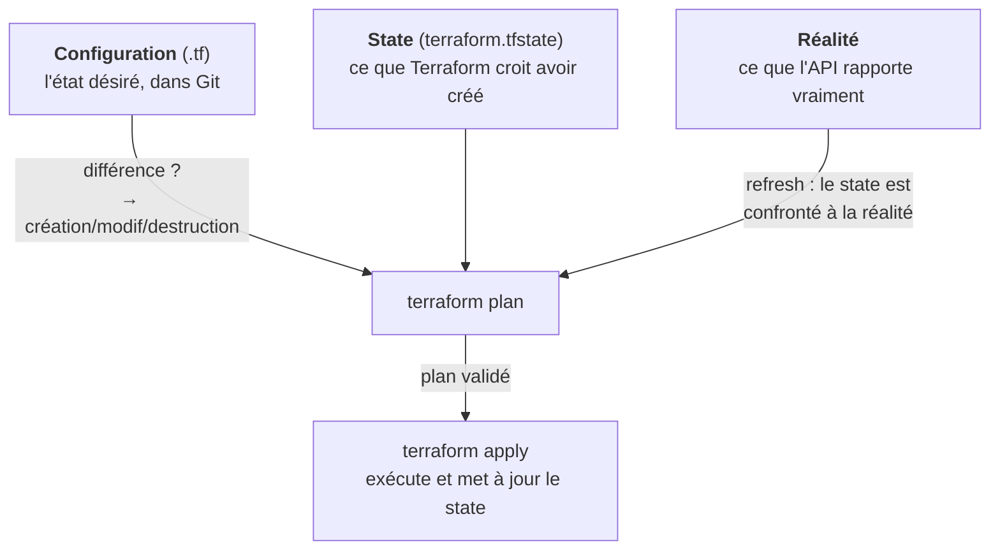

# Chapitre 13 : Terraform, provisionner par l'état

!!! abstract "Objectifs du chapitre"
    À l'issue de ce chapitre, vous saurez :

    - expliquer le modèle de Terraform : ressources, providers, graphe de dépendances, fichier d'état, cycle plan/apply ;
    - lire une configuration HCL simple et prédire ce qu'un `terraform plan` affichera ;
    - expliquer la détection de dérive par comparaison à trois termes (configuration / state / réalité) ;
    - articuler Terraform et Ansible : qui provisionne, qui configure, et pourquoi les deux se complètent.

    Théorie approfondie, pratique en découverte : le [TP 10](../tp/tp10-terraform.md) manipule Terraform en local via le socket Podman, et le cloud reste au tableau, conformément à la philosophie du parcours.

## 1. Le problème que Vagrant ne résout pas

Vagrant décrit des VM **sur votre poste**. Mais la production vit ailleurs : des centaines de ressources chez un fournisseur cloud (machines, réseaux, équilibreurs, DNS, bases managées, droits d'accès...), créées via des **API**. Les cliquer dans une console web reproduirait à l'échelle du cloud tout ce que ce semestre a combattu : irreproductible, indocumenté, driftable à merci. Le besoin : décrire ces ressources dans des fichiers et laisser un outil appeler les API : le provisionnement déclaratif.

**Terraform** (HashiCorp, 2014) est le standard du domaine. Sa percée conceptuelle n'est pas de parler à AWS (chaque cloud a son outil maison, CloudFormation chez AWS...) mais de parler à **tout** : un cœur unique (langage, graphe, état) et des **providers** interchangeables, plus de 3 000, des clouds aux DNS en passant par... Docker, ce qui nous permettra un TP entièrement local.

!!! note "Terraform et OpenTofu"
    Suite au passage de Terraform sous licence BUSL (2023, comme Vagrant : ch. 11), la communauté a créé **OpenTofu**, fork open source hébergé par la Linux Foundation, compatible et activement développé. Tout ce chapitre s'applique aux deux ; en entreprise vous rencontrerez les deux ; le TP accepte l'un ou l'autre (`terraform` et `tofu` sont interchangeables à notre niveau).

## 2. Le langage : décrire des ressources

Terraform se code en **HCL** (*HashiCorp Configuration Language*), déclaratif et typé, dans des fichiers `.tf`. L'unité est le bloc `resource` :

```terraform title="main.tf (l'exemple du TP 10)"
terraform {
  required_providers {
    docker = {
      source  = "kreuzwerker/docker"
      version = "~> 3.0"
    }
  }
}

# Le provider : à QUELLE API parle-t-on (ici : le socket Podman, compatible Docker)
provider "docker" {
  host = "unix:///run/user/1000/podman/podman.sock"
}

# Ressource 1 : une image
resource "docker_image" "web" {
  name = "docker.io/library/nginx:1.27-alpine"
}

# Ressource 2 : un conteneur, qui DÉPEND de l'image
resource "docker_container" "web" {
  name  = "tf-demo"
  image = docker_image.web.image_id     # ← la référence crée la dépendance
  ports {
    internal = 80
    external = 8080
  }
}
```

Trois choses à lire dans cet exemple :

1. Chaque ressource a un **type** (`docker_container`) et un **nom local** (`web`) ; le couple l'identifie dans la configuration.
2. La ligne `image = docker_image.web.image_id` n'est pas une simple valeur : c'est une **référence entre ressources**, et Terraform en déduit l'ordre (l'image avant le conteneur). Vous n'écrivez jamais l'ordre : il est **calculé**.
3. Le provider est une configuration comme une autre : changer d'API (de Docker local à AWS) change les types de ressources, pas le langage ni le cycle de travail.

### 2.1 Le graphe de ressources

De toutes les références, Terraform construit un **graphe orienté acyclique de dépendances** : qui doit exister avant qui. Il en tire l'ordre de création, l'ordre **inverse** de destruction, et le **parallélisme** (les ressources indépendantes se créent en même temps). C'est la réponse outillée au problème « orchestrer » du chapitre 10, pour le cas particulier du provisionnement, et c'est un avant-goût direct du S3 : le DAG, que vous retrouverez comme abstraction centrale d'Airflow.

## 3. Le fichier d'état : la pièce originale du modèle

### 3.1 Pourquoi un état ?

Ansible n'a pas de mémoire : à chaque exécution il interroge les machines et compare. Terraform, lui, maintient un fichier, le **state** (`terraform.tfstate`) : l'inventaire de ce qu'il a créé, avec la correspondance entre chaque ressource déclarée et l'objet réel (identifiants d'API, attributs). Pourquoi cette mémoire ? Parce que l'API d'un cloud contient des milliers d'objets qui ne le regardent pas : sans state, impossible de savoir que *cette* VM parmi cent est « la sienne », ni de détecter qu'une ressource déclarée hier a été supprimée du fichier aujourd'hui (et doit donc être détruite). **Le state est la frontière de propriété de Terraform sur le monde.**

### 3.2 La comparaison à trois termes

Le cycle de travail confronte en permanence **trois** sources, et c'est le schéma d'examen par excellence :



Les cas remarquables, à savoir dérouler :

- **Configuration modifiée** (vous éditez un `.tf`) : `plan` montre l'écart configuration/state → apply converge.
- **Réalité modifiée à la main** (quelqu'un supprime ou modifie la ressource hors Terraform) : au refresh, le state se met à jour face à la réalité, et `plan` révèle l'écart avec la configuration : **c'est la détection de dérive**, que le TP 10 provoque volontairement (`podman rm -f` du conteneur, puis `terraform plan` : il propose de le recréer).
- **Ressource retirée de la configuration** : elle reste dans le state → `plan` propose sa **destruction**. Corollaire qui surprend : Terraform détruit ce qu'on cesse de déclarer ; l'oubli d'un fichier a des conséquences.

### 3.3 Les servitudes du state

Ce pouvoir a un coût, et l'honnêteté technique impose de le dire : le state **contient des secrets** en clair (attributs sensibles des ressources) et ne doit jamais aller dans Git ; à plusieurs, il doit être **partagé et verrouillé** (backends distants : un bucket objet + verrou ; sinon, deux `apply` simultanés corrompent tout) ; et sa perte est grave (Terraform « oublie » ce qu'il possède ; l'import de ressources existantes est possible mais laborieux). Une part significative de l'ingénierie Terraform réelle est de la gestion de state : retenez-le comme la contrepartie structurelle du modèle.

### 3.4 plan/apply : la revue avant l'action

Le cycle quotidien : `terraform plan` calcule et **affiche** les actions (`+` créer, `-` détruire, `~` modifier, `-/+` remplacer) sans rien toucher ; on lit, on fait relire, puis `terraform apply` exécute. Ce temps de revue obligatoire est ce qui rend l'outil utilisable sur des infrastructures critiques, et vous connaissez déjà ses parents : le `--check` d'Ansible, le `nginx -t` avant reload, le `sshd -t` du TP 1 : **toujours regarder ce qu'on va faire avant de le faire**, ici érigé en workflow.

## 4. Terraform et Ansible : la complémentarité

La question d'examen classique : « Terraform et Ansible font-ils la même chose ? ». Non, et la carte du chapitre 10 donne la grille :

| | Terraform | Ansible |
|---|---|---|
| Problème | **Provisionner** : faire exister | **Configurer** : mettre dans l'état voulu |
| Interlocuteur | Des **API** (cloud, hyperviseurs, SaaS) | Des **OS** (via SSH) |
| Mémoire | Le **state** (nécessaire : le monde est vaste) | Aucune (la machine EST l'état, on la relit) |
| Grain | Ressources d'infrastructure | Paquets, fichiers, services, utilisateurs |
| Convergence | plan/apply, à la demande | Exécution du playbook, à la demande |

Le pattern de production standard les enchaîne : **Terraform crée** les machines et réseaux (et produit un inventaire), **Ansible configure** ce qui vient d'exister. Notre TP 9 en est la maquette exacte, avec Vagrant dans le rôle de Terraform : même partage des tâches, théâtre local. Deux variantes à connaître en culture : le tout-immutable (Terraform + images pré-configurées par Packer : plus d'Ansible au démarrage, ch. 10 §6) et le tout-cloud-init (configuration de naissance minimale). Savoir *choisir* entre ces patterns est une compétence C1 de fin de parcours.

## Ce qu'il faut retenir

1. Terraform = provisionnement **déclaratif multi-fournisseurs** : un cœur (HCL, graphe, state, plan/apply) et des providers pour chaque API. OpenTofu en est le fork open source compatible.
2. Les **références entre ressources** construisent un **graphe** dont l'outil déduit ordre, destruction inverse et parallélisme : jamais d'ordre écrit à la main. (Le DAG reviendra au S3.)
3. Le **state** est la mémoire de propriété : indispensable pour retrouver « ses » ressources et détruire ce qui n'est plus déclaré ; servitudes réelles : secrets, partage/verrouillage, sauvegarde.
4. **Comparaison à trois termes** configuration / state / réalité : sachez dérouler les trois cas (config modifiée, réalité modifiée = **dérive détectée par `plan`**, ressource dé-déclarée = destruction proposée).
5. `plan` avant `apply` : la revue avant l'action, dans la lignée de `--check`, `nginx -t`, `sshd -t`.
6. **Terraform provisionne (API), Ansible configure (OS)** : complémentaires, enchaînés en production ; le TP 9 en est la maquette locale avec Vagrant.

## Bibliographie du chapitre

### Sources primaires

- Documentation Terraform : [developer.hashicorp.com/terraform/docs](https://developer.hashicorp.com/terraform/docs) : « Core workflow », « State », « Providers ». La page « Purpose of Terraform State » est la lecture préparatoire du TP 10.
- OpenTofu : [opentofu.org](https://opentofu.org/) : le manifeste du fork et la documentation (miroir fidèle).
- Le provider Docker utilisé au TP 10 : [registry.terraform.io/providers/kreuzwerker/docker](https://registry.terraform.io/providers/kreuzwerker/docker/latest/docs).

### Lectures recommandées

- Yevgeniy Brikman, *Terraform: Up and Running*, 3ᵉ éd., O'Reilly, 2022 : chapitres 1 à 3 (dont l'excellent « How to manage Terraform state ») ; le chapitre 1 recoupe et prolonge notre chapitre 10.
- Kief Morris, *Infrastructure as Code*, 2ᵉ éd. : les chapitres sur les « stacks » et la gestion d'état, pour prendre de la hauteur sur plan/apply.

### Pour aller plus loin

- HashiCorp, « Terraform graph » : visualisez le graphe de dépendances du TP 10 (`terraform graph | dot -Tsvg`) ; comparez avec les DAG d'Airflow au S3.
- L'histoire de la licence : billets d'annonce HashiCorp (août 2023) et manifeste OpenTofu : un cas d'école de gouvernance open source, à discuter en TD.
- Pulumi : le provisionnement déclaratif écrit en langage général (Python, TypeScript) ; comparez les compromis avec HCL.
