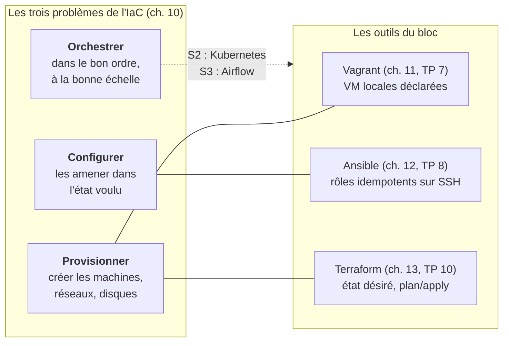

# Bloc 3 : Infrastructure as Code

**Semaines 9 à 13.** Vous avez éprouvé deux fois la même douleur : au défi du bloc 1 (impossible de redéployer en 30 minutes) et aux TP 5-6 (chaque geste répété sur N machines, chaque ajout de serveur touchant N fichiers). Vous avez même écrit vous-mêmes le cahier des charges de la solution (ch. 9, §4). Ce bloc la livre : **l'infrastructure décrite dans des fichiers, versionnée dans Git, appliquée par des outils idempotents**.

À la fin du bloc, la commande `./deploy.sh` reconstruit l'intégralité de l'architecture du bloc 2 (4 machines, réseau, pare-feu, base, backends, load balancer, données) depuis un dépôt Git, sur un poste vierge de toute configuration manuelle. Et vous rejouerez le défi du bloc 1, chronomètre en main.

## Les trois problèmes, les trois outils

L'orchestration, troisième problème, n'a pas d'outil dédié ce semestre : un simple script ordonnera Vagrant puis Ansible. Les orchestrateurs véritables (Kubernetes pour les services, Airflow pour les tâches) sont la matière des semestres 2 et 3 : vous saurez alors exactement quel vide ils comblent.

## Organisation du bloc

| Semaine | CM | TP |
|---|---|---|
| 9 | [Ch. 10 : L'IaC, les trois problèmes et les concepts](cours/10-infrastructure-as-code.md) | [TP 7](tp/tp7-vagrant.md) (début) : premiers `vagrant up` |
| 10 | [Ch. 11 : Vagrant, décrire des machines](cours/11-vagrant.md) | [TP 7](tp/tp7-vagrant.md) (fin) : le socle multi-machines en une commande |
| 11 | [Ch. 12 : Ansible, configurer par l'état désiré](cours/12-ansible.md) | [TP 8](tp/tp8-ansible.md) (début) : inventaire, premiers rôles |
| 12 | [Ch. 12 (suite)](cours/12-ansible.md) : templates, handlers, vault | [TP 8](tp/tp8-ansible.md) (fin) : les 4 rôles, preuve d'idempotence |
| 13 | [Ch. 13 : Terraform, provisionner par l'état](cours/13-terraform.md) | [TP 9](tp/tp9-chaine-complete.md) : la chaîne complète + [TP 10](tp/tp10-terraform.md) : Terraform en découverte |

## Ce que vous saurez faire à la fin du bloc

- Définir et illustrer : déclaratif vs impératif, idempotence, état désiré vs état réel, immutabilité, convergence.
- Décrire un parc de VM locales dans un Vagrantfile (boxes, réseau privé, provisioners) et le reconstruire à volonté (`vagrant destroy && vagrant up`).
- Écrire un projet Ansible structuré : inventaire par groupes, `group_vars`, rôles, templates Jinja2, handlers, secrets chiffrés avec ansible-vault ; **prouver** l'idempotence d'un playbook.
- Expliquer le modèle de Terraform (graphe de ressources, state, plan/apply, providers) et détecter une dérive avec `terraform plan`.
- Articuler les outils : Terraform et Vagrant *provisionnent*, Ansible *configure* ; savoir défendre ce partage des rôles.

## Le livrable qui change tout

À partir du TP 8, votre dépôt `listify` devient la **source de vérité unique** : le code applicatif ET la définition complète de l'infrastructure qui l'exécute. Le README doit permettre à l'enseignant de tout reconstruire en une commande : c'est exactement le format du projet noté du semestre (40 % de la note), et le geste professionnel le plus discriminant que ce parcours vous enseigne.
