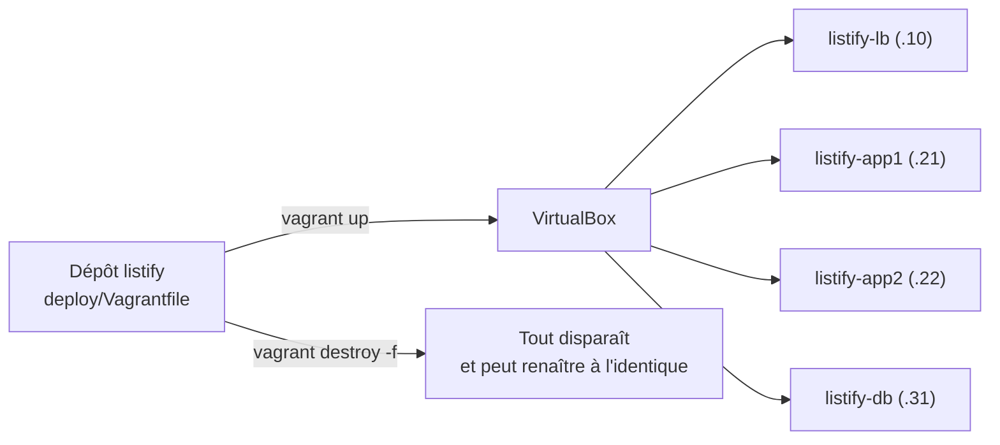

# TP 7 : Le socle multi-machines en une commande

!!! abstract "Fiche du TP"
    - **Durée** : 4 h
    - **Prérequis** : TP 6 terminé ; chapitres 10 et 11
    - **Livrables** : le `Vagrantfile` des 4 machines committé dans le dépôt `listify` ; le **chronométrage** d'un `vagrant destroy && vagrant up` complet ; runbook à jour
    - **Compétences travaillées** : C2 (cœur du TP), C6

    À la fin de ce TP, le parc entier du bloc 2 (4 machines, réseau privé, hostnames) se crée et se détruit en une commande. Les machines ne portent encore aucun service : c'est le travail d'Ansible au TP 8.

## Ce que vous allez construire



## Étape 0 : préparer le terrain (30 min)

### 0.1 Installer Vagrant

Suivez le guide d'installation aux versions figées (distribué en semaine 1). Sur un poste Ubuntu/Debian, la voie officielle est le dépôt APT de HashiCorp :

```bash
wget -O - https://apt.releases.hashicorp.com/gpg | sudo gpg --dearmor -o /usr/share/keyrings/hashicorp-archive-keyring.gpg
echo "deb [signed-by=/usr/share/keyrings/hashicorp-archive-keyring.gpg] https://apt.releases.hashicorp.com $(lsb_release -cs) main" | sudo tee /etc/apt/sources.list.d/hashicorp.list
sudo apt update && sudo apt install -y vagrant
vagrant --version
```

### 0.1 bis - Le plugin vagrant-hostmanager

La résolution de noms interne (le `/etc/hosts` que vous répliquiez à la main sur chaque machine au TP 5) est un problème si courant qu'un **plugin Vagrant** le résout : [`vagrant-hostmanager`](https://github.com/devopsgroup-io/vagrant-hostmanager). Il maintient les entrées `/etc/hosts` **sur toutes les VM du parc, et sur votre poste hôte**, à jour automatiquement à chaque `up`/`destroy`. Installez-le une fois :

```bash
vagrant plugin install vagrant-hostmanager
vagrant plugin list      # doit montrer vagrant-hostmanager
```

Pourquoi un plugin plutôt que notre provisioner shell du TP 5 ? Parce qu'il est **idempotent par conception** (pas de garde `grep` à écrire, cf. ch. 10) et qu'il gère le côté **hôte** : l'entrée `192.168.56.10 listify.local` que vous ajoutiez manuellement à votre `/etc/hosts` aux TP 5 et 8 sera désormais posée toute seule. C'est l'esprit de l'IaC : un problème récurrent finit par avoir son outil dédié.

### 0.2 Libérer les adresses ET les noms : traiter les VM du bloc 2

Vos nouvelles machines Vagrant vont entrer en conflit avec celles du bloc 2 sur **deux** ressources :

- l'**adresse** : deux machines revendiquant `192.168.56.21` sur le même réseau, vous savez désormais ce que ça donne (il suffit de les **éteindre**) ;
- le **nom VirtualBox** : notre Vagrantfile nomme ses VM `listify-lb`, `listify-app1`... (via `vb.name`), exactement comme vos VM manuelles. Or deux VM VirtualBox ne peuvent pas porter le même nom, même éteintes. `vagrant up` échoue alors dès la première avec :

    ```text
    A VirtualBox machine with the name 'listify-lb' already exists.
    ```

Il ne suffit donc pas d'éteindre : il faut **libérer les noms**. Deux façons, au choix.

=== "Renommer (garder le bloc 2 comme témoin)"
    Le TP 9 conserve les VM manuelles comme filet de sécurité ; renommez-les pour libérer les identifiants sans les perdre. **VM éteintes**, sur le poste hôte :

    ```bash
    for n in lb app1 app2 db; do
      VBoxManage modifyvm "listify-$n" --name "s2-listify-$n" 2>/dev/null \
        && echo "renommée : listify-$n -> s2-listify-$n"
    done
    ```

=== "Supprimer (si le bloc 2 est validé)"
    Si vous n'avez plus besoin des VM manuelles (le TP 9 rejouera tout le déploiement) :

    ```bash
    for n in lb app1 app2 db; do
      VBoxManage unregistervm "listify-$n" --delete 2>/dev/null \
        && echo "supprimée : listify-$n"
    done
    ```

!!! warning "Si `vagrant up` a déjà échoué en cours de route"
    Le conflit s'arrête à la première machine : vous vous retrouvez avec `lb` à moitié créée et les autres `not created`. Après avoir libéré les noms, nettoyez cet état partiel avant de recommencer, depuis `deploy/` :

    ```bash
    vagrant destroy -f
    vagrant up
    ```

Purgez aussi les empreintes SSH de ces adresses (les machines Vagrant auront de nouvelles clés d'hôte, vous connaissez la musique) :

```bash
for ip in 192.168.56.10 192.168.56.21 192.168.56.22 192.168.56.31; do
  ssh-keygen -f ~/.ssh/known_hosts -R "$ip"
done
```

!!! note "Vos entrées `~/.ssh/config` du bloc 2 deviennent obsolètes"
    Elles pointent vers l'utilisateur `deploy` et votre clé personnelle ; les machines Vagrant utilisent l'utilisateur `vagrant` et une clé générée par machine (dans `.vagrant/`). Pendant ce bloc, la porte d'entrée est **`vagrant ssh <machine>`**, qui gère tout ; laissez vos entrées de config en place mais ne vous étonnez pas qu'elles ne fonctionnent plus telles quelles. Ansible, au TP 8, utilisera l'inventaire pour trouver utilisateur et clés.

## Étape 1 : premier contact, une seule machine (45 min)

Avant le parc, le geste de base, dans un répertoire jetable :

```bash
mkdir /tmp/vagrant-demo && cd /tmp/vagrant-demo
vagrant init bento/ubuntu-24.04     # génère un Vagrantfile minimal (commenté)
vagrant up                          # télécharge la box (une fois), crée, démarre
```

Pendant que la box se télécharge (~600 Mo, mise en cache pour toute la suite), lisez le Vagrantfile généré. Puis explorez, chaque commande allant au runbook :

```bash
vagrant status
vagrant ssh                 # vous êtes DANS la VM, utilisateur vagrant (sudo sans mot de passe)
# regardez : hostname, ip -brief addr (une seule carte : NAT), puis exit
vagrant ssh-config          # comment vagrant ssh se connecte : port NAT, clé dédiée
VBoxManage list runningvms  # côté VirtualBox : la VM existe, nommée d'après le dossier
ls .vagrant/                # l'état local de Vagrant (jamais dans Git)
vagrant halt                # extinction propre
vagrant destroy -f          # destruction complète
cd ~ && rm -rf /tmp/vagrant-demo
```

??? question "Point de contrôle n° 1"
    Répondez au runbook : où la box a-t-elle été stockée (`vagrant box list`) ? Par quel mécanisme réseau `vagrant ssh` entre-t-il dans la VM alors que vous n'avez configuré aucune redirection (indice : `vagrant ssh-config` montre un port sur 127.0.0.1 : Vagrant a créé la redirection NAT pour vous : celle que vous faisiez à la main depuis le TP 1) ?

## Étape 2 : le Vagrantfile du parc Listify (1 h)

Dans votre dépôt `listify`, créez le répertoire d'infrastructure et le Vagrantfile (celui du chapitre 11, enrichi de la configuration hostmanager) :

```bash
cd ~/Github/edu/listify        # adaptez à votre chemin
mkdir -p deploy && cd deploy
```

```ruby title="deploy/Vagrantfile"
# -*- mode: ruby -*-
# Le parc Listify : nom => [adresse privée, RAM en Mo]
MACHINES = {
  "lb"   => ["192.168.56.10", 1024],
  "app1" => ["192.168.56.21", 1024],
  "app2" => ["192.168.56.22", 1024],
  "db"   => ["192.168.56.31", 1024],
}

Vagrant.configure("2") do |config|
  config.vm.box = "bento/ubuntu-24.04"
  config.vm.box_version = "202508.03.0"

  # Résolution interne du parc, gérée par le plugin vagrant-hostmanager
  # (remplace le /etc/hosts recopié à la main au TP 5 : ch. 7, §5)
  config.hostmanager.enabled           = true   # lancer à chaque up/destroy
  config.hostmanager.manage_guest      = true   # mettre à jour le /etc/hosts des VM
  config.hostmanager.manage_host       = true   # ... ET celui du poste hôte
  config.hostmanager.ignore_private_ip = false  # utiliser l'adresse host-only (.10...)
  config.hostmanager.include_offline   = true   # inclure les VM éteintes

  MACHINES.each do |name, (ip, ram)|
    config.vm.define name do |machine|
      machine.vm.hostname = "listify-#{name}"
      machine.vm.network "private_network", ip: ip
      # Le load balancer répond aussi au nom "listify.local" (alias hostmanager)
      if name == "lb"
        machine.hostmanager.aliases = ["listify.local"]
      end
      machine.vm.provider "virtualbox" do |vb|
        vb.name   = "listify-#{name}"
        vb.memory = ram
        vb.cpus   = 1
      end
    end
  end
end
```

!!! note "`manage_host = true` va demander votre mot de passe"
    Modifier le `/etc/hosts` **de l'hôte** exige les droits root sur votre poste : au premier `vagrant up`, hostmanager vous demandera votre mot de passe sudo. C'est le prix (assumé) de la mise à jour automatique côté hôte. En contrepartie, l'entrée `192.168.56.10 listify-lb listify.local` apparaît toute seule dans votre `/etc/hosts` : vous n'aurez **pas** à l'ajouter à la main aux TP 8 et 9.

Ajoutez l'état local au `.gitignore` du dépôt, puis lancez et **chronométrez** :

```bash
echo "deploy/.vagrant/" >> ../.gitignore
time vagrant up
vagrant status              # les 4 : running
```

Comptez ce que ces minutes ont remplacé : la création des 4 VM, les cartes réseau, les hostnames, les adresses netplan, le /etc/hosts partout, sans aucun des pièges du TP 5 (MAC dupliquées, clés d'hôte partagées, `dquote>`...). Chaque box démarre neuve avec son identité propre : **les problèmes d'individualisation du clonage n'existent structurellement plus**.

??? question "Point de contrôle n° 2 : le parc répond"
    ```bash
    vagrant ssh app1 -c 'hostname && ip -brief addr'
    # listify-app1 ; enp0s3 (NAT) + enp0s9 ou enp0s8 (192.168.56.21)
    vagrant ssh app1 -c 'ping -c2 listify-db'    # la résolution interne fonctionne
    vagrant ssh lb   -c 'ping -c2 192.168.56.31' # le réseau privé est câblé
    ```

    Notez au passage le nom d'interface que la box attribue à la carte privée (il peut différer de `enp0s8` selon la box : peu importe, netplan est géré par Vagrant ici).

### 2.1 Vérifier le travail de hostmanager, et le lire avec les yeux du chapitre 10

Le plugin a écrit les entrées `/etc/hosts` **partout** : sur les quatre VM, et sur votre poste. Constatez-le des deux côtés :

```bash
# Sur une VM :
vagrant ssh app1 -c 'grep listify /etc/hosts'
# 192.168.56.10  listify-lb listify.local
# 192.168.56.21  listify-app1 ... etc.

# Sur votre poste hôte :
grep listify /etc/hosts
# les mêmes entrées, dont listify.local -> celui du lb
```

Puis vérifiez l'**idempotence** (la propriété centrale du ch. 10) : rejouez la mise à jour et comptez.

```bash
vagrant hostmanager                 # relancer la mise à jour des /etc/hosts
vagrant ssh app1 -c 'grep -c listify-db /etc/hosts'   # doit rester 1, jamais dupliqué
```

C'est tout l'intérêt d'un outil dédié par rapport au provisioner shell qu'on aurait pu écrire (`cat >> /etc/hosts`) : ce dernier dupliquerait le bloc à chaque exécution (la non-idempotence silencieuse du ch. 10, §4.2) tant qu'on ne lui ajoute pas une garde `if ! grep -q ...` à la main. hostmanager, comme les modules Ansible du TP 8, apporte cette structure *par défaut* : lire l'état, comparer, n'agir que si besoin. Retenez le principe : dès qu'un besoin est récurrent (ici, `/etc/hosts`), préférez l'outil qui gère l'idempotence à sa place plutôt que de la reconstruire.

## Étape 3 : le geste-phénix (30 min)

Le moment le plus important du TP, à vivre pleinement :

```bash
time vagrant destroy -f      # TOUT disparaît : machines, disques
vagrant status               # not created
time vagrant up              # ... et tout renaît, à l'identique
```

Consignez les deux chronos. Puis écrivez au runbook la réponse à cette question, en une phrase chacun : qu'est-ce qui a de la valeur maintenant, la machine ou le fichier ? où est passé le risque de drift des machines *elles-mêmes* ? que reste-t-il à automatiser pour que le défi du bloc 1 soit gagnable (indice : les machines sont nues) ?

!!! tip "Accélérer les reconstructions : les clones liés"
    Ajoutez `vb.linked_clone = true` dans le bloc provider : au lieu de copier le disque de la box pour chaque VM, VirtualBox crée des clones liés (delta sur une image de base importée une fois). Reconstructions nettement plus rapides, disque économisé : mesurez la différence, elle ira au compte rendu. (Vous reconnaissez le mécanisme : c'est le « clone lié » que VirtualBox proposait au TP 5, cette fois bien employé.)

## Point de contrôle final

- [ ] Plugin `vagrant-hostmanager` installé (`vagrant plugin list`)
- [ ] `deploy/Vagrantfile` committé ; `deploy/.vagrant/` ignoré par Git
- [ ] `vagrant up` depuis zéro : 4 machines, hostnames corrects, réseau privé fonctionnel, résolution par noms
- [ ] `/etc/hosts` de l'hôte ET des VM peuplés par hostmanager (dont `listify.local`), sans duplication au rejeu
- [ ] Chronos consignés : up initial, destroy, up de reconstruction (et avec linked_clone en bonus)
- [ ] Les réponses de l'étape 3 rédigées au runbook
- [ ] Les 4 VM manuelles du bloc 2 éteintes (conservées jusqu'au TP 9)

## Pour aller plus loin (bonus)

1. **Snapshots Vagrant** : `vagrant snapshot save app1 avant-essai` puis `vagrant snapshot restore app1 avant-essai` : comparez ce filet de sécurité au `destroy && up` : quand l'un, quand l'autre ?
2. **`vagrant global-status`** : Vagrant suit tous les environnements du poste ; utile quand on a semé des VM de TP partout.
3. **Une 5ᵉ machine en 30 secondes** : ajoutez `"app3" => ["192.168.56.23", 1024]` au dictionnaire, `vagrant up app3`, vérifiez, puis `vagrant destroy -f app3` et retirez la ligne. Mesurez ce que ce geste coûtait au TP 6.

## Questions de compréhension (à préparer pour le TD)

1. `vagrant up` est-il idempotent ? Testez (relancez-le sur un parc déjà démarré) et argumentez avec le vocabulaire du chapitre 10.
2. Pourquoi `.vagrant/` ne doit-il jamais être committé, alors que le Vagrantfile doit l'être ? Reliez à la distinction état désiré / état local, et au cas du state Terraform (ch. 13, §3.3).
3. hostmanager gère `/etc/hosts` idempotemment. Si vous deviez le refaire à la main avec un provisioner shell (`cat >> /etc/hosts`), quelle garde faudrait-il, et comment la compliquer pour gérer le cas où le bloc à insérer **change** d'une exécution à l'autre ? (Indice : c'est plus dur qu'un simple `grep`, et c'est exactement ce que gèrent les marqueurs de `blockinfile` d'Ansible, TP 8.)
4. La box `bento/ubuntu-24.04` est du code que vous exécutez : listez les risques (chaîne d'approvisionnement) et les parades raisonnables (sources, versions épinglées, miroir local de l'école). Le S2 reposera la même question pour les images de conteneurs.
