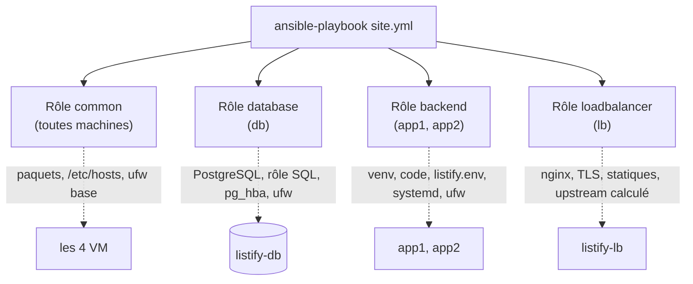

# TP 8 : Configurer avec Ansible, les quatre rôles

!!! abstract "Fiche du TP"
    - **Durée** : 6 h (3 séances : inventaire + rôle common + database ; backend ; loadbalancer + preuve d'idempotence)
    - **Prérequis** : TP 7 terminé (parc Vagrant fonctionnel) ; chapitre 12
    - **Livrables** : le projet Ansible complet dans `deploy/ansible/`, les 4 rôles, l'inventaire, le vault ; la **preuve d'idempotence** (`changed=0` au 2ᵉ passage) ; runbook à jour
    - **Compétences travaillées** : C2 (cœur), C6

    Tout ce que vous avez tapé à la main aux TP 2-6 devient ici du code rejouable. Gardez vos runbooks ouverts : ce TP est leur traduction, ligne à ligne, en modules idempotents.

## Ce que vous allez construire



## Étape 0 : installer Ansible et brancher l'inventaire sur Vagrant (45 min)

### 0.1 Installer Ansible et les collections

Ansible s'exécute sur votre **poste** (le nœud de contrôle), pas dans les VM. On l'installe dans un environnement virtuel Python dédié au projet, avec les collections utilisées par nos rôles :

```bash
cd ~/Github/edu/listify/deploy
python3 -m venv .ansible-venv
source .ansible-venv/bin/activate
pip install ansible
ansible-galaxy collection install community.general community.postgresql
ansible --version
```

### 0.2 L'inventaire, et comment il trouve les machines Vagrant

Créez l'arborescence du projet Ansible :

```bash
mkdir -p ansible/inventories/vagrant ansible/group_vars/all
cd ansible
```

Le point délicat : les machines Vagrant s'atteignent par l'utilisateur `vagrant` et une clé **par machine** rangée dans `.vagrant/`. On déclare tout cela dans l'inventaire :

```ini title="deploy/ansible/inventories/vagrant/hosts.ini"
[lb]
lb ansible_host=192.168.56.10

[app]
app1 ansible_host=192.168.56.21
app2 ansible_host=192.168.56.22

[db]
db ansible_host=192.168.56.31

[listify:children]
lb
app
db

[listify:vars]
ansible_user=vagrant
ansible_ssh_private_key_file=../../.vagrant/machines/{{ inventory_hostname }}/virtualbox/private_key
ansible_ssh_common_args=-o StrictHostKeyChecking=accept-new
```

Trois points à comprendre (et à noter) :

- Le groupe **`listify:children`** rassemble tous les tiers : c'est notre équivalent du groupe `all`, mais nommé, pour appliquer des variables communes.
- La clé privée est **calculée par machine** via `{{ inventory_hostname }}` : Vagrant range une clé distincte par VM, l'inventaire suit.
- `StrictHostKeyChecking=accept-new` accepte automatiquement la clé d'hôte à la première connexion (les VM viennent d'être créées, leurs clés sont neuves et de confiance) sans jamais accepter un **changement** de clé : le juste milieu pour de l'automatisation.

Vérifiez la connexion **avant** d'écrire le moindre rôle, c'est le geste qui évite des heures de confusion :

```bash
ansible -i inventories/vagrant/hosts.ini all -m ping
# db | SUCCESS => {"ping": "pong"} ... pour les 4 machines
```

!!! tip "Un ansible.cfg pour ne plus répéter `-i`"
    Créez `deploy/ansible/ansible.cfg` :

    ```ini
    [defaults]
    inventory = inventories/vagrant/hosts.ini
    host_key_checking = False
    roles_path = roles
    ```

    Désormais `ansible all -m ping` suffit depuis ce dossier. Ce fichier fait partie du projet (committé).

## Étape 1 : le rôle `common` (1 h)

Le socle appliqué à toutes les machines : ce qui, au TP 5, était le « bloc du TP 1 en accéléré ». Créez l'arborescence et les fichiers :

```bash
mkdir -p roles/common/tasks roles/common/handlers
```

```yaml title="deploy/ansible/roles/common/tasks/main.yml"
- name: Mise à jour du cache APT (valable 1 h)
  ansible.builtin.apt:
    update_cache: true
    cache_valid_time: 3600

- name: Les paquets de base sont présents
  ansible.builtin.apt:
    name:
      - ufw
      - python3
      - acl          # nécessaire à become vers un user non-root (voir §backend)
    state: present

- name: Fuseau horaire cohérent (logs datés juste)
  community.general.timezone:
    name: Europe/Paris

- name: Résolution interne du parc dans /etc/hosts
  ansible.builtin.blockinfile:
    path: /etc/hosts
    marker: "# {mark} LISTIFY HOSTS"
    block: |
      192.168.56.10   listify-lb
      192.168.56.21   listify-app1
      192.168.56.22   listify-app2
      192.168.56.31   listify-db

- name: Politique ufw par défaut - refuser en entrée
  community.general.ufw:
    direction: incoming
    policy: deny

- name: Politique ufw par défaut - autoriser en sortie
  community.general.ufw:
    direction: outgoing
    policy: allow

- name: SSH autorisé (avant l'activation, comme toujours)
  community.general.ufw:
    rule: allow
    port: "22"
    proto: tcp

- name: ufw activé
  community.general.ufw:
    state: enabled
```

Arrêtez-vous sur `blockinfile` : c'est la réponse propre à la garde `grep` artisanale du TP 7. Ses **marqueurs** (`# BEGIN/END LISTIFY HOSTS`) délimitent le bloc géré ; rejouer la tâche remplace le bloc entre marqueurs sans jamais dupliquer, et modifier le contenu met à jour proprement. L'idempotence *par structure* du chapitre 12, là où le shell exigeait de la reconstruire.

Ajoutez `common` au playbook et testez immédiatement (on construit rôle par rôle, on ne écrit pas tout d'un coup) :

```yaml title="deploy/ansible/site.yml (première version)"
- name: Socle commun à toutes les machines
  hosts: listify
  become: true
  roles:
    - common
```

```bash
ansible-playbook site.yml
```

Lisez le `PLAY RECAP` : des `changed` partout (on installe), `failed=0`. **Relancez la même commande** : cette fois `changed=0` sur les quatre machines. Vous venez de prouver l'idempotence de votre premier rôle : consignez les deux récapitulatifs côte à côte au runbook.

## Étape 2 : le rôle `database` (1 h 30)

La traduction de l'étape 3 du TP 5. Les secrets d'abord : créez le vault avec le mot de passe de la base.

```bash
ansible-vault create group_vars/all/vault.yml
# (une phrase de passe vous est demandée ; NOTEZ-LA, elle protège le secret)
```

Dans l'éditeur qui s'ouvre :

```yaml
vault_db_password: "un-mot-de-passe-fort-genere-par-vos-soins"
```

Puis les variables **en clair** qui référencent le vault (pour que `grep db_password` trouve toujours la définition, ch. 12, §6) :

```yaml title="deploy/ansible/group_vars/all/main.yml"
db_name: listify
db_user: listify
db_password: "{{ vault_db_password }}"
pg_version: 16
```

Le rôle :

```bash
mkdir -p roles/database/tasks roles/database/handlers
```

```yaml title="deploy/ansible/roles/database/tasks/main.yml"
- name: PostgreSQL et le connecteur Python sont présents
  ansible.builtin.apt:
    name:
      - postgresql
      - python3-psycopg2      # requis par les modules postgresql_*
    state: present

- name: PostgreSQL écoute aussi sur l'adresse privée
  ansible.builtin.lineinfile:
    path: "/etc/postgresql/{{ pg_version }}/main/postgresql.conf"
    regexp: '^#?listen_addresses'
    line: "listen_addresses = 'localhost, {{ ansible_host }}'"
  notify: Redémarrer PostgreSQL

- name: Le rôle SQL applicatif existe
  become_user: postgres
  community.postgresql.postgresql_user:
    name: "{{ db_user }}"
    password: "{{ db_password }}"

- name: La base applicative existe, possédée par ce rôle
  become_user: postgres
  community.postgresql.postgresql_db:
    name: "{{ db_name }}"
    owner: "{{ db_user }}"

- name: Chaque backend est autorisé dans pg_hba (une entrée par machine du groupe app)
  become_user: postgres
  community.postgresql.postgresql_pg_hba:
    dest: "/etc/postgresql/{{ pg_version }}/main/pg_hba.conf"
    contype: host
    databases: "{{ db_name }}"
    users: "{{ db_user }}"
    source: "{{ hostvars[item]['ansible_host'] }}/32"
    method: scram-sha-256
  loop: "{{ groups['app'] }}"
  notify: Recharger PostgreSQL

- name: Le port PostgreSQL est ouvert à chaque backend
  community.general.ufw:
    rule: allow
    from_ip: "{{ hostvars[item]['ansible_host'] }}"
    to_port: "5432"
    proto: tcp
  loop: "{{ groups['app'] }}"
```

```yaml title="deploy/ansible/roles/database/handlers/main.yml"
- name: Redémarrer PostgreSQL
  ansible.builtin.systemd_service:
    name: postgresql
    state: restarted

- name: Recharger PostgreSQL
  ansible.builtin.systemd_service:
    name: postgresql
    state: reloaded
```

Le moment fort du TP est la double boucle `loop: "{{ groups['app'] }}"` : les autorisations pg_hba **et** ufw sont générées **une par backend, depuis l'inventaire**. Ajoutez app3 à l'inventaire un jour, et les deux entrées apparaissent toutes seules. Le « coût de app3 » que vous aviez chiffré au TP 6 (éditer pg_hba, éditer ufw, sur la bonne machine, sans oubli) vient de tomber à zéro. Relisez la synthèse du TP 6 : c'est ici, concrètement, que sa promesse est tenue.

Ajoutez le play `database` au `site.yml` (`hosts: db`), exécutez, vérifiez, relancez pour l'idempotence.

## Étape 3 : le rôle `backend` (1 h 30)

La traduction du TP 2 / étape 4 du TP 5. Le code applicatif est copié depuis le dépôt vers les machines : on le référence par un chemin relatif au projet.

```bash
mkdir -p roles/backend/tasks roles/backend/templates roles/backend/handlers
```

```yaml title="deploy/ansible/roles/backend/tasks/main.yml"
- name: Python et venv présents
  ansible.builtin.apt:
    name: [python3, python3-venv]
    state: present

- name: L'utilisateur système listify existe
  ansible.builtin.user:
    name: listify
    system: true
    home: /opt/listify
    shell: /usr/sbin/nologin

- name: /opt/listify traversable (Nginx du lb servira les statiques ; ici cohérence)
  ansible.builtin.file:
    path: /opt/listify
    state: directory
    owner: listify
    group: listify
    mode: "0751"

- name: Le code du backend est déployé
  ansible.builtin.copy:
    src: "{{ playbook_dir }}/../../backend/"
    dest: /opt/listify/backend/
    owner: listify
    group: listify
    mode: "0644"
    directory_mode: "0755"
  notify: Redémarrer listify

- name: Le venv existe avec les dépendances
  ansible.builtin.pip:
    requirements: /opt/listify/backend/requirements.txt
    virtualenv: /opt/listify/venv
    virtualenv_command: python3 -m venv
  become_user: listify
  notify: Redémarrer listify

- name: Le répertoire de configuration existe
  ansible.builtin.file:
    path: /etc/listify
    state: directory
    mode: "0755"

- name: Le fichier d'environnement (secret) est en place
  ansible.builtin.template:
    src: listify.env.j2
    dest: /etc/listify/listify.env
    owner: root
    group: listify
    mode: "0640"
  notify: Redémarrer listify

- name: L'unité systemd est installée
  ansible.builtin.template:
    src: listify.service.j2
    dest: /etc/systemd/system/listify.service
    mode: "0644"
  notify:
    - Recharger systemd
    - Redémarrer listify

- name: Le service listify est démarré et activé au boot
  ansible.builtin.systemd_service:
    name: listify
    enabled: true
    state: started

- name: Le port 8000 est ouvert au load balancer seulement
  community.general.ufw:
    rule: allow
    from_ip: "{{ hostvars[groups['lb'][0]]['ansible_host'] }}"
    to_port: "8000"
    proto: tcp
```

Les deux templates, où la configuration se calcule :

```jinja title="deploy/ansible/roles/backend/templates/listify.env.j2"
DB_HOST=listify-db
DB_PORT=5432
DB_NAME={{ db_name }}
DB_USER={{ db_user }}
DB_PASSWORD={{ db_password }}
```

```jinja title="deploy/ansible/roles/backend/templates/listify.service.j2"
[Unit]
Description=Listify backend (Gunicorn)
After=network-online.target
Wants=network-online.target

[Service]
User=listify
Group=listify
WorkingDirectory=/opt/listify/backend
EnvironmentFile=/etc/listify/listify.env
ExecStart=/opt/listify/venv/bin/gunicorn --workers 3 --bind 0.0.0.0:8000 wsgi:app
Restart=on-failure
RestartSec=2

[Install]
WantedBy=multi-user.target
```

```yaml title="deploy/ansible/roles/backend/handlers/main.yml"
- name: Recharger systemd
  ansible.builtin.systemd_service:
    daemon_reload: true

- name: Redémarrer listify
  ansible.builtin.systemd_service:
    name: listify
    state: restarted
```

Notez la décision du TP 6 (`--bind 0.0.0.0:8000`) devenue permanente dans le template : le rôle est **identique** sur app1 et app2, l'unité n'est plus une identité mais un rôle. Et la chaîne handler `template listify.service → notify: Recharger systemd + Redémarrer listify` code exactement votre réflexe manuel « après avoir modifié l'unité : daemon-reload puis restart », désormais déclenché **seulement si le fichier change**.

Ajoutez le play `backend` (`hosts: app`), exécutez, vérifiez que les deux backends répondent, relancez pour l'idempotence.

## Étape 4 : le rôle `loadbalancer` (1 h)

La traduction du TP 5 étape 5 + TP 6 étape 2, avec l'upstream **calculé depuis l'inventaire**.

```bash
mkdir -p roles/loadbalancer/tasks roles/loadbalancer/templates roles/loadbalancer/handlers roles/loadbalancer/files
```

Copiez vos statiques et le certificat dans le rôle (ou générez le certificat par une tâche : ci-dessous, on le génère, plus propre) :

```yaml title="deploy/ansible/roles/loadbalancer/tasks/main.yml"
- name: Nginx présent
  ansible.builtin.apt:
    name: nginx
    state: present

- name: Répertoire des statiques
  ansible.builtin.file:
    path: /opt/listify/frontend
    state: directory
    mode: "0755"

- name: Les statiques sont déployés
  ansible.builtin.copy:
    src: "{{ playbook_dir }}/../../frontend/"
    dest: /opt/listify/frontend/
    mode: "0644"
    directory_mode: "0755"

- name: Répertoire des certificats
  ansible.builtin.file:
    path: /etc/nginx/ssl
    state: directory
    mode: "0755"

- name: Certificat auto-signé (généré s'il n'existe pas)
  ansible.builtin.command:
    cmd: >
      openssl req -x509 -newkey ec -pkeyopt ec_paramgen_curve:prime256v1
      -keyout /etc/nginx/ssl/listify.key -out /etc/nginx/ssl/listify.crt
      -days 365 -nodes -subj "/CN=listify.local"
      -addext "subjectAltName=DNS:listify.local"
    creates: /etc/nginx/ssl/listify.crt      # ← garde d'idempotence pour un command
  notify: Recharger nginx

- name: Le site Listify est configuré
  ansible.builtin.template:
    src: listify.conf.j2
    dest: /etc/nginx/sites-available/listify
    mode: "0644"
  notify: Recharger nginx

- name: Le site Listify est activé
  ansible.builtin.file:
    src: /etc/nginx/sites-available/listify
    dest: /etc/nginx/sites-enabled/listify
    state: link
  notify: Recharger nginx

- name: Le site par défaut est désactivé
  ansible.builtin.file:
    path: /etc/nginx/sites-enabled/default
    state: absent
  notify: Recharger nginx

- name: Les ports HTTP et HTTPS sont ouverts
  community.general.ufw:
    rule: allow
    port: "{{ item }}"
    proto: tcp
  loop: ["80", "443"]
```

```jinja title="deploy/ansible/roles/loadbalancer/templates/listify.conf.j2"
upstream listify_backend {

    server {{ hostvars[host]['ansible_host'] }}:8000 max_fails=3 fail_timeout=10s;

}

server {
    listen 80;
    server_name listify.local;
    return 301 https://$host$request_uri;
}

server {
    listen 443 ssl;
    server_name listify.local;

    ssl_certificate     /etc/nginx/ssl/listify.crt;
    ssl_certificate_key /etc/nginx/ssl/listify.key;
    ssl_protocols       TLSv1.2 TLSv1.3;

    root /opt/listify/frontend;
    index index.html;
    location / {
        try_files $uri $uri/ =404;
    }

    location /api/ {
        proxy_pass http://listify_backend;
        proxy_next_upstream error timeout http_502 http_503;
        add_header X-Upstream $upstream_addr always;
        proxy_set_header Host              $host;
        proxy_set_header X-Real-IP         $remote_addr;
        proxy_set_header X-Forwarded-For   $proxy_add_x_forwarded_for;
        proxy_set_header X-Forwarded-Proto $scheme;
    }
}
```

```yaml title="deploy/ansible/roles/loadbalancer/handlers/main.yml"
- name: Recharger nginx
  ansible.builtin.systemd_service:
    name: nginx
    state: reloaded
```

Le template `listify.conf.j2` est le sommet du TP : la boucle `` **régénère l'upstream depuis l'inventaire**. La liste des backends n'existe qu'à un seul endroit du projet, l'inventaire, et Nginx, pg_hba et ufw en dérivent tous les trois. La duplication d'information du chapitre 9 est vaincue.

Complétez le `site.yml` avec le play `loadbalancer` (`hosts: lb`). Le playbook est maintenant complet :

```yaml title="deploy/ansible/site.yml (final)"
- name: Socle commun
  hosts: listify
  become: true
  roles: [common]

- name: Tier données
  hosts: db
  become: true
  roles: [database]

- name: Tier applicatif
  hosts: app
  become: true
  roles: [backend]

- name: Tier exposé
  hosts: lb
  become: true
  roles: [loadbalancer]
```

## Étape 5 : la preuve d'idempotence et la validation (45 min)

```bash
ansible-playbook site.yml --ask-vault-pass          # 1ʳᵉ exécution complète
```

Complétez `/etc/hosts` de votre **poste** (`192.168.56.10 listify.local`, comme au TP 5), puis validez de bout en bout :

```bash
curl -sk https://listify.local/api/health           # ok/ok
for i in $(seq 1 4); do
  curl -sk -D - -o /dev/null https://listify.local/api/health | grep -i x-upstream
done                                                 # alternance app1/app2
```

Puis **la preuve reine**, à mettre en évidence au runbook :

```bash
ansible-playbook site.yml --ask-vault-pass          # 2ᵉ exécution, sans rien changer
```

Le `PLAY RECAP` doit afficher **`changed=0`** sur les quatre machines. C'est la démonstration formelle que votre infrastructure est décrite par un état désiré idempotent (ch. 10). Si une tâche passe `changed` au 2ᵉ tour, c'est un défaut à corriger : le suspect n° 1 est la tâche `command`/`openssl` (vérifiez que la garde `creates:` fait son travail).

!!! tip "Le mot de passe du vault, sans le retaper"
    Pour les nombreuses exécutions du TP : mettez la phrase de passe dans un fichier `deploy/ansible/.vault-pass` (ajouté au `.gitignore` !), et `ansible-playbook site.yml --vault-password-file .vault-pass`. En production, ce fichier viendrait d'un gestionnaire de secrets, jamais du disque.

## Point de contrôle final

- [ ] `ansible all -m ping` : les 4 machines répondent
- [ ] `ansible-playbook site.yml` construit l'application complète ; `https://listify.local` fonctionne au navigateur
- [ ] **2ᵉ exécution : `changed=0` partout** (les deux RECAP au runbook)
- [ ] Round-robin prouvé (`X-Upstream` alterne)
- [ ] Le secret n'apparaît en clair nulle part dans Git (`git grep` le mot de passe : rien ; le vault est chiffré)
- [ ] Projet committé : rôles, inventaire, `site.yml`, `ansible.cfg`, vault chiffré ; `.vault-pass` et `.ansible-venv` ignorés

## Pour aller plus loin (bonus)

1. **La preuve du calcul depuis l'inventaire** : ajoutez `app3` (192.168.56.23) au Vagrantfile *et* à l'inventaire, `vagrant up app3`, relancez le playbook. Sans toucher un seul rôle : le backend s'installe sur app3, pg_hba et ufw de db gagnent une entrée, l'upstream Nginx passe à trois serveurs. Mesurez : combien de fichiers **vous** avez édités ? (Réponse : deux lignes.) Comparez au « coût de app3 » chiffré au TP 6.
2. **`--check --diff`** : provoquez un drift à la main (`vagrant ssh db -c 'sudo systemctl stop postgresql'` ou modifiez un fichier de conf), puis `ansible-playbook site.yml --check --diff` : Ansible **rapporte l'écart sans corriger**. Vous tenez un détecteur de drift.
3. **ansible-lint** : `pip install ansible-lint && ansible-lint` sur vos rôles ; corrigez ce qu'il signale. Quelles non-idempotences potentielles trouve-t-il ?

## Questions de compréhension (à préparer pour le TD)

1. Pour chaque rôle, citez la tâche qui a exigé de **reconstruire l'idempotence à la main** (garde `creates:`, `blockinfile` avec marqueurs...) et expliquez pourquoi le module « nu » ne suffisait pas.
2. Déroulez ce qui se passe si vous changez `vault_db_password` puis relancez le playbook : quelles machines passent `changed`, quel handler se déclenche, l'application reste-t-elle cohérente pendant l'opération ?
3. La tâche pg_hba boucle sur `groups['app']`. Que produit exactement le playbook si vous **retirez** app2 de l'inventaire puis relancez ? L'ancienne entrée pg_hba disparaît-elle ? (Testez : la réponse révèle une limite importante des rôles « additifs » et introduit la notion d'état *convergent complet* vs *additif*.)
4. Comparez, chronos à l'appui, le temps de ce TP à celui du TP 5+6 (que vous aviez consigné). Puis comparez le temps d'un **rejeu** (2ᵉ `ansible-playbook`) à celui d'une reconstruction manuelle. C'est la matière de votre compte rendu, et l'argument de vente de l'IaC en une ligne.
