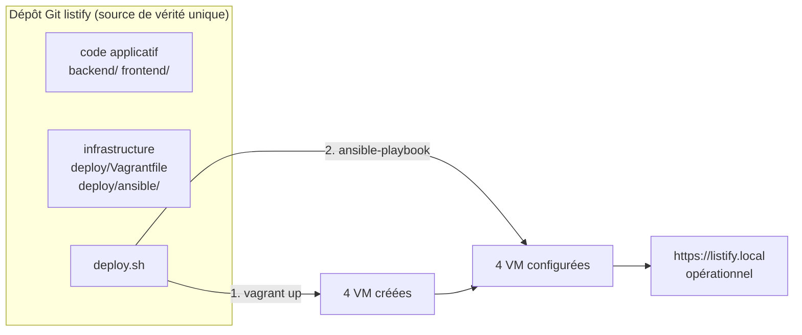

# TP 9 : La chaîne complète, et la revanche du défi

!!! abstract "Fiche du TP"
    - **Durée** : 4 h
    - **Prérequis** : TP 7 et 8 terminés ; chapitres 10 à 12
    - **Livrables** : le script `deploy.sh` qui reconstruit tout depuis un dépôt vierge ; le **compte rendu comparatif chronométré** avec le défi du bloc 1 ; le README « reconstruction en une commande » ; runbook final
    - **Compétences travaillées** : C2 (cœur), C1, C6

    C'est le TP de clôture du semestre. On soude Vagrant et Ansible, on rejoue le défi du bloc 1, et on mesure le chemin parcouru.

## Ce que vous allez construire



## Étape 1 : souder les deux moitiés (1 h 30)

Aux TP 7 et 8, vous lanciez `vagrant up` **puis** `ansible-playbook` à la main. C'est l'**orchestration** (ch. 10) qui manque : le bon ordre, écrit quelque part. Deux façons de la coder ; on construit les deux pour les comparer.

### 1.1 Approche A : le provisioner Ansible de Vagrant

Vagrant sait appeler Ansible lui-même, comme provisioner. Ajoutez à la fin de chaque définition de machine, ou globalement, un provisioner `ansible` : Vagrant génère alors son propre inventaire et lance le playbook sur la machine concernée. Élégant, mais le déclenchement par machine se marie mal avec nos dépendances inter-machines (le LB a besoin que les backends existent). On préfère donc, pour notre architecture, lancer Ansible **une fois, sur tout le parc, après que toutes les VM sont debout** : c'est l'approche B.

### 1.2 Approche B : un script d'orchestration (retenue)

Le script qui incarne « le bon ordre », à la racine du dépôt :

```bash title="deploy.sh"
#!/usr/bin/env bash
# Reconstruit l'intégralité de Listify depuis zéro.
# Prérequis sur le poste : VirtualBox, Vagrant, et le venv Ansible du deploy/.
set -euo pipefail

cd "$(dirname "$0")/deploy"

echo "==> 1/2 Provisionnement des machines (Vagrant)"
vagrant up

echo "==> 2/2 Configuration des machines (Ansible)"
cd ansible
source .ansible-venv/bin/activate
ansible-playbook site.yml --vault-password-file .vault-pass

echo "==> Terminé. Vérification :"
curl -sk https://listify.local/api/health || \
  echo "   (pensez à '192.168.56.10 listify.local' dans /etc/hosts du poste)"
```

```bash
chmod +x deploy.sh
```

L'orchestration est ici un script de deux étapes ; c'est modeste, mais **explicite et versionné**, ce que votre discipline personnelle des blocs 1-2 n'était pas. Les orchestrateurs des semestres suivants (Kubernetes, Airflow) remplaceront ce script par des systèmes qui gèrent l'ordre, les reprises et l'échelle : vous saurez alors précisément quel manque ils comblent, car vous l'aurez écrit à la main.

!!! warning "Une dépendance d'ordre à ne pas masquer"
    `vagrant up` crée les machines mais ne garantit pas que PostgreSQL sera prêt à la microseconde où le backend démarre. Ici, pas de souci : Ansible configure la base (play `db`) **avant** les backends (play `app`), et de toute façon notre backend sait attendre (503 propre, conçu au TP 2). Mais notez la question, elle est centrale au S2 : *comment un composant attend-il qu'un autre soit prêt ?* Les réponses (probes, health checks, retry) sont au programme de Kubernetes.

Testez le script sur votre parc existant : il doit être **idempotent** de bout en bout (vagrant up ne recrée rien, ansible passe `changed=0`).

## Étape 2 : la reconstruction totale (1 h)

Le vrai test : depuis un état vierge. Simulez le poste neuf.

```bash
# 1. Tout détruire
cd deploy && vagrant destroy -f && cd ..

# 2. (Optionnel mais probant) cloner le dépôt ailleurs, comme le ferait un collègue
cd /tmp && git clone <url-ou-chemin-de-votre-dépôt> listify-neuf && cd listify-neuf

# 3. Recréer le venv Ansible et le fichier de vault-pass (ils ne sont PAS dans Git)
python3 -m venv deploy/ansible/.ansible-venv
deploy/ansible/.ansible-venv/bin/pip install ansible
deploy/ansible/.ansible-venv/bin/ansible-galaxy collection install community.general community.postgresql
echo "VOTRE_PHRASE_DE_PASSE_VAULT" > deploy/ansible/.vault-pass

# 4. LA commande unique
time ./deploy.sh
```

Chronométrez. À la fin, `https://listify.local` fonctionne, servi par une infrastructure que **vous n'avez pas touchée à la main une seule fois**.

!!! note "Ce qui n'est pas dans Git est ce qu'il faut re-fournir"
    L'étape 3 ci-dessus révèle la frontière exacte entre le versionné et le local : le venv Ansible (reconstructible) et le mot de passe du vault (secret, jamais commité) doivent être re-fournis. Documentez-les **précisément** dans le README : c'est là que se joue le « reconstructible par un tiers ». Un README qui oublie le vault-pass produit un dépôt qui « marche chez moi » : l'exact défaut que tout le semestre combat.

## Étape 3 : la revanche du défi du bloc 1 (1 h)

Le moment que le semestre entier préparait. Ressortez votre compte rendu du **défi du bloc 1** : les 30 minutes chronométrées, l'échec, les trous du runbook, le cahier des charges que vous aviez écrit.

Refaites le défi, version bloc 3 : « redéployez l'application complète sur une infrastructure neuve ». Chronométrez `./deploy.sh` depuis `vagrant destroy`.

Puis rédigez le **compte rendu comparatif** (livrable noté), en quatre points :

1. **Les chronos, face à face** : le manuel du bloc 1 (estimation honnête de ce qu'il aurait fallu pour *réussir*, pas seulement le temps écoulé), le manuel multi-machines du bloc 2, et la commande unique d'aujourd'hui. Un tableau, des minutes.
2. **Le cahier des charges, point par point** : reprenez les 6 propriétés que vous aviez listées (chapitre 9, §4 : écrit, versionné, exécutable, idempotent, déclaratif, factorisé) et montrez, pour chacune, *où* dans votre projet elle est réalisée. C'est l'auto-évaluation la plus formatrice du semestre.
3. **Ce qui a disparu** : la liste des pièges des blocs 1-2 que l'IaC a fait s'évanouir (MAC dupliquées, clés d'hôte, oublis de pg_hba, secrets dans le code, drift entre app1 et app2, `dquote>`...). Pour chacun : *par quel mécanisme* précis il n'existe plus.
4. **Ce qui reste** : l'IaC n'a pas tout résolu. L'orchestration est un script fragile ; le LB reste un SPOF ; la base est un singleton non répliqué ; la reconstruction re-détruit tout plutôt que de faire évoluer en douceur. Nommez ces limites : elles sont le programme des semestres 2 et 3, et les nommer prouve que vous avez compris où vous en êtes.

## Étape 4 : le README de reconstruction (30 min)

Le livrable le plus professionnalisant du parcours (et le critère le plus discriminant du projet noté). Votre `README.md` doit permettre à l'enseignant, sur un poste neuf, de tout reconstruire. Structure minimale exigée :

```markdown
# Listify - déploiement automatisé

## Prérequis du poste
- VirtualBox >= 7.0, Vagrant >= 2.4, Python 3
- (versions exactes testées : ...)

## Reconstruction complète
1. Cloner ce dépôt
2. Préparer les secrets et l'outillage (non versionnés) :
   - créer `deploy/ansible/.vault-pass` contenant la phrase de passe du vault
   - `python3 -m venv deploy/ansible/.ansible-venv && ... pip install ansible && ansible-galaxy collection install ...`
3. Ajouter `192.168.56.10 listify.local` au /etc/hosts du poste
4. Lancer : `./deploy.sh`
5. Ouvrir https://listify.local

## Architecture
(le schéma du bloc 2 + le plan d'adressage)

## Structure du dépôt
(code applicatif / deploy/ infra)
```

Testez ce README à la lettre en binôme croisé si possible : donnez votre dépôt à un autre binôme, sans explication orale, et regardez où il bute. Chaque hésitation est un défaut de README à corriger. C'est aussi le protocole exact de la soutenance.

## Point de contrôle final

- [ ] `./deploy.sh` reconstruit tout depuis `vagrant destroy`, en une commande, application accessible au bout
- [ ] Le script est idempotent (relancé sur un parc en place : rien ne casse, `changed=0`)
- [ ] Reconstruction depuis un clone frais réussie (venv + vault-pass re-fournis d'après le README seul)
- [ ] Compte rendu comparatif rédigé (4 points, chronos inclus)
- [ ] README « reconstruction en une commande » testé par un tiers
- [ ] Dépôt propre : `.gitignore` correct (pas de `.vagrant/`, `.ansible-venv/`, `.vault-pass`, `terraform.tfstate`), vault chiffré, aucun secret en clair (`git grep`)

## Pour aller plus loin (bonus)

1. **Cible de production simulée** : ajoutez un second inventaire `inventories/prod/hosts.ini` pointant vers d'autres adresses (ou d'autres VM), et montrez que `ansible-playbook -i inventories/prod/...` déploierait ailleurs **sans changer un rôle**. La séparation code/données (inventaire) porte enfin son fruit : un même code, N environnements.
2. **Un test de fumée automatisé** : ajoutez à `deploy.sh` une série de `curl` qui échoue (exit non nul) si l'application ne répond pas correctement. Premier pas vers les tests post-déploiement du CI/CD (S2).
3. **Molecule** : testez le rôle `backend` en isolation avec Molecule (ch. 12, bibliographie). Comparez à votre test « manuel » (déployer, curler).

## Questions de compréhension (à préparer pour le TD et l'examen)

1. Votre `deploy.sh` orchestre en deux étapes ordonnées. Énumérez précisément ce qu'un vrai orchestrateur (Kubernetes) ajouterait que ce script ne fait pas : reprises sur échec, attente de disponibilité, mise à l'échelle, remplacement sans coupure. Pour chacun, dites où votre déploiement actuel serait pris en défaut.
2. La reconstruction `destroy && up` détruit puis recrée. En production, on ne détruit pas la base à chaque déploiement. Quelle partie de votre infrastructure ne doit **jamais** être traitée en « destroy && recreate », et comment un vrai système sépare le déploiement du code (jetable) de celui des données (précieux) ? (Vous retrouvez stateless/stateful : c'est la question centrale du S2 avec les StatefulSets.)
3. Reprenez la carte provisionner/configurer/orchestrer (ch. 10). Placez-y chacun de vos fichiers (Vagrantfile, rôles Ansible, deploy.sh) et justifiez. Où est le trou que le S2 comblera ?
