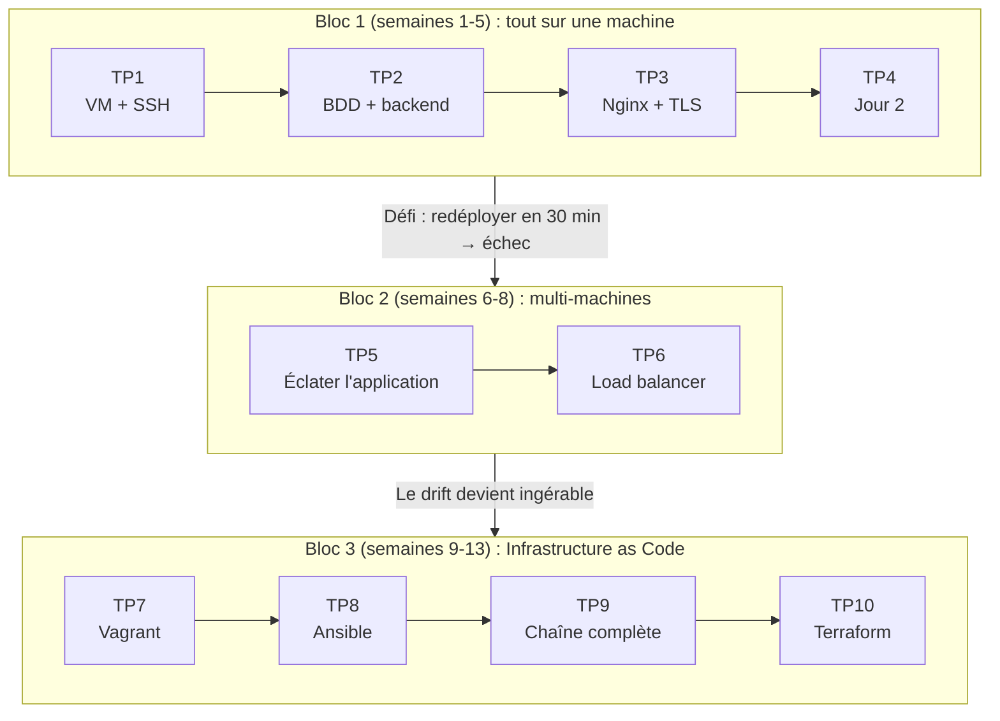

# Semestre 1 : Fondations, du serveur unique à l'Infrastructure as Code

**Objectif général :** comprendre ce qu'est *réellement* un déploiement (les couches système, réseau et applicatives), puis découvrir pourquoi et comment l'automatiser.

**Prérequis :** bases de Linux (shell), bases de réseau (adresses IP, ports), développement web (savoir lire une application 3-tiers simple).

## Vue d'ensemble du semestre

Le semestre suit une trajectoire en trois temps, chacun se terminant par une prise de conscience qui motive le suivant :

1. **[Bloc 1](bloc1/index.md) (semaines 1 à 5) : le déploiement « à l'ancienne », tout sur une machine.** Vous installez et exploitez l'application fil rouge à la main sur une VM Ubuntu Server : système, réseau, reverse proxy, TLS, sauvegardes. Le bloc se clôt par un défi chronométré... conçu pour être perdu.
2. **Bloc 2 (semaines 6 à 8) : architecture multi-machines.** Un service par VM, réseau privé, pare-feu inter-machines, répartition de charge. La douleur du bloc 1, multipliée par quatre machines : le *configuration drift* devient tangible.
3. **Bloc 3 (semaines 9 à 13) : Infrastructure as Code.** Vagrant décrit les machines, Ansible les configure de façon idempotente, Terraform introduit l'état désiré. L'application entière se déploie en une commande depuis un dépôt Git ; on rejoue le défi du bloc 1 et on chronomètre.

## Concepts évalués à l'examen

Ce semestre introduit des concepts qui reviendront pendant tout le parcours. À l'examen théorique, on attend de vous des définitions rigoureuses et la capacité à raisonner avec :

- **Idempotence** : une opération est idempotente si l'exécuter une ou plusieurs fois produit le même état final. Concept central du semestre.
- **Déclaratif vs impératif** : décrire l'état voulu vs décrire la suite d'actions.
- **Configuration drift** : divergence progressive entre l'état réel d'un serveur et son état supposé.
- **Pets vs cattle** : serveurs uniques et soignés vs serveurs interchangeables et remplaçables.
- **Provisionner / configurer / orchestrer** : les trois problèmes que résout l'IaC, et la cartographie des outils selon ces axes.
- Ainsi que les fondamentaux techniques : systemd, DNS, NAT, TLS et chaîne de confiance, reverse proxy, workers.

## Évaluation du semestre

| Épreuve | Poids | Modalités |
|---|---|---|
| Contrôle continu | 30 % | Comptes rendus de TP tenus en « journal de bord » (runbook) : commandes, erreurs, diagnostics |
| Projet | 40 % | Par binôme : déployer une application 3-tiers *différente de celle du cours* de manière 100 % automatisée (Vagrant + Ansible), README permettant à l'enseignant de tout reconstruire en une commande. Soutenance avec injection d'une panne en direct, diagnostic commenté |
| Examen théorique | 30 % | Questions de concepts (idempotence, drift, déclaratif/impératif, TLS, systemd...) et étude de cas d'architecture sur papier |

## Environnement de travail

- **Poste étudiant** : 16 Go de RAM recommandés (8 Go minimum avec adaptations), VirtualBox ≥ 7.0, puis Vagrant au bloc 3.
- **Système invité de référence** : Ubuntu Server 24.04 LTS « Noble Numbat ». Toutes les corrections et les pannes injectées sont préparées sur cette version : ne changez pas de distribution sans accord de l'enseignant.
- Un **guide d'installation** aux versions figées est distribué en semaine 1 ; les images ISO et boxes Vagrant sont disponibles sur le miroir local de l'école pour économiser la bande passante.
