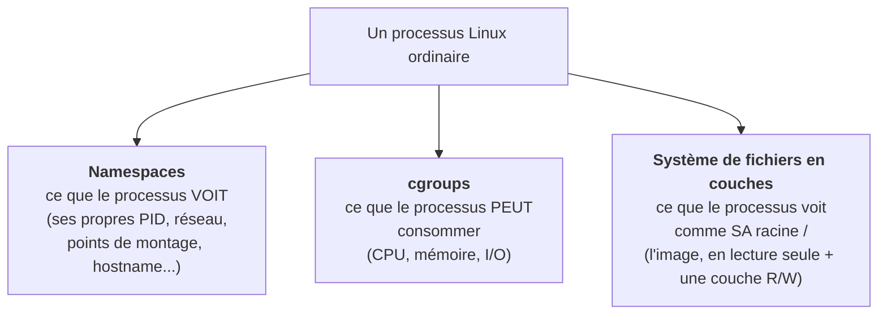
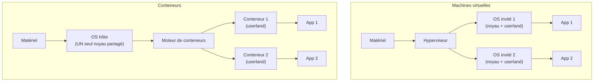
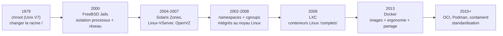

# Chapitre 14 : Pourquoi les conteneurs ?

!!! abstract "Objectifs du chapitre"
    À l'issue de ce chapitre, vous saurez :

    - énoncer les limites concrètes des machines virtuelles que les conteneurs viennent lever ;
    - expliquer le problème du « ça marche sur ma machine » et pourquoi ni les VM ni Ansible ne le résolvent complètement ;
    - définir un conteneur par contraste rigoureux avec une VM (ce que chacun virtualise) ;
    - situer historiquement l'idée (des chroot aux conteneurs OCI) pour comprendre qu'elle n'est pas née avec Docker.

## 1. Le point de départ : ce que le S1 laissait ouvert

Au semestre 1, vous déployiez sur des **machines virtuelles**, et vous avez fini par les décrire en code (Vagrant + Ansible). C'était un immense progrès, mais trois douleurs subsistaient, que ce chapitre nomme pour mieux les dépasser :

1. **La lourdeur.** Chaque VM embarque un noyau et un OS complet : centaines de Mo de RAM, dizaines de secondes de démarrage, plusieurs Go de disque. Au TP 6 du S1, faire tourner quatre VM saturait déjà un poste à 8 Go. Impossible d'en lancer cinquante.
2. **La lenteur du cycle.** `vagrant destroy && vagrant up` prenait des minutes ; reconstruire pour tester un changement de configuration était coûteux.
3. **La reproductibilité imparfaite.** Ansible converge une machine vers un état voulu, mais **au moment de l'exécution** : si un dépôt APT a changé, si une version de paquet a bougé, la machine obtenue en janvier diffère de celle de mars. Le playbook est reproductible ; son *résultat*, moins.

C'est ce troisième point qui est le plus profond, et il porte un nom.

## 2. Le problème du « ça marche sur ma machine »

### 2.1 Le symptôme

Le développeur teste son application sur son poste : elle fonctionne. En production, elle échoue. Enquête : la production a Python 3.10, le poste 3.12 ; une bibliothèque système (`libpq`, `libssl`) diffère d'une version mineure ; une variable d'environnement présente localement manque sur le serveur. Le fossé entre « chez moi » et « en production » est le premier poste de dépenses en temps perdu des équipes, et la source d'innombrables incidents.

### 2.2 Pourquoi les VM ne le règlent qu'à moitié

Une VM fige le **noyau et l'OS**, mais pas la manière dont *votre application et ses dépendances* y sont installées. Deux équipes partant de la même box Ubuntu obtiennent deux environnements différents selon ce qu'elles y installent, dans quel ordre, à quelle date. La VM déplace la frontière, elle ne la supprime pas.

### 2.3 Pourquoi Ansible ne le règle qu'à moitié

Ansible décrit l'installation, donc rapproche les environnements. Mais il **décrit un processus** qui s'exécute contre un monde mouvant (les dépôts de paquets, les registres PyPI). Rejouer le même playbook trois mois plus tard peut installer des versions différentes. La reproductibilité d'Ansible est celle de la *recette*, pas du *plat*.

### 2.4 La réponse des conteneurs : figer le résultat, pas la recette

L'idée du conteneur est de livrer non plus une recette à exécuter sur la cible, mais un **artefact déjà construit** : une **image** contenant l'application *et tout son environnement utilisateur* (bibliothèques, dépendances, fichiers, configuration par défaut), figé au bit près. On construit l'image **une fois** ; on exécute **exactement ce même artefact** sur le poste du développeur, dans la CI, et en production. Le « chez moi » et le « en prod » deviennent, littéralement, le même fichier. C'est l'aboutissement de l'**immutabilité** entrevue au S1 (le « serveur phénix ») : ici, l'artefact immuable existe pour de bon.

!!! note "Ce que l'image ne contient PAS : le noyau"
    Une image de conteneur embarque l'espace utilisateur (les programmes et bibliothèques) mais **pas de noyau** : elle utilise celui de la machine hôte. C'est toute la différence avec une VM, et la source à la fois de sa légèreté et de ses limites (section 4). Retenez cette phrase, elle est la clé du chapitre : **une VM virtualise le matériel ; un conteneur virtualise l'espace utilisateur d'un système, en partageant le noyau de l'hôte.**

## 3. Qu'est-ce qu'un conteneur, concrètement ?

Contrairement à une intuition répandue, un conteneur n'est **pas** un objet spécial créé par un logiciel magique. C'est un **processus Linux ordinaire**, auquel le noyau applique trois restrictions :

- Les **namespaces** donnent au processus une vue *isolée* du système : il croit avoir ses propres identifiants de processus, sa propre interface réseau, son propre système de fichiers. C'est l'**isolation**.
- Les **cgroups** (*control groups*) limitent et comptabilisent ses *ressources* : « ce conteneur ne dépassera pas 512 Mo de RAM ni 1 cœur ». C'est la **maîtrise des ressources**.
- Un **système de fichiers en couches** lui présente l'image comme racine `/`, en superposant une couche inscriptible par-dessus des couches en lecture seule partagées. C'est la **portabilité** et l'efficacité disque.

Le moteur de conteneurs (Podman, Docker) n'est qu'un **chef d'orchestre** qui configure ces trois primitives et lance le processus. Le TP 11 vous le prouvera : vous créerez un « conteneur » à la main avec `unshare` et `cgcreate`, sans aucun moteur, et vous verrez que Podman ne fait rien de plus mystérieux. Le chapitre 15 détaille chacune de ces primitives.

## 4. Conteneur vs VM : le tableau qui doit être limpide

| Critère | Machine virtuelle | Conteneur |
|---|---|---|
| Ce qui est virtualisé | Le **matériel** | L'**espace utilisateur** (via namespaces) |
| Noyau | Un noyau **par VM** | **Partagé** avec l'hôte |
| Démarrage | Dizaines de secondes (boot d'un OS) | Millisecondes (lancer un processus) |
| Empreinte | Centaines de Mo à Go | Mo à dizaines de Mo |
| Densité (par machine) | Dizaines | Centaines à milliers |
| Isolation | **Très forte** (frontière matérielle) | Forte mais **moindre** (noyau commun : voir §4.1) |
| OS invité | N'importe lequel (Linux, Windows...) | **Doit partager le noyau de l'hôte** (Linux sur Linux) |

### 4.1 La contrepartie honnête : l'isolation

Le noyau partagé est la force *et* la faiblesse du conteneur. Force : légèreté extrême. Faiblesse : la surface d'isolation est celle du noyau Linux, un logiciel énorme ; une faille du noyau (une « évasion de conteneur ») peut permettre à un conteneur compromis d'atteindre l'hôte ou ses voisins, ce qu'une frontière matérielle de VM interdit. C'est pourquoi, dans les environnements *multi-locataires* hostiles (un cloud public exécutant le code de clients inconnus côte à côte), on ajoute une couche : des « micro-VM » (Firecracker d'AWS, gVisor de Google) qui redonnent une frontière de noyau à chaque conteneur. À notre échelle (vos propres applications, en confiance), l'isolation par namespaces suffit, mais un ingénieur doit **connaître cette limite** et ne jamais dire « le conteneur isole autant qu'une VM ».

!!! danger "L'erreur d'examen classique"
    « Un conteneur est une VM légère » : **faux et pénalisé**. Une VM virtualise le matériel et a son noyau ; un conteneur partage le noyau de l'hôte et n'isole que l'espace utilisateur. La bonne réponse mentionne toujours le **noyau**.

### 4.2 Ce n'est pas « l'un ou l'autre »

VM et conteneurs se **combinent** massivement en production : on exécute des conteneurs *dans* des VM (c'est exactement ce que fait Kubernetes chez tous les fournisseurs cloud, et ce que vous ferez au bloc 2 avec minikube). La VM apporte la frontière d'isolation forte entre locataires ; le conteneur apporte la densité et la vitesse à l'intérieur. Savoir articuler les deux est une question d'architecture (C1) attendue à l'examen.

## 5. Une idée plus ancienne que Docker

Docker (2013) a rendu les conteneurs *utilisables par tous*, mais n'a rien inventé des primitives. La lignée est longue et mérite d'être connue, car elle montre que l'innovation est souvent un travail d'**assemblage et d'ergonomie** plus que d'invention pure :

Le tournant technique côté noyau est l'arrivée des **cgroups**, développés chez Google (« process containers », 2006-2007) pour isoler les ressources de leurs services internes, puis fusionnés dans le noyau Linux. L'apport décisif de Docker n'est pas l'isolation (LXC la faisait) mais l'**image** : un format d'empaquetage partageable, versionnable, construit par un simple fichier texte, et un registre pour le distribuer. C'est cette ergonomie qui a fait basculer l'industrie, et c'est le sujet des chapitres 16 et 17.

## Ce qu'il faut retenir

1. Les VM sont lourdes, lentes à démarrer, et ne règlent qu'à moitié le « ça marche sur ma machine » (elles figent l'OS, pas la façon dont l'app y est installée). Ansible non plus (il décrit un processus qui s'exécute contre un monde mouvant).
2. La réponse des conteneurs : livrer un **artefact déjà construit** (l'image), figé au bit près, exécuté à l'identique du poste à la production. C'est l'immutabilité du S1, enfin concrète.
3. Un conteneur est un **processus Linux ordinaire** restreint par trois primitives du noyau : **namespaces** (ce qu'il voit), **cgroups** (ce qu'il consomme), **système de fichiers en couches** (sa racine). Le moteur ne fait que les configurer.
4. **Une VM virtualise le matériel (noyau par VM) ; un conteneur virtualise l'espace utilisateur (noyau partagé).** D'où la légèreté du conteneur et son isolation moindre. Jamais « une VM légère ».
5. VM et conteneurs se combinent (conteneurs dans des VM) ; le choix se justifie par l'architecture.
6. L'idée est ancienne (chroot, jails, zones, LXC) ; l'apport de Docker est l'**image** et l'ergonomie, pas les primitives.

## Regard recherche

!!! quote "Pour aller vers la recherche"
    - **Wes Felter, Alexandre Ferreira, Ram Rajamony, Juan Rubio, « An Updated Performance Comparison of Virtual Machines and Linux Containers », IEEE ISPASS, 2015** (rapport IBM RC25482). L'article de référence qui **mesure** la différence de performance VM (KVM) vs conteneurs (Docker) sur CPU, mémoire, réseau et I/O. Conclusion nuancée et honnête : les conteneurs égalent ou dépassent les VM sur presque tous les axes, mais l'écart dépend fortement de la charge. À lire pour apprendre à *mesurer* plutôt que croire. [Accessible via IBM Research / IEEE.]
    - **Poul-Henning Kamp, Robert Watson, « Jails: Confining the omnipotent root », SANE, 2000.** Le papier fondateur des FreeBSD Jails : les motivations de l'isolation de processus y sont posées avec une clarté qui n'a pas vieilli.
    - **Stephen Soltesz et al., « Container-based Operating System Virtualization: A Scalable, High-performance Alternative to Hypervisors », EuroSys, 2007.** L'argument académique pour la virtualisation *au niveau OS* (l'ancêtre conceptuel du conteneur), face aux hyperviseurs. Utile pour situer le débat densité vs isolation.

    Question de recherche à se poser : *où* exactement l'isolation par namespaces est-elle plus faible que celle d'une VM, et quelles défenses (seccomp, gVisor, Kata Containers, micro-VM) referment cet écart ? C'est un domaine de recherche actif.

## Bibliographie du chapitre

### Sources primaires

- Documentation Podman, « What is Podman? » et le glossaire : [docs.podman.io](https://docs.podman.io/). La terminologie officielle du semestre.
- Open Container Initiative, page de présentation : [opencontainers.org](https://opencontainers.org/) (les spécifications elles-mêmes sont vues au ch. 16).
- `man namespaces`, `man cgroups` (page de manuel Linux) : la source qui fait foi pour le ch. 15, à survoler dès maintenant.

### Lectures recommandées

- Nigel Poulton, *Docker Deep Dive*, édition récente : chapitres 1-2 pour le « pourquoi », très pédagogiques (les commandes s'adaptent à Podman).
- Liz Rice, *Container Security*, O'Reilly, 2020 : chapitre 1 (« Container Security Threats ») pour comprendre d'emblée l'enjeu d'isolation ; l'autrice construit aussi un conteneur « from scratch », dans l'esprit de notre TP 11.

### Pour aller plus loin

- L'article de blog historique de Solomon Hykes présentant Docker (dotCloud, 2013) et la fameuse démo qui a lancé l'écosystème.
- Jérôme Petazzoni, « Anatomy of a Container » (conférence, plusieurs versions en ligne) : une plongée vivante dans les primitives, complémentaire du ch. 15.
