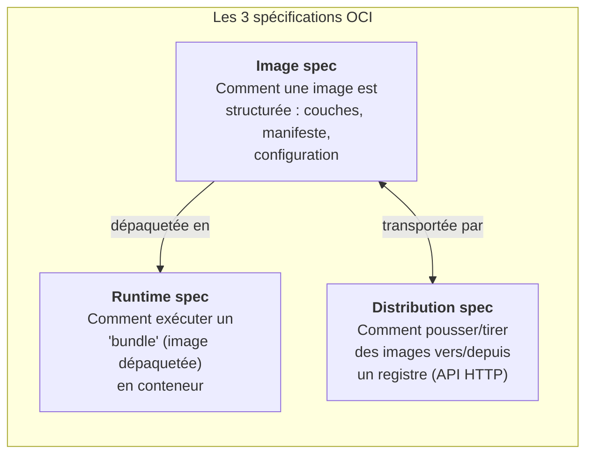
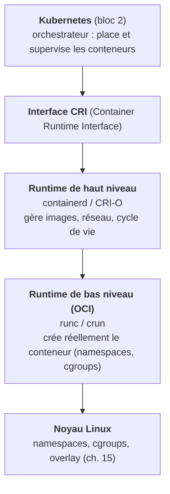
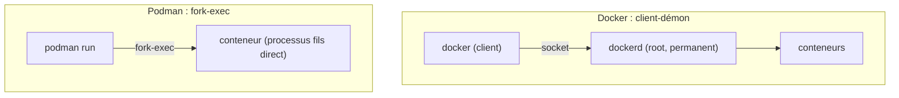

# Chapitre 16 : L'écosystème et les standards OCI

!!! abstract "Objectifs du chapitre"
    À l'issue de ce chapitre, vous saurez :

    - expliquer pourquoi une standardisation (OCI) était nécessaire et ce que couvrent ses trois spécifications ;
    - situer chaque brique de la pile : image, runtime, moteur, distribution (Docker, Podman, containerd, runc, CRI-O) ;
    - décrire l'architecture **sans démon** et **rootless** de Podman et la comparer honnêtement à Docker ;
    - expliquer l'intégration de Podman avec systemd (Quadlet) et sa parenté avec le S1.

## 1. Le besoin de standards : la guerre des formats évitée

En 2013-2015, Docker règne, mais l'inquiétude monte : un acteur unique contrôle le format d'image, le runtime, le protocole de distribution. Que se passe-t-il si Docker change ces formats à sa guise ? Les entreprises refusent de bâtir leur infrastructure sur un standard *de fait* propriétaire. En 2015 naît donc l'**Open Container Initiative (OCI)**, sous l'égide de la Linux Foundation, avec la participation de Docker, Red Hat, Google, et d'autres. L'OCI publie des **spécifications ouvertes** que tout outil peut implémenter, garantissant l'interopérabilité.

C'est une leçon d'ingénierie et d'écosystème à retenir : **la standardisation d'une interface libère l'innovation au-dessus et en dessous.** Grâce à l'OCI, Podman peut remplacer Docker sans que vos images changent : c'est précisément ce qui rend la compétence « Docker » transférable, argument central de ce parcours.

## 2. Les trois spécifications OCI

L'OCI définit trois contrats, qu'il faut savoir distinguer (question d'examen fréquente) :



| Spécification | Définit | Analogie |
|---|---|---|
| **Image** | Le format d'une image : ses couches (tar+gzip), son manifeste, sa configuration (commande, variables, utilisateur) | Le format d'un fichier `.deb` |
| **Runtime** | Comment un *bundle* (image extraite + config) devient un conteneur en marche (namespaces, cgroups, montages) | Ce que fait `dpkg` en installant |
| **Distribution** | L'API HTTP d'un registre pour `push`/`pull` (tags, digests, authentification) | Le protocole d'un dépôt APT |

Un point conceptuel clé : une image est identifiée de deux façons. Par un **tag** (`listify-backend:1.2`), mutable et lisible, et par un **digest** (`sha256:a1b2...`), l'empreinte cryptographique **immuable** de son contenu. Le tag peut être réaffecté (`:latest` change) ; le digest, jamais : deux images de digest identique sont **bit à bit** les mêmes. En production, on déploie par digest pour une reproductibilité absolue : c'est l'immutabilité poussée à sa forme la plus stricte, celle que le S1 cherchait sans l'atteindre tout à fait.

## 3. La pile démystifiée : qui fait quoi

L'écosystème semble un fouillis de noms ; en réalité, c'est une pile de responsabilités bien séparées, chacune correspondant à une couche OCI ou à l'orchestration au-dessus :



- **runc** (et son alternative en C, **crun**, plus rapide et utilisée par Podman) : le **runtime de bas niveau**, conforme à la *runtime spec*. C'est lui qui fait *réellement* les appels systèmes du chapitre 15. Minuscule et interchangeable.
- **containerd** / **CRI-O** : les **runtimes de haut niveau**. Ils gèrent le téléchargement des images, le stockage, le réseau, et délèguent la création du conteneur à runc/crun. CRI-O est spécifiquement conçu pour Kubernetes.
- **Docker** et **Podman** : les **moteurs** (outils utilisateur) qui offrent la ligne de commande, construisent les images, et orchestrent tout ce qui précède.

!!! note "L'insight à retenir"
    Quand vous tapez `podman run`, la vraie création du conteneur est faite tout en bas par `crun`, via les primitives du ch. 15. Tous les étages au-dessus (moteur, runtime de haut niveau) ne font qu'apprêter le terrain et gérer le cycle de vie. Cette séparation en couches est ce qui permet à Kubernetes de fonctionner indifféremment avec containerd ou CRI-O : il parle à l'interface CRI, pas à un produit.

## 4. Docker vs Podman : l'architecture, honnêtement

### 4.1 Docker : le modèle client-démon

Docker repose sur un **démon** (`dockerd`), un processus qui tourne en permanence, **en root**, et à qui la commande `docker` (un client) envoie des ordres via une socket. Ce modèle a deux conséquences problématiques :

- **Un point de défaillance central** : si `dockerd` meurt, tous les conteneurs qu'il gère tombent, et son redémarrage est délicat.
- **Une surface de sécurité** : le démon tourne en root ; qui peut parler à sa socket peut, de fait, obtenir root sur la machine (`docker run -v /:/host ...`). Donner accès à Docker, c'est donner root.

### 4.2 Podman : sans démon, rootless

Podman adopte le modèle **fork-exec**, sans démon : la commande `podman run` **est** le processus parent du conteneur, exactement comme un shell qui lance un programme. Conséquences, qui sont autant d'atouts pédagogiques :



- **Transparence** : un conteneur Podman est un simple processus fils, visible dans `ps` sur l'hôte, géré par les outils habituels. L'architecture est *lisible*, ce qui en fait un excellent support pédagogique (on l'a choisi pour cela).
- **Rootless par défaut** : grâce au namespace **user** (ch. 15, §2.2), Podman s'exécute avec **vos** droits d'utilisateur. Aucun démon root, aucune socket privilégiée. En salle de TP, aucun droit administrateur n'est requis.
- **Intégration systemd** : puisqu'il n'y a pas de démon, c'est **systemd** qui peut superviser les conteneurs, comme n'importe quel service (section 5).

### 4.3 « Mais l'entreprise utilise Docker »

C'est vrai : Docker reste le standard *de fait* en entreprise et dans beaucoup de tutoriels. Deux raisons de ne pas s'en inquiéter :

1. **Les commandes sont identiques.** Grâce à l'OCI, `podman` implémente la même interface que `docker` ; `alias docker=podman` fonctionne dans l'immense majorité des cas. Ce que vous apprenez ici s'applique tel quel à Docker.
2. **Le monde bascule.** Kubernetes lui-même a **retiré** son support direct de Docker (dépréciation de « dockershim », 2020-2022) au profit de containerd/CRI-O ; Podman gagne du terrain, notamment dans l'écosystème Red Hat. La compétence conceptuelle (les primitives, l'OCI) prime sur l'outil, comme toujours dans ce parcours.

## 5. Podman et systemd : la boucle avec le S1

Sans démon pour maintenir les conteneurs en vie, comment garantir qu'un service conteneurisé redémarre au boot et après un crash ? Réponse : **systemd**, exactement comme au S1. Podman génère des unités systemd pour ses conteneurs. La méthode moderne est **Quadlet** : on décrit un conteneur dans un fichier `.container` (syntaxe proche d'une unité systemd), et systemd le gère comme un service natif.

```ini title="Exemple de Quadlet : ~/.config/containers/systemd/listify-backend.container"
[Container]
Image=localhost/listify-backend:latest
PublishPort=8000:8000
Environment=DB_HOST=listify-db

[Service]
Restart=on-failure

[Install]
WantedBy=default.target
```

Vous retrouvez **mot pour mot** les concepts du chapitre 2 du S1 : `Restart=on-failure`, `WantedBy=`, la supervision par systemd. Le TP 14 le mettra en pratique. La boucle est bouclée : le conteneur, unité de déploiement du S2, est supervisé par l'outil de gestion de services du S1. Rien ne se perd, tout se réassemble.

## Ce qu'il faut retenir

1. L'**OCI** (2015) standardise trois contrats : **image** (format), **runtime** (exécution d'un bundle), **distribution** (API des registres). Grâce à eux, les outils sont interchangeables : Podman remplace Docker sans changer vos images.
2. Une image s'identifie par un **tag** (mutable) et un **digest** `sha256` (immuable, l'empreinte du contenu). On déploie par digest pour la reproductibilité stricte.
3. La pile : **runc/crun** (runtime bas niveau OCI, fait les appels systèmes du ch. 15) < **containerd/CRI-O** (haut niveau) < **Docker/Podman** (moteur) < **Kubernetes** (via l'interface CRI).
4. **Docker** = client-**démon** root permanent (SPOF + surface de sécurité). **Podman** = **fork-exec sans démon**, **rootless** (namespace user), transparent, intégré à systemd. Commandes identiques (OCI) : la compétence est transférable.
5. Sans démon, **systemd** supervise les conteneurs (Quadlet, fichiers `.container`) : on retrouve `Restart=`, `WantedBy=` du S1.

## Regard recherche

!!! quote "Pour aller vers la recherche"
    - **The Open Container Initiative, spécifications** (image-spec, runtime-spec, distribution-spec) sur [github.com/opencontainers](https://github.com/opencontainers). Lire une spécification est un exercice formateur : c'est un texte normatif, précis, sans marketing. Comparez la *image-spec* à la structure réelle d'une image (TP 12, `podman image inspect`).
    - **Brendan Burns, Joe Beda, Kelsey Hightower, *Kubernetes: Up and Running*** (chapitre sur les runtimes) pour la place de CRI. Et surtout, le billet de l'équipe Kubernetes « Don't Panic: Kubernetes and Docker » (2020) sur la dépréciation de dockershim : un cas d'étude sur la valeur des interfaces standardisées.
    - Sur l'**économie des standards ouverts** : les travaux en gestion de l'innovation sur les *platform standards* (par ex. les analyses autour de la fondation Linux et de la CNCF) montrent pourquoi la coopétition (coopérer sur le standard, se concurrencer sur le produit) accélère un secteur. Un angle « sciences de gestion » pour un étudiant curieux d'innovation.

## Bibliographie du chapitre

### Sources primaires

- Documentation Podman, en particulier « Podman vs Docker » et « rootless » : [docs.podman.io](https://docs.podman.io/). La source officielle des comparaisons de ce chapitre.
- Spécifications OCI : [opencontainers.org](https://opencontainers.org/).
- Documentation Quadlet : `man quadlet` et la section correspondante de la doc Podman.

### Lectures recommandées

- Red Hat, « Podman in Action » (Daniel Walsh et al., Manning, 2023) : le livre de référence sur Podman, par ses mainteneurs ; chapitres 1-3 pour l'architecture.
- Nigel Poulton, *Docker Deep Dive* : pour comprendre le modèle Docker qu'on compare ici (transposable).

### Pour aller plus loin

- Le blog de Dan Walsh (mainteneur Podman/SELinux chez Red Hat) : de nombreux billets sur le rootless et la sécurité, à la source.
- L'histoire de la dépréciation de dockershim et de l'interface CRI : documentation Kubernetes, section « Container Runtimes ».
