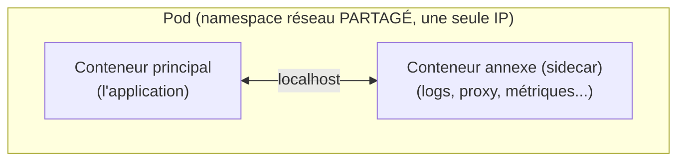

# Chapitre 18 : Réseau, stockage et composition des conteneurs

!!! abstract "Objectifs du chapitre"
    À l'issue de ce chapitre, vous saurez :

    - expliquer les modes réseau des conteneurs (bridge, port mapping, réseaux définis par l'utilisateur) et les spécificités du rootless ;
    - distinguer volumes et bind mounts, et raisonner le cycle de vie des données ;
    - composer plusieurs services avec un fichier Compose (réseaux, volumes, healthchecks, dépendances) ;
    - expliquer le **pod** Podman et `podman kube generate` comme passerelle conceptuelle vers Kubernetes.

    Ce chapitre prépare directement le [TP 13](../tp/tp13-composition-pod.md), où vous composerez les trois tiers de Listify.

## 1. Le réseau des conteneurs

### 1.1 Le mode bridge et le port mapping

Par défaut, un conteneur reçoit son **propre namespace réseau** (ch. 15) : sa propre interface, sa propre adresse IP privée. Le moteur crée un **pont** (*bridge*) virtuel sur l'hôte, auquel les conteneurs se raccordent, et gère le routage vers l'extérieur (NAT). Vous reconnaissez le schéma du réseau host-only du S1 : un sous-réseau privé + une passerelle, mais cette fois à l'échelle des conteneurs, sur une seule machine.

Comme les conteneurs sont sur un réseau privé, un service qu'ils exposent n'est **pas** joignable depuis l'hôte sans **redirection de port** (*port mapping*), l'exact équivalent des redirections NAT VirtualBox du S1 :

```bash
podman run -p 8000:8000 listify-backend    # port 8000 de l'hôte -> port 8000 du conteneur
```

Le trafic vers `localhost:8000` de l'hôte est redirigé vers le port 8000 du conteneur. Sans ce `-p`, le conteneur écoute, mais personne ne le joint de l'extérieur. La friction est la même qu'au TP 1 du S1 ; l'ayant vécue, vous la comprenez d'emblée.

### 1.2 Les réseaux définis par l'utilisateur : la découverte par nom

Le point qui change tout pour une application multi-conteneurs : sur un **réseau défini par l'utilisateur**, les conteneurs se joignent **par leur nom**, résolu par un DNS interne intégré au moteur (sous Podman, **Netavark** et **aardvark-dns**). Plus besoin de connaître les adresses IP :

```bash
podman network create listify-net
podman run -d --name listify-db  --network listify-net postgres:16
podman run -d --name listify-backend --network listify-net listify-backend
# Le backend joint la base par le nom "listify-db" : DB_HOST=listify-db
```

C'est le `DB_HOST=listify-db` du S1, mais fourni gratuitement par le moteur : la résolution de noms interne que vous mainteniez à la main dans `/etc/hosts` (puis avec hostmanager) est ici **native**. Retenez la progression : `/etc/hosts` distribué (S1 bloc 2) → DNS de réseau conteneur (ici) → DNS de service Kubernetes (bloc 2). Le même besoin, des solutions de plus en plus intégrées.

### 1.3 Les spécificités du rootless

Le rootless a une contrainte à connaître : un utilisateur non privilégié **ne peut pas** ouvrir les ports **< 1024** (la règle du S1, chapitre 3). En rootless, `podman run -p 80:80` échoue donc par défaut ; on publie sur un port élevé (`-p 8080:80`) ou on lève la restriction du noyau. De plus, le trafic réseau rootless passe par un composant en espace utilisateur (**pasta** ou **slirp4netns**) plutôt que par le noyau : léger surcoût, transparent pour nous. Ces détails (à connaître en notions) sont le prix, minime, de la sécurité du rootless.

## 2. Le stockage : la persistance face à l'éphémère

### 2.1 Le rappel fondamental

Le chapitre 15 l'a établi : la couche inscriptible d'un conteneur (upperdir) est **détruite avec lui**. Tout ce qu'un conteneur écrit dans son système de fichiers disparaît à sa suppression. Pour une application **sans état** (le backend, le frontend de Listify), c'est parfait : on peut détruire et recréer à volonté. Pour une application **avec état** (la base de données !), c'est une catastrophe à éviter absolument. La distinction stateless/stateful du S1 devient ici une question de survie des données.

### 2.2 Volumes et bind mounts

Deux mécanismes font persister des données **hors** du cycle de vie du conteneur :

| Mécanisme | Ce que c'est | Usage typique |
|---|---|---|
| **Volume** | Un espace de stockage géré par le moteur, indépendant des conteneurs | Les **données** d'une base (production) |
| **Bind mount** | Un répertoire de l'hôte monté dans le conteneur | Le **code** en développement (édition à chaud), des fichiers de config |

```bash
# Volume : les données PostgreSQL survivent à la destruction du conteneur
podman volume create listify-data
podman run -d --name listify-db -v listify-data:/var/lib/postgresql/data postgres:16
podman rm -f listify-db          # le conteneur meurt...
# ...mais le volume listify-data garde les données ; un nouveau conteneur les retrouve
```

```bash
# Bind mount : le répertoire courant monté dans le conteneur (dev)
podman run -v "$PWD":/app listify-backend
```

Règle de conception : **les données précieuses vont dans un volume ; le conteneur reste jetable.** C'est ce découplage qui permettra à Kubernetes de détruire et recréer des Pods sans perdre les données (via PV/PVC au bloc 2). Et c'est pourquoi la question « faut-il mettre sa base de données dans un conteneur (ou dans Kubernetes) ? » mérite une vraie réflexion, que le bloc 2 approfondira.

## 3. La composition : décrire une application multi-conteneurs

### 3.1 Le besoin

Lancer Listify à la main, c'est trois `podman run` avec les bons réseaux, volumes, variables, dans le bon ordre. On retrouve la douleur du S1 : des commandes impératives, un ordre implicite, rien de versionné. La réponse est la même qu'au S1 : **décrire l'état voulu dans un fichier déclaratif**. Ce fichier est le fichier **Compose**.

### 3.2 Le fichier Compose

La spécification **Compose** (à l'origine Docker Compose, aujourd'hui un standard ouvert) décrit, en YAML, un ensemble de services, leurs réseaux, volumes, dépendances et sondes. `podman-compose` (ou `podman compose`) le lit et crée tout :

```yaml title="compose.yaml (structure pour Listify)"
services:
  db:
    image: postgres:16
    environment:
      POSTGRES_DB: listify
      POSTGRES_USER: listify
      POSTGRES_PASSWORD: ${DB_PASSWORD}
    volumes:
      - listify-data:/var/lib/postgresql/data
    healthcheck:
      test: ["CMD", "pg_isready", "-U", "listify"]
      interval: 5s

  backend:
    build: ./backend
    environment:
      DB_HOST: db
      DB_PASSWORD: ${DB_PASSWORD}
    depends_on:
      db:
        condition: service_healthy   # attendre que la base soit PRÊTE

  frontend:
    build: ./frontend
    ports:
      - "8080:80"
    depends_on:
      - backend

volumes:
  listify-data:
```

Chaque élément fait écho au parcours : un **réseau** implicite relie les services (ils se joignent par nom : `DB_HOST: db`) ; un **volume** persiste la base ; les **variables** portent la configuration (facteur III du S1) ; le **healthcheck** et `depends_on: condition: service_healthy` résolvent, enfin proprement, le problème d'ordre de démarrage qui nous poursuit depuis le S1 (« attendre que la base soit prête »). Le fichier Compose est, littéralement, l'**Infrastructure as Code du poste de développeur**.

!!! note "Le healthcheck, une vieille question enfin bien posée"
    Au S1, votre backend savait attendre la base (503 propre) parce que systemd ne pouvait pas garantir l'ordre entre machines. Ici, `condition: service_healthy` exprime la dépendance de disponibilité de façon **déclarative**. Au bloc 2, Kubernetes généralisera cela avec les *probes* (liveness/readiness). Suivez ce fil : c'est l'un des plus instructifs du parcours.

## 4. Le pod : la passerelle vers Kubernetes

### 4.1 Qu'est-ce qu'un pod ?

Podman introduit une notion que Docker n'a pas et que Kubernetes place au centre de tout : le **pod**. Un pod est un **groupe de conteneurs qui partagent certains namespaces** (notamment le **réseau** : ils partagent la même adresse IP et se joignent par `localhost`) et un cycle de vie commun. L'idée : certains conteneurs sont si étroitement liés qu'ils forment une unité de déploiement indivisible.



Que Podman propose exactement le concept central de Kubernetes n'est pas un hasard : c'est **délibéré**, pour offrir une transition en douceur. Ce que vous apprenez du pod ici se transposera directement au bloc 2.

### 4.2 `podman kube generate` : du pod au manifeste Kubernetes

Le geste-passerelle du bloc : Podman peut **générer un manifeste Kubernetes** (le fichier YAML que Kubernetes consomme) à partir d'un pod existant, et inversement l'exécuter :

```bash
podman pod create --name listify-pod
# ... on ajoute des conteneurs au pod ...
podman kube generate listify-pod -f listify-pod.yaml   # produit un YAML Kubernetes
podman kube play listify-pod.yaml                       # rejoue un YAML Kubernetes localement
```

Vous obtenez ainsi, **sans installer Kubernetes**, un premier fichier au format Kubernetes, produit à partir de ce que vous maîtrisez déjà. Au TP 13, vous générerez ce YAML et le lirez : c'est votre premier contact concret avec l'objet `Pod` de Kubernetes, préparé par vos propres conteneurs. La marche vers le bloc 2 en sera d'autant plus douce.

## Ce qu'il faut retenir

1. **Réseau** : chaque conteneur a son namespace réseau ; le **port mapping** (`-p`) l'expose à l'hôte (comme le NAT VirtualBox du S1). Sur un **réseau défini par l'utilisateur**, les conteneurs se joignent **par nom** (DNS interne) : la résolution de noms du S1, native. Rootless : pas de ports < 1024, trafic via pasta/slirp4netns.
2. **Stockage** : la couche du conteneur est **éphémère** ; les **volumes** (gérés par le moteur) persistent les données précieuses (la base), les **bind mounts** montent un répertoire de l'hôte (le code en dev). Données dans un volume, conteneur jetable.
3. **Composition** : le fichier **Compose** décrit déclarativement services, réseaux, volumes, variables, **healthchecks** et dépendances (`condition: service_healthy` règle l'ordre de démarrage). C'est l'IaC du poste de développeur.
4. Le **pod** groupe des conteneurs partageant le namespace réseau (même IP, `localhost`) : le concept central de Kubernetes, offert d'avance par Podman. `podman kube generate` produit un **manifeste Kubernetes** : la passerelle vers le bloc 2.

## Regard recherche

!!! quote "Pour aller vers la recherche"
    - **Brendan Burns, David Oppenheimer, « Design Patterns for Container-based Distributed Systems », USENIX HotCloud, 2016.** Écrit par un des créateurs de Kubernetes, ce court article **théorise le pod** : il formalise les patterns *sidecar*, *ambassador*, *adapter* qui justifient de regrouper des conteneurs. C'est la lecture idéale pour comprendre *pourquoi* le pod existe, juste avant le bloc 2. Fortement recommandé.
    - **Sur les systèmes de fichiers en réseau et le stockage conteneurisé** : la question « base de données dans un conteneur ? » renvoie à des décennies de recherche sur la persistance et la cohérence. Le chapitre correspondant de Kleppmann (*Designing Data-Intensive Applications*, vu au S3) en est la meilleure porte d'entrée.
    - Piste : comparez les implémentations réseau (Netavark de Podman, CNI de Kubernetes) ; le modèle **CNI** (Container Network Interface) est un standard dont l'étude ouvre sur la recherche en réseaux définis par logiciel (SDN).

## Bibliographie du chapitre

### Sources primaires

- Spécification Compose : [compose-spec.io](https://compose-spec.io/). Le standard ouvert, indépendant de Docker.
- Documentation Podman : sections « Networking », « Volumes », « Pods », et `podman-kube-generate(1)` / `podman-kube-play(1)`.
- Documentation Netavark et aardvark-dns (le réseau de Podman).

### Lectures recommandées

- « Podman in Action » (Manning, 2023), chapitres sur le réseau, les volumes et les pods : la référence pratique alignée sur nos TP.
- Documentation Kubernetes, concept « Pod » : [kubernetes.io/docs/concepts/workloads/pods](https://kubernetes.io/docs/concepts/workloads/pods/), à lire en regard du YAML généré au TP 13.

### Pour aller plus loin

- Le Container Network Interface (CNI), spécification : [github.com/containernetworking/cni](https://github.com/containernetworking/cni). Le standard réseau que Kubernetes utilise.
- Sur la persistance : la Container Storage Interface (CSI), pendant de CNI pour le stockage, qui reviendra au bloc 2 avec les StorageClass.
