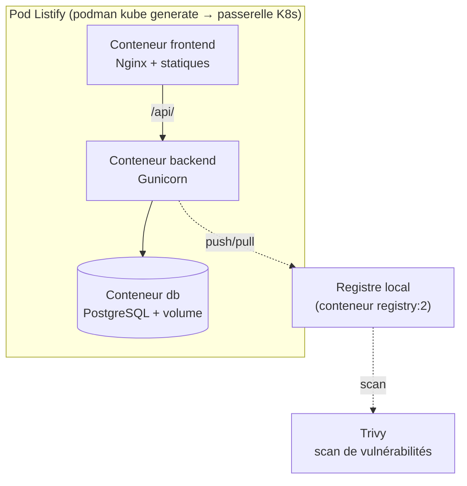

# Bloc 1 : la conteneurisation

**Semaines 1 à 5.** Vous allez découvrir ce qu'est *réellement* un conteneur, non pas en récitant « c'est une VM légère » (raccourci faux qui vous handicapera), mais en **construisant un conteneur à la main**, avec les seules primitives du noyau Linux, avant même de lancer Podman. Puis vous conteneuriserez les trois tiers de Listify, les composerez, les scannerez, et les regrouperez dans un *pod* : la passerelle conceptuelle vers Kubernetes.

## Pourquoi commencer par « sous le capot » ?

Parce que la magie apparente des conteneurs (démarrage en millisecondes, isolation, portabilité) repose sur quelques mécanismes précis du noyau : **namespaces**, **cgroups**, **systèmes de fichiers en couches**. Un ingénieur qui les connaît diagnostique un problème de conteneur en minutes ; celui qui ne voit qu'une « boîte noire » est perdu dès que l'abstraction fuit. C'est le cœur théorique du semestre, et l'examen y insiste.

C'est aussi le prolongement direct du S1 : la colonne « isolation » de votre tableau de progression passait de « VM et segmentation réseau » à « namespaces, cgroups, rootless ». Ce bloc rend cette ligne concrète.

## L'architecture cible du bloc

À la fin du bloc, Listify tourne **entièrement en conteneurs** sur votre poste, sans aucune VM, composé par un fichier déclaratif, avec ses images construites, versionnées, scannées et servies depuis un registre local.

## Organisation du bloc

| Semaine | CM | TP |
|---|---|---|
| 1 | [Ch. 14 : Pourquoi les conteneurs](cours/14-pourquoi-les-conteneurs.md) | [TP 11](tp/tp11-namespaces-cgroups.md) (début) : namespaces à la main |
| 2 | [Ch. 15 : Sous le capot](cours/15-sous-le-capot.md) (namespaces, cgroups, OverlayFS) | [TP 11](tp/tp11-namespaces-cgroups.md) (fin) : cgroups, un « conteneur » sans moteur |
| 3 | [Ch. 16 : OCI et l'écosystème](cours/16-oci-ecosysteme.md) (Podman, containerd, runc) | [TP 12](tp/tp12-images-containerfile.md) : Containerfile des trois services |
| 4 | [Ch. 17 : Les images](cours/17-images.md) (multi-stage, cache, scan) | [TP 13](tp/tp13-composition-pod.md) : composition et pod |
| 5 | [Ch. 18 : Réseau, stockage et composition](cours/18-reseau-stockage-composition.md) | [TP 14](tp/tp14-registre-scan.md) : registre local, scan Trivy, Quadlet |

## Ce que vous saurez faire à la fin du bloc

- Expliquer, primitives du noyau à l'appui, la différence **fondamentale** entre un conteneur et une machine virtuelle, et défendre le choix de l'une ou l'autre (compétence C1).
- Construire un « conteneur » rudimentaire à la main (`unshare`, `cgroups`) pour démystifier le moteur.
- Situer chaque brique de l'écosystème (image, runtime, distribution ; Docker, Podman, containerd, runc, CRI-O) et expliquer l'architecture **sans démon** et **rootless** de Podman.
- Écrire des `Containerfile` optimisés (multi-stage, ordre des layers, utilisateur non-root), mesurer la taille des images, scanner leurs vulnérabilités avec Trivy.
- Composer plusieurs services (réseaux, volumes, healthchecks) et générer un manifeste Kubernetes depuis un *pod* Podman.

## Le fil rouge, repris

Le code de Listify ne change pas. Ce qui change, c'est son **emballage** : au S1, chaque tier était installé sur une machine par Ansible ; ici, chaque tier devient une **image**, construite une fois et exécutable partout. Vous mesurerez ce que cette immutabilité apporte : plus de dérive possible entre l'image testée et l'image déployée, puisque c'est **le même artefact**.
