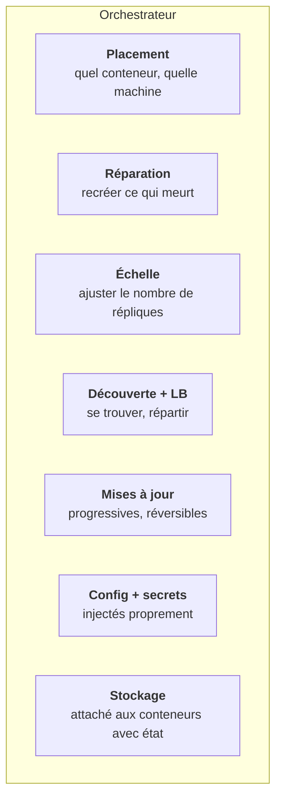
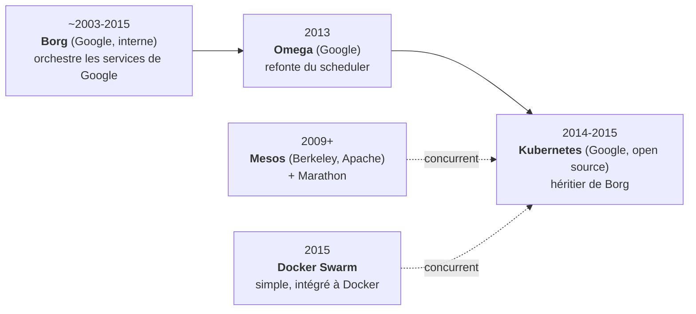

# Chapitre 19 : Le problème de l'orchestration

!!! abstract "Objectifs du chapitre"
    À l'issue de ce chapitre, vous saurez :

    - énumérer les problèmes concrets que pose l'exécution de nombreux conteneurs sur plusieurs machines ;
    - définir l'orchestration de conteneurs et distinguer ses grandes fonctions (placement, réparation, mise à l'échelle, découverte, mise à jour) ;
    - situer Kubernetes dans son histoire (Borg, Mesos, Swarm) et expliquer, avec du recul, pourquoi il s'est imposé ;
    - distinguer un orchestrateur de **services** (Kubernetes) d'un orchestrateur de **tâches** (Airflow, S3).

## 1. Du conteneur unique au parc de conteneurs

Au bloc 1, vous lanciez trois conteneurs sur votre poste avec un fichier Compose. C'est parfait pour développer. Mais la production réelle ressemble à ceci : des dizaines de services, chacun répliqué plusieurs fois pour la charge et la disponibilité, répartis sur des dizaines de machines, évoluant en permanence. À cette échelle, une nuée de questions surgit, qu'aucun `podman run` ni fichier Compose ne résout :

| Question | Le problème d'orchestration correspondant |
|---|---|
| Sur **quelle machine** lancer ce conteneur ? | **Placement** (*scheduling*) : trouver un nœud avec assez de CPU/RAM, respecter les contraintes |
| Un conteneur meurt, une machine tombe : et après ? | **Auto-réparation** : détecter et recréer ailleurs, automatiquement |
| La charge double ce soir : comment ajouter des répliques ? | **Mise à l'échelle** (*scaling*), idéalement automatique |
| Comment les services se **trouvent-ils** entre eux, alors que les conteneurs vont et viennent ? | **Découverte de services** et équilibrage de charge internes |
| Comment passer de la v1 à la v2 **sans coupure** ? | **Déploiements progressifs** (rolling updates) et retours arrière |
| Où mettre les mots de passe, les fichiers de configuration ? | **Gestion de la configuration et des secrets**, à l'échelle du parc |
| Comment persister les données quand les conteneurs sont jetables ? | **Stockage** attaché au bon endroit |

Un **orchestrateur de conteneurs** est le système qui répond à **toutes** ces questions de manière automatisée et cohérente. Sans lui, on retomberait dans la coordination manuelle du S1, multipliée par le nombre de conteneurs : ingérable.

## 2. Ce que fait un orchestrateur, précisément

Rassemblons les fonctions en une vue d'ensemble, car chacune deviendra un objet ou un mécanisme concret de Kubernetes dans les chapitres suivants :

Le point commun de toutes ces fonctions, et l'idée qui structure tout le bloc : l'orchestrateur travaille par **objectif déclaré**, pas par ordres impératifs. On ne lui dit pas « lance ce conteneur sur cette machine » ; on lui dit « je veux **trois répliques** de ce service en permanence », et **il se débrouille** pour que ce soit toujours vrai, en réagissant aux pannes, aux ajouts de machines, aux montées de charge. C'est la réconciliation du chapitre 20.

## 3. Une brève histoire, pour comprendre pourquoi Kubernetes

L'orchestration n'est pas née avec Kubernetes. Connaître sa généalogie éclaire ses choix de conception, et c'est une question de culture attendue à l'examen.

- **Borg** (Google, à partir de ~2003) : le système interne qui orchestre *tous* les services de Google (recherche, Gmail...) sur des centaines de milliers de machines. Longtemps secret, il est le véritable ancêtre de Kubernetes. Beaucoup de concepts de Kubernetes (Pods, labels, réconciliation) viennent directement de Borg.
- **Mesos** (UC Berkeley puis Apache, ~2009) avec Marathon : une approche différente, plus « noyau de datacenter » ; a équipé Twitter et Airbnb à leur apogée.
- **Docker Swarm** (2015) : la réponse simple et intégrée de Docker. Facile à prendre en main, mais moins puissant à grande échelle.
- **Kubernetes** (Google, ouvert en 2014, v1.0 en 2015) : la réécriture *open source* des idées de Borg, offerte à la communauté et confiée à la **CNCF** (Cloud Native Computing Foundation).

### 3.1 Pourquoi Kubernetes a gagné

La « guerre des orchestrateurs » (2015-2017) s'est soldée par la victoire nette de Kubernetes. Les raisons, à savoir analyser :

1. **L'héritage de Borg** : un design éprouvé sur une décennie à l'échelle de Google, pas une invention improvisée.
2. **La gouvernance ouverte** : confié à une fondation neutre (CNCF), pas contrôlé par un seul éditeur (contrairement à Swarm/Docker). Les grands acteurs (Google, Red Hat, Microsoft, AWS...) ont préféré coopérer sur un standard neutre : la leçon des standards ouverts du chapitre 16, à nouveau.
3. **L'extensibilité** : une API que l'on peut étendre (CRD, opérateurs), un écosystème qui a explosé (Helm, Prometheus, Istio...).
4. **Le portage universel** : le même Kubernetes tourne sur votre poste (kind), dans le datacenter, et chez tous les clouds (EKS, GKE, AKS). « Écrire une fois, déployer partout » à l'échelle de l'infrastructure.

L'effet réseau a fait le reste : plus Kubernetes gagnait d'utilisateurs, plus l'écosystème s'enrichissait, plus il devenait le choix évident. C'est un cas d'école d'adoption de technologie, digne d'être étudié pour lui-même.

!!! note "Kubernetes, k8s, et l'écosystème « cloud native »"
    On abrège Kubernetes en **k8s** (k, puis 8 lettres, puis s). La **CNCF** héberge des centaines de projets qui gravitent autour (le paysage « cloud native ») ; vous en croiserez plusieurs au bloc 3 (Prometheus, Argo CD). Kubernetes est le socle de cet écosystème.

## 4. Orchestrateur de services vs orchestrateur de tâches

Une distinction capitale, à poser dès maintenant car elle traverse les semestres 2 et 3 et tombe à l'examen transversal :

| | Orchestrateur de **services** (Kubernetes) | Orchestrateur de **tâches** (Airflow, S3) |
|---|---|---|
| Ce qu'il orchestre | Des **processus longs** (serveurs web, bases...) censés tourner en permanence | Des **traitements finis** (un calcul, un ETL) qui démarrent, s'exécutent, se terminent |
| Objectif | Maintenir un **état** (« 3 répliques tournent ») | Exécuter un **graphe de dépendances** (« B après A, puis C ») |
| Mécanisme | **Réconciliation continue** | **Ordonnancement de DAG** |
| En cas d'échec | Recréer pour maintenir l'état | Reprendre la tâche (idempotence !) |

Kubernetes maintient des services *vivants* ; Airflow (S3) enchaîne des tâches *qui se terminent*. Ce ne sont pas des concurrents mais des outils complémentaires, et un système réel utilise souvent les deux (on peut même faire tourner Airflow *sur* Kubernetes). Savoir dire lequel convient à un besoin donné est une compétence d'architecte (C1).

## Ce qu'il faut retenir

1. À l'échelle de la production (beaucoup de conteneurs, beaucoup de machines, évolution permanente), une nuée de problèmes surgit : **placement, réparation, échelle, découverte, mises à jour, config/secrets, stockage**. L'orchestrateur les résout tous, de façon automatisée et cohérente.
2. Un orchestrateur travaille par **objectif déclaré** (« je veux 3 répliques ») et se débrouille pour le maintenir : c'est la réconciliation (ch. 20).
3. Histoire : **Borg** (Google, interne) → **Kubernetes** (open source, CNCF) ; concurrents Mesos et Swarm. Kubernetes a gagné par l'héritage Borg, la gouvernance ouverte, l'extensibilité et le portage universel.
4. Kubernetes orchestre des **services** (processus longs, réconciliation) ; Airflow (S3) orchestre des **tâches** (traitements finis, DAG). Complémentaires, pas concurrents.

## Regard recherche

!!! quote "Pour aller vers la recherche"
    Ce chapitre s'appuie sur des articles de recherche **exceptionnellement lisibles**, écrits par les ingénieurs mêmes qui ont construit ces systèmes. À lire absolument pour qui veut comprendre l'origine des idées :

    - **Abhishek Verma et al., « Large-scale cluster management at Google with Borg », EuroSys, 2015.** *Le* papier qui a levé le voile sur Borg, dix ans après sa création. On y trouve, formalisés, les Pods, les priorités, la réconciliation, le taux d'utilisation des machines. La source primaire de Kubernetes.
    - **Brendan Burns, Brian Grant, David Oppenheimer, Eric Brewer, John Wilkes, « Borg, Omega, and Kubernetes », ACM Queue / CACM, 2016.** Écrit par les créateurs de Kubernetes, ce texte raconte **ce qu'ils ont appris** de Borg et Omega, et pourquoi Kubernetes est conçu comme il l'est. Court, lumineux, incontournable.
    - **Malte Schwarzkopf et al., « Omega: flexible, scalable schedulers for large compute clusters », EuroSys, 2013.** La refonte du scheduler qui a inspiré l'architecture ouverte de Kubernetes. Plus technique.
    - **Benjamin Hindman et al., « Mesos: A Platform for Fine-Grained Resource Sharing in the Data Center », NSDI, 2011.** L'approche concurrente, pour comprendre les alternatives et les compromis.

    Piste d'innovation : le **placement** (scheduling) est un problème d'optimisation combinatoire toujours actif en recherche. Cherchez **Firmament** (Gog et al., OSDI 2016), qui modélise le scheduling comme un problème de flot dans un graphe. Le sujet est loin d'être clos.

## Bibliographie du chapitre

### Sources primaires

- Les quatre articles ci-dessus (Borg, Borg/Omega/Kubernetes, Omega, Mesos).
- Documentation Kubernetes, « Overview » et « Kubernetes Components » : [kubernetes.io/docs/concepts/overview](https://kubernetes.io/docs/concepts/overview/). La source qui fait foi pour toute la suite du bloc.

### Lectures recommandées

- Nigel Poulton, *The Kubernetes Book* (édition annuelle), chapitres 1-2 : la meilleure introduction pédagogique au « pourquoi ».
- Kelsey Hightower, Brendan Burns, Joe Beda, *Kubernetes: Up and Running*, 3ᵉ éd., O'Reilly, 2022, chapitre 1 : par des créateurs de Kubernetes.

### Pour aller plus loin

- La conférence de John Wilkes, « Cluster Management at Google » (plusieurs versions en ligne) : l'histoire de Borg racontée par l'un de ses architectes, avec l'humour et le recul de l'expérience.
- Le documentaire « Kubernetes: The Documentary » (CNCF/Honeypot, 2022) : l'histoire humaine du projet, ses débuts incertains chez Google, la décision de l'ouvrir.
